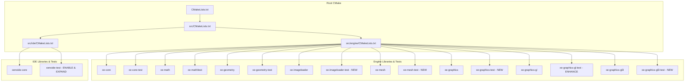

# Implementation Plan: CMake Libraries Unit Test Coverage

## Goal Description
Review all CMake libraries across the Xenoide repository (`src/engine/` and `src/ide/`). For any C++ library lacking an associated unit test suite, create a dedicated Catch2 v3 unit test executable integrated with CTest. For each translation unit (`.h`/`.cpp`) in the target libraries, provide a corresponding test file (`<TranslationUnit>Test.cpp`) containing a single `TEST_CASE` that includes the TU header. This provides realistic baseline unit test coverage and compilation smoke testing across the entire codebase.

---

## User Review Required

> [!IMPORTANT]
> **Scope Confirmation**:
> 1. **Primary Target Libraries (No Unit Test Executable)**:
>    - `xe::imageloader` (`src/engine/src/libxe-imageloader`)
>    - `xe::mesh` (`src/engine/src/libxe-mesh`)
>    - `xe::graphics-gl3` (`src/engine/src/libxe-graphics-gl3`)
>    - `xe::graphics` (`src/engine/src/libxe-graphics`)
> 2. **Partially Integrated / Inactive Test Suites**:
>    - `xenoide-core` (`src/ide/src/xenoide-core`): has inactive dummy `xenoide-test`, needs enablement in `src/ide/src/CMakeLists.txt` via `XE_ENABLE_TESTING` and per-TU tests for `FileService`, `StringUtil`, `Predef`.
>    - `xe::graphics-gl` (`src/engine/src/libxe-graphics-gl`): has `unit-test/` building `libxe-graphics-test`, but lacks tests for `xe::graphics-gl` translation units (`GraphicsDeviceGL`, `RendererGL`, `SubsetGL`, `TextureRepository`, `UtilGL`, `Conversion`, etc.).
>    - `xe::scene` (`src/engine/src/libxe-scene`): existing `test/` is commented out in CMake due to legacy namespace references; can be re-enabled and aligned.
> 3. **Existing Partially Covered Libraries**:
>    - `xe::core` (`src/engine/src/libxe-core-test`): currently only tests `DataType.Test.cpp`. We can add per-TU test files for `Buffer`, `Core`, `Timer`, `FPSCounter`, `FileUtil`, `Logger`, `Input`, `InputManager`, `DeviceStatus`, `FileStream`, `FileStreamSource`, `MemoryStream`, `Stream`, `StreamSource`, `BasicApplication`, `MessageBus`.
>    - `xe::geometry` (`src/engine/src/libxe-geometry-test`): has Box/Ellipsoid/Plane generator tests; missing `MeshBuffersTest.cpp`.
>    - `xe::math` (`src/engine/src/libxe-math/test`): already has 13 test files covering all primary math primitives.

> [!NOTE]
> **Test File Naming Convention**:
> The prompt specifies: *called TranslationUnitTest.cpp*.
> In existing code:
> - `src/engine/src/libxe-core-test/DataType.Test.cpp`
> - `src/engine/src/libxe-geometry-test/BoxGenerator.Test.cpp`
> - `src/engine/src/libxe-math/test/Box.Test.cpp`
> 
> We propose naming files `<TranslationUnit>Test.cpp` (e.g. `MeshUploadTest.cpp`, `ImageLoaderTest.cpp`) matching the user prompt, or `<TranslationUnit>.Test.cpp` (e.g. `MeshUpload.Test.cpp`) if strictly following the existing dot notation. The plan specifies `<TranslationUnit>Test.cpp`.

---

## Architecture & Layout Plan



### Directory Placement Options
- **Engine Tests**: Following the established pattern of `libxe-core-test` and `libxe-geometry-test`, each engine test executable will be placed in a sibling folder under `src/engine/src/` (e.g. `libxe-imageloader-test/`). Sibling directories (`libxe-*-test`) are preferred as they match `libxe-core-test` and `libxe-geometry-test` in `src/engine/src/CMakeLists.txt`.
- **IDE Tests**: `src/ide/src/xenoide-test/` already exists as a sibling directory; we will expand and wire it.

---

## Proposed Changes

### Component 1: Engine Libraries Lacking Unit Tests

---

#### 1. `xe::imageloader` (`libxe-imageloader`)
**Library Target**: `xe-imageloader` (alias `xe::imageloader`)
**Translation Units**:
- `Image` (`include/xe/Image.h`)
- `ImageLoader` (`include/xe/ImageLoader.h`, `src/ImageLoader.cpp`)

##### [NEW] `src/engine/src/libxe-imageloader-test/CMakeLists.txt`
```cmake
set(target "xe-imageloader-test")

set(sources
    "ImageTest.cpp"
    "ImageLoaderTest.cpp"
)

add_executable(${target} ${sources})
target_link_libraries(${target} PRIVATE
    xe::imageloader
    xe::interface
    Catch2::Catch2WithMain
)

include(Catch)
catch_discover_tests(${target})
```

##### [NEW] `src/engine/src/libxe-imageloader-test/ImageTest.cpp`
```cpp
#include <catch2/catch_test_macros.hpp>
#include <xe/Image.h>

TEST_CASE("Image header inclusion and basic sanity", "[imageloader][Image]") {
    REQUIRE(true);
}
```

##### [NEW] `src/engine/src/libxe-imageloader-test/ImageLoaderTest.cpp`
```cpp
#include <catch2/catch_test_macros.hpp>
#include <xe/ImageLoader.h>

TEST_CASE("ImageLoader header inclusion and format parsing", "[imageloader][ImageLoader]") {
    auto formatJpeg = parseImageFormat("image/jpeg");
    REQUIRE(formatJpeg.has_value());
    REQUIRE(formatJpeg.value() == ImageFormat::Jpeg);

    auto formatPng = parseImageFormat("image/png");
    REQUIRE(formatPng.has_value());
    REQUIRE(formatPng.value() == ImageFormat::Png);

    auto formatUnknown = parseImageFormat("unknown");
    REQUIRE_FALSE(formatUnknown.has_value());
}
```

##### [MODIFY] `src/engine/src/CMakeLists.txt`
Register `libxe-imageloader-test` when `XE_ENABLE_TESTING` is ON:
```cmake
add_subdirectory ("libxe-imageloader")
if (XE_ENABLE_TESTING)
    set(CMAKE_FOLDER "Engine/Tests")
    add_subdirectory ("libxe-imageloader-test")
    set(CMAKE_FOLDER "Engine")
endif()
```

---

#### 2. `xe::mesh` (`libxe-mesh`)
**Library Target**: `xe-mesh` (alias `xe::mesh`)
**Translation Units**:
- `MeshUpload` (`src/xe/mesh/MeshUpload.h`, `src/xe/mesh/MeshUpload.cpp`)

##### [NEW] `src/engine/src/libxe-mesh-test/CMakeLists.txt`
```cmake
set(target "xe-mesh-test")

set(sources
    "MeshUploadTest.cpp"
)

add_executable(${target} ${sources})
target_link_libraries(${target} PRIVATE
    xe::mesh
    xe::interface
    Catch2::Catch2WithMain
)

include(Catch)
catch_discover_tests(${target})
```

##### [NEW] `src/engine/src/libxe-mesh-test/MeshUploadTest.cpp`
```cpp
#include <catch2/catch_test_macros.hpp>
#include <xe/mesh/MeshUpload.h>

TEST_CASE("MeshUpload header inclusion and default options", "[mesh][MeshUpload]") {
    xe::MeshUploadOptions options;
    REQUIRE((options.attribMask & xe::MeshAttribPosition) != 0);
    REQUIRE((options.attribMask & xe::MeshAttribNormal) != 0);
    REQUIRE((options.attribMask & xe::MeshAttribTexCoord0) != 0);
}
```

##### [MODIFY] `src/engine/src/CMakeLists.txt`
Register `libxe-mesh-test` when `XE_ENABLE_TESTING` is ON:
```cmake
add_subdirectory ("libxe-mesh")
if (XE_ENABLE_TESTING)
    set(CMAKE_FOLDER "Engine/Tests")
    add_subdirectory ("libxe-mesh-test")
    set(CMAKE_FOLDER "Engine")
endif()
```

---

#### 3. `xe::graphics-gl3` (`libxe-graphics-gl3`)
**Library Target**: `libxe-graphics-gl3` (alias `xe::graphics-gl3`)
**Translation Units**:
- `glcore3-api.h` / `glcore3-api.cpp`
- `glcore3-buffer.h` / `glcore3-buffer.cpp`
- `glcore3-common.h` / `glcore3-common.cpp`
- `glcore3-context.h` / `glcore3-context.cpp`
- `glcore3-geometry.h` / `glcore3-geometry.cpp`
- `glcore3-pipeline.h` / `glcore3-pipeline.cpp`
- `glcore3-program.h` / `glcore3-program.cpp`
- `glcore3-sampler.h` / `glcore3-sampler.cpp`
- `glcore3-texture.h` / `glcore3-texture.cpp`
- `glcore3-vertexlayout.h` / `glcore3-vertexlayout.cpp`

##### [NEW] `src/engine/src/libxe-graphics-gl3-test/CMakeLists.txt`
```cmake
set(target "xe-graphics-gl3-test")

set(sources
    "GLCore3ApiTest.cpp"
    "GLCore3BufferTest.cpp"
    "GLCore3CommonTest.cpp"
    "GLCore3ContextTest.cpp"
    "GLCore3GeometryTest.cpp"
    "GLCore3PipelineTest.cpp"
    "GLCore3ProgramTest.cpp"
    "GLCore3SamplerTest.cpp"
    "GLCore3TextureTest.cpp"
    "GLCore3VertexLayoutTest.cpp"
)

add_executable(${target} ${sources})
target_link_libraries(${target} PRIVATE
    xe::graphics-gl3
    xe::interface
    Catch2::Catch2WithMain
)

include(Catch)
catch_discover_tests(${target})
```

##### [NEW] Per-TU Test Files in `src/engine/src/libxe-graphics-gl3-test/`:
- `GLCore3ApiTest.cpp`: includes `<catch2/catch_test_macros.hpp>` and `<xe/graphics/gl3/glcore3-api.h>`.
- `GLCore3BufferTest.cpp`: includes `<xe/graphics/gl3/glcore3-buffer.h>`.
- `GLCore3CommonTest.cpp`: includes `<xe/graphics/gl3/glcore3-common.h>`.
- `GLCore3ContextTest.cpp`: includes `<xe/graphics/gl3/glcore3-context.h>`.
- `GLCore3GeometryTest.cpp`: includes `<xe/graphics/gl3/glcore3-geometry.h>`.
- `GLCore3PipelineTest.cpp`: includes `<xe/graphics/gl3/glcore3-pipeline.h>`.
- `GLCore3ProgramTest.cpp`: includes `<xe/graphics/gl3/glcore3-program.h>`.
- `GLCore3SamplerTest.cpp`: includes `<xe/graphics/gl3/glcore3-sampler.h>`.
- `GLCore3TextureTest.cpp`: includes `<xe/graphics/gl3/glcore3-texture.h>`.
- `GLCore3VertexLayoutTest.cpp`: includes `<xe/graphics/gl3/glcore3-vertexlayout.h>`.

##### [MODIFY] `src/engine/src/CMakeLists.txt`
Register `libxe-graphics-gl3-test` when `XE_ENABLE_TESTING` is ON:
```cmake
add_subdirectory ("libxe-graphics-gl3")
if (XE_ENABLE_TESTING)
    set(CMAKE_FOLDER "Engine/Tests")
    add_subdirectory ("libxe-graphics-gl3-test")
    set(CMAKE_FOLDER "Engine")
endif()
```

---

#### 4. `xe::graphics` (`libxe-graphics`)
**Library Target**: `libxe-graphics` (alias `xe::graphics`)
**Translation Units**:
- Implementations: `GraphicsContext`, `GraphicsDevice`, `GraphicsDeviceFactory`, `GraphicsManager`, `IWindow`, `Image`, `ImageImpl`, `ImageLoader`, `Material`, `PixelFormat`, `Program`, `RenderBackend`, `Shader`, `Subset`, `Texture`.
- Headers / descriptors: `BufferDescriptor.h`, `Graphics.h`, `GraphicsAPI.h`, `types.h`, `Uniform.h`, `Vertex.h`, `VertexFormat.h`, `VertexLayout.h`, `Viewport.h`.

##### [NEW] `src/engine/src/libxe-graphics-test/CMakeLists.txt`
```cmake
set(target "xe-graphics-unit-test")

set(sources
    "BufferDescriptorTest.cpp"
    "GraphicsTest.cpp"
    "GraphicsAPITest.cpp"
    "GraphicsContextTest.cpp"
    "GraphicsDeviceTest.cpp"
    "GraphicsDeviceFactoryTest.cpp"
    "GraphicsManagerTest.cpp"
    "IWindowTest.cpp"
    "ImageTest.cpp"
    "ImageImplTest.cpp"
    "ImageLoaderTest.cpp"
    "MaterialTest.cpp"
    "PixelFormatTest.cpp"
    "ProgramTest.cpp"
    "RenderBackendTest.cpp"
    "ShaderTest.cpp"
    "SubsetTest.cpp"
    "TextureTest.cpp"
    "TypesTest.cpp"
    "UniformTest.cpp"
    "VertexTest.cpp"
    "VertexFormatTest.cpp"
    "VertexLayoutTest.cpp"
    "ViewportTest.cpp"
)

add_executable(${target} ${sources})
target_link_libraries(${target} PRIVATE
    xe::graphics
    xe::interface
    Catch2::Catch2WithMain
)

include(Catch)
catch_discover_tests(${target})
```

##### [NEW] Per-TU Test Files in `src/engine/src/libxe-graphics-test/`:
Each file includes `<catch2/catch_test_macros.hpp>` and the corresponding `<xe/graphics/<Header>.h>` with a single `TEST_CASE`.

##### [MODIFY] `src/engine/src/CMakeLists.txt`
Register `libxe-graphics-test` when `XE_ENABLE_TESTING` is ON:
```cmake
add_subdirectory ("libxe-graphics")
if (XE_ENABLE_TESTING)
    set(CMAKE_FOLDER "Engine/Tests")
    add_subdirectory ("libxe-graphics-test")
    set(CMAKE_FOLDER "Engine")
endif()
```

---

### Component 2: Partially Integrated Test Suites

---

#### 5. `xenoide-core` (`src/ide/src/xenoide-core`)
**Library Target**: `xenoide-core`
**Translation Units**:
- `FileService.h` / `FileService.cpp`
- `StringUtil.h` / `StringUtil.cpp`
- `Predef.h`

##### [MODIFY] `src/ide/src/CMakeLists.txt`
Enable `xenoide-test` when `XE_ENABLE_TESTING` is ON:
```cmake
if (XE_ENABLE_TESTING OR XENOIDE_TESTS)
    set(CMAKE_FOLDER "IDE/Tests")
    add_subdirectory("xenoide-test")
    set(CMAKE_FOLDER "IDE")
endif()
```

##### [MODIFY] `src/ide/src/xenoide-test/CMakeLists.txt`
```cmake
set(target "xenoide-test")

set(sources
    "xenoide-test-main.cpp"
    "FileServiceTest.cpp"
    "StringUtilTest.cpp"
    "PredefTest.cpp"
)

add_executable(${target} ${sources})
target_link_libraries(${target} PRIVATE
    xenoide-core
    xenoide-base
    Catch2::Catch2WithMain
)

include(Catch)
catch_discover_tests(${target})
```

##### [NEW] Per-TU Test Files in `src/ide/src/xenoide-test/`:
- `FileServiceTest.cpp`: includes `<catch2/catch_test_macros.hpp>` and `<xenoide/core/FileService.h>`.
- `StringUtilTest.cpp`: includes `<catch2/catch_test_macros.hpp>` and `<xenoide/core/StringUtil.h>`.
- `PredefTest.cpp`: includes `<catch2/catch_test_macros.hpp>` and `<xenoide/core/Predef.h>`.

---

#### 6. `xe::graphics-gl` (`libxe-graphics-gl`)
**Library Target**: `libxe-graphics-gl` (alias `xe::graphics-gl`)
**Translation Units**:
- `Conversion`, `GL`, `GraphicsDeviceGL`, `Renderer`, `RendererGL`, `SubsetGL`, `TextureRepository`, `Types`, `UtilGL`

##### [MODIFY] `src/engine/src/libxe-graphics-gl/unit-test/CMakeLists.txt`
Rename target to `xe-graphics-gl-test` (to avoid conflict with `xe::graphics` tests) and add tests for `xe::graphics-gl` TUs:
- `ConversionTest.cpp`
- `GLTest.cpp`
- `GraphicsDeviceGLTest.cpp`
- `RendererTest.cpp`
- `RendererGLTest.cpp`
- `SubsetGLTest.cpp`
- `TextureRepositoryTest.cpp`
- `TypesTest.cpp`
- `UtilGLTest.cpp`
Links: `xe::graphics-gl`, `xe::graphics`, `xe::interface`, `Catch2::Catch2WithMain`.

---

### Component 3: Extending Existing Test Suites (Optional / Recommended)

---

#### 7. `xe::core` (`libxe-core-test`)
**Translation Units without dedicated tests**:
`Buffer`, `Core`, `Timer`, `FPSCounter`, `FileUtil`, `Logger`, `Input`, `InputManager`, `DeviceStatus`, `FileStream`, `FileStreamSource`, `MemoryStream`, `Stream`, `StreamSource`, `BasicApplication`, `MessageBus`, `Predef`, `Span`, `XE`.

##### [MODIFY] `src/engine/src/libxe-core-test/CMakeLists.txt`
Add test files:
- `BufferTest.cpp`, `CoreTest.cpp`, `TimerTest.cpp`, `FPSCounterTest.cpp`, `FileUtilTest.cpp`, `LoggerTest.cpp`, `InputTest.cpp`, `InputManagerTest.cpp`, `DeviceStatusTest.cpp`, `FileStreamTest.cpp`, `FileStreamSourceTest.cpp`, `MemoryStreamTest.cpp`, `StreamTest.cpp`, `StreamSourceTest.cpp`, `BasicApplicationTest.cpp`, `MessageBusTest.cpp`, `PredefTest.cpp`, `SpanTest.cpp`, `XETest.cpp`.

---

## Verification Plan

### Automated Tests
1. **Dependency Export & Setup**:
   ```bash
   mise run setup:export-recipes
   mise run setup:release
   ```
2. **CMake Configure**:
   ```bash
   mise run configure:release
   ```
3. **Build All Binaries**:
   ```bash
   mise run build:release
   ```
4. **Run Unit Tests via CTest**:
   ```bash
   mise run test:release
   ```
   Verify with `ctest --preset conan-release -N` that all newly created unit tests are discovered and listed.
5. **Static Analysis & Formatting**:
   ```bash
   mise run format
   mise run tidy:release --fix
   ```

### Manual Verification
- Verify each test executable builds with zero warnings (`-Wall -Wextra -Werror`).
- Verify each translation unit header compiles cleanly in its respective test file.
- Verify Catch2 discovers each `TEST_CASE` individually via `catch_discover_tests`.
