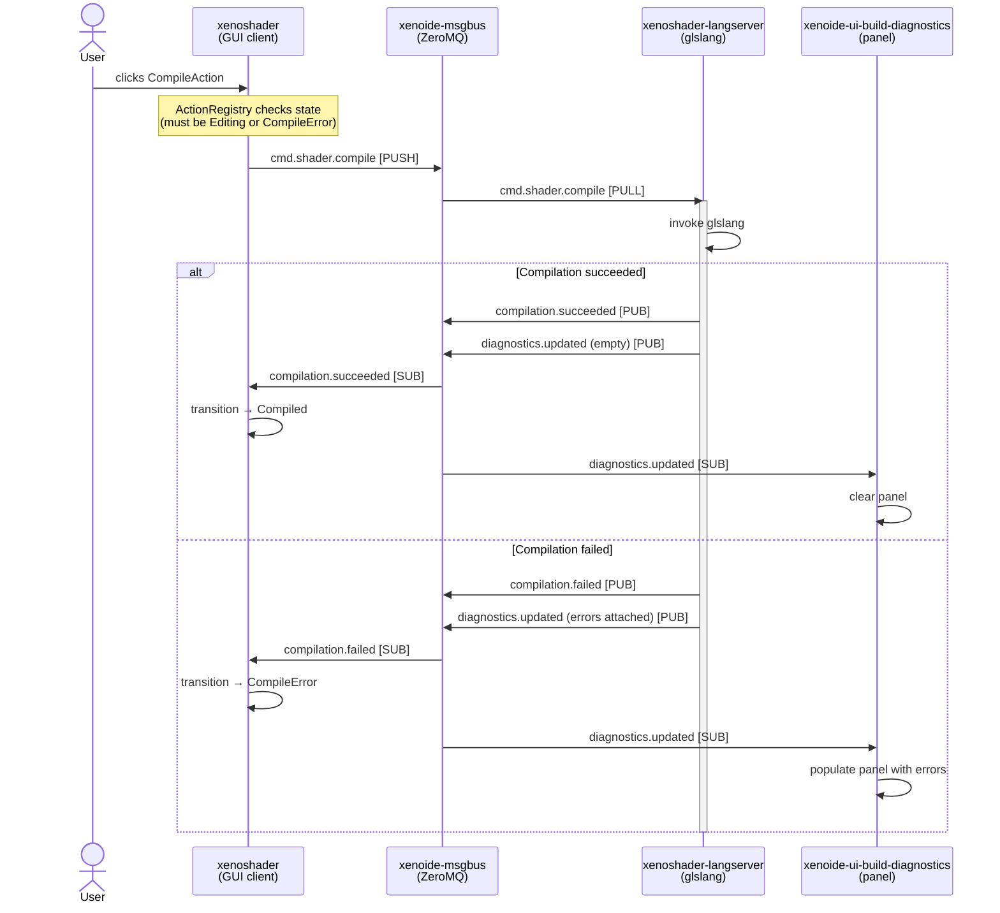
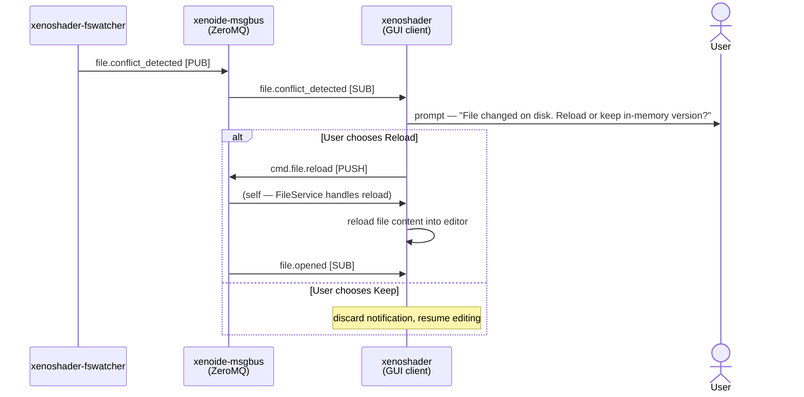
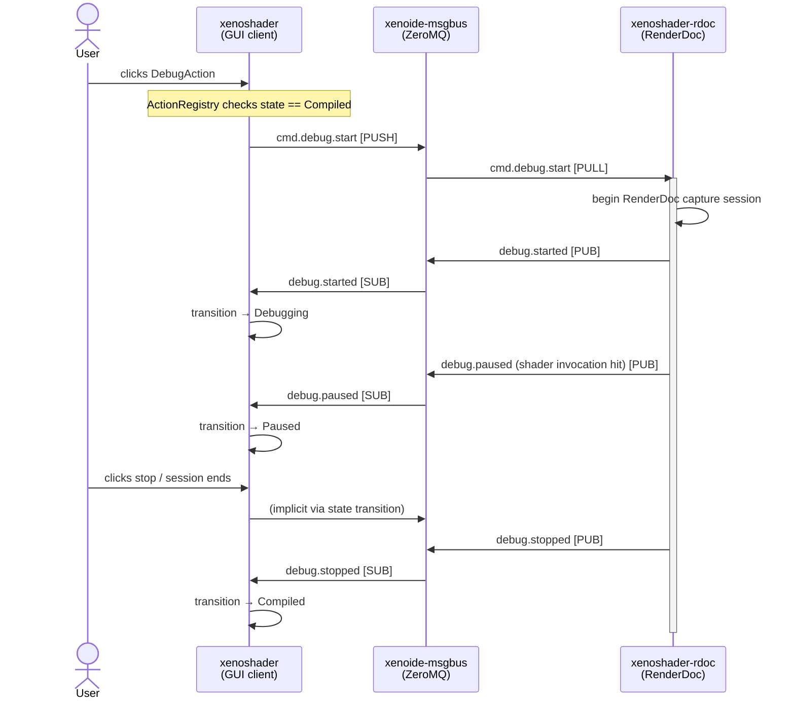

# Command / Event Flow — Sequence Diagrams

Mermaid `sequenceDiagram`. Two representative flows are shown: shader compilation and file-conflict resolution.

---

## 1. Shader Compile Flow

---

## 2. File-Conflict Resolution Flow

---

## 3. Debug Session Flow

