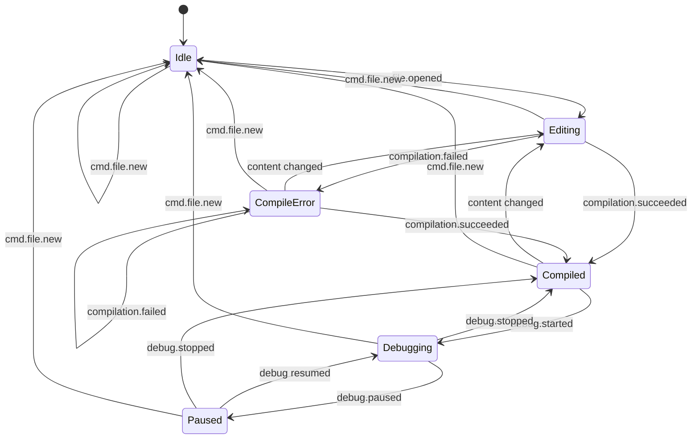

# Application State Machine

Mermaid `stateDiagram-v2`. Renderable on GitHub, GitLab, Obsidian, and the Mermaid Live Editor.

## Notes

- `cmd.file.new` is valid in all states; it always returns to `Idle`.
- `CompileError → CompileError` represents a re-compile that still fails.
- The `Debugging` / `Paused` sub-cycle maps directly to the RenderDoc capture / step loop.
- `content changed` is an internal editor event, not a bus message; it is detected locally by the GUI process.
