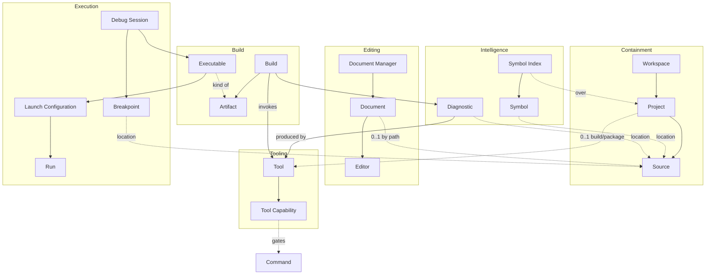

# Xenoide IDE — Domain Model

The canonical description of the entities, relationships, and invariants of the code-editing domain. Terms are defined in @GLOSSARY.md; architectural patterns and archetypes live in @ARCHITECTURE.md.

The model is a **single unified domain**: a full IDE and an SDI code editor are the same entities at different cardinalities (an SDI editor is a `Document Manager` holding one `Document`). Related tooling (`Build System`, `Package Manager`, `Debugger`, `Language Server`, `Refactoring Engine`, `Terminal`, `Profiler`, `File Watcher`) all attach as `Tool`s.

## Overview

Solid arrows denote ownership/composition; dotted arrows denote references. Cardinalities are given in each section below.

## Containment

- **Workspace** — the optional top-level container of a development session. References a root folder and holds the open Projects. Enables monorepos and multi-project sessions.
- **Project** — a buildable unit: a root folder, its Build System and Package Manager (each `0..1`), and the Artifacts it produces. Owns its Sources.
- **Source** — a source-code file. Belongs to at most one Project, or is opened standalone (a bare file).

### Relationships

- `Workspace` 1 → 0..N `Project`
- `Project` 1 → 0..N `Source`
- `Project` 1 → 0..1 `Build System` (a `Tool`)
- `Project` 1 → 0..1 `Package Manager` (a `Tool`)

## Editing

- **Document** — the in-memory unit of editing: the content, a dirty flag, and undo/redo history. References at most one `Source`, by path. A Document created from memory (unsaved) has no Source until first save, at which point a Source is created.
- **Editor** — a pane bound to exactly one `Document`. Holds per-pane state (caret, selection). A Document may be shown in 1..N Editors (split view, or multiple representations such as source text plus a derived view).
- **Document Manager** — the owner of the open Documents. An SDI editor is a Document Manager restricted to one Document.

### Relationships

- `Document Manager` 1 → 0..N `Document`
- `Document` 1 → 0..1 `Source` (by path reference)
- `Document` 1 → 1..N `Editor`
- `Editor` N → 1 `Document`

## Intent and Occurrence

- **Command** — a named operation the user invokes on the domain (Open, Save, Build, Debug, Refactor). A Command is available only when the required Tool Capabilities are advertised.
- **Event** — a named occurrence reported by the system (BuildFinished, DiagnosticPublished, DebugPaused).

## Tooling

- **Tool** — any external capability the IDE drives or integrates. Two kinds:
  - **Invoked Tool** — transient: each operation is a fresh invocation that runs and returns output. Examples: `Build System`, `Compiler`, `Package Manager`.
  - **Server Tool** — long-running: has a start→run→stop lifecycle, holds internal state, and streams events. Examples: `Language Server`, `Debugger`, `Refactoring Engine`, `Terminal`, `Profiler`, `File Watcher`.
- **Tool Capability** — a discrete ability a `Tool` advertises (e.g. a `Debugger` → `conditional-breakpoints`, `disassembly`; a `Language Server` → `go-to-definition`, `hover`). A Command is invocable only when the configured Tool advertises the matching Tool Capability.

### Relationships

- `Tool` 1 → 0..N `Tool Capability`
- `Tool Capability` gates 0..N `Command`

## Intelligence

- **Symbol** — a named, addressable code element (function, class, variable, type, macro, …) with a location in a `Source`, and its declaration / definition / references.
- **Symbol Index** — the queryable model of Symbols across a Project's Sources, maintained by a Server Tool (Language Server) or a dedicated indexer. Powers navigation, completion, refactoring, Class Explorer, and Code Structure view.
- **Diagnostic** — information about a specific location in a `Source`: a severity (error / warning / note), the producing `Tool`, and a location (Source + line/column).

### Relationships

- `Symbol Index` 1 → 0..N `Symbol`
- `Symbol` N → 1 `Source` (location)
- `Diagnostic` N → 1 `Source` (location)
- `Diagnostic` N → 1 `Tool` (producer)

## Build

- **Artifact** — a file produced by a `Build`. The set of kinds is determined by the language/tech stack: native compiled languages produce `Executable`, `Static Library`, `Dynamic Library`; shading languages produce a `Shader Program` (or no artifact at all, only Diagnostics — e.g. `glslLangValidator`).
- **Executable** — a runnable, debug-capable Artifact (optionally carrying debug information).
- **Build** — an operation that runs a Build System (an Invoked Tool) over a Project to produce Artifacts and Diagnostics. Has a status: `InProgress` / `Succeeded` / `Failed`.
- **Compile** — a Build scoped to a single Source (so "compile this `.glsl`" is a one-file Build).

### Relationships

- `Project` 1 → `Build System` —invoked by→ `Build`
- `Build` 1 → 0..N `Artifact`
- `Build` 1 → 0..N `Diagnostic`
- `Compile` is a `Build` whose scope is one `Source`

## Execution

- **Launch Configuration** — how to start an `Executable`: the artifact, command-line arguments, environment variables, and working directory. `0..N` per Executable. Hierarchical: created from scratch or from a template; created on demand by the user.
- **Run** — starting an `Executable` from a Launch Configuration without a debugger.
- **Debug Session** — a stateful session in which a `Debugger` (Server Tool) controls a running `Executable`. States: `Running` / `Paused` / `Stopped`. Owns Breakpoints and exposes the Call Stack, Variables, Memory, and Disassembly (derived views of session state).
- **Breakpoint** — a pause location (`Source` + line) with an enabled/disabled state. A **conditional** Breakpoint fires when a predicate is true. Debugging capabilities (conditional breakpoints, disassembly, memory inspection, …) are advertised by the configured `Debugger`.

### Relationships

- `Executable` 1 → 0..N `Launch Configuration`
- `Launch Configuration` N → 1 `Executable`
- `Debug Session` 1 → 1 `Executable`
- `Debug Session` 1 → 1 `Debugger` (Server Tool)
- `Debug Session` 1 → 0..N `Breakpoint`
- `Breakpoint` N → 1 `Source` (location)

## State

The domain model records **intrinsic** entity state as building blocks — e.g. `Document.dirty`, `Build.status`, `Debug Session.state`, `Server Tool.lifecycle`. These are generic/abstract: each application composes them into its own **concrete** application-level state machine (e.g. an app derives `Compiled` from "last Build Succeeded" and `Paused` from "Debug Session state is Paused"). Application-level state machines are application-specific and are documented alongside the application (see @specs/APP-XENOSHADER.md), not here.

## Invariants

- A `Document` references at most one `Source`, by path; an unsaved Document references none.
- A `Document` is displayed in at least one `Editor` while open.
- A `Command` is invocable only when every `Tool Capability` it requires is advertised by the configured `Tool`.
- A `Diagnostic` is produced by exactly one `Tool` and located in exactly one `Source`.
- A `Build` produces Artifacts whose kinds are determined by the Project's language/tech stack.
- A `Debug Session` controls exactly one `Executable` through exactly one `Debugger`.
