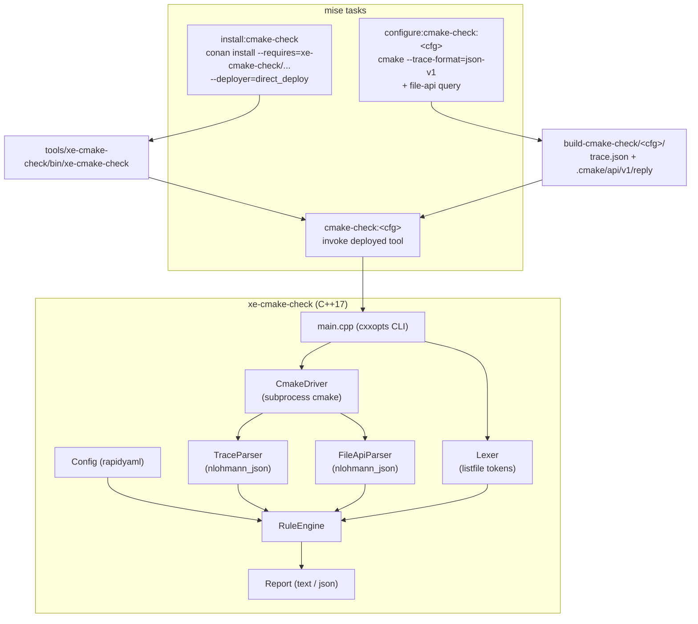

# Implementation Plan: `xe-cmake-check` — Native CMake Style Checker

## Goal Description

Formalize the conventions documented in `docs/CMAKE.md` into an automated **style
checker** for the monorepo. The checker is a native **C++17 CLI tool**
(`xe-cmake-check`), packaged as a local Conan recipe (mirroring `glazer`), and
wired into `mise` tasks.

The tool is a **checker only** — it does not auto-format files. It validates all
in-scope CMake files and reports rule violations with a non-zero exit code on
errors, so it can gate developer workflows and CI.

Parsing is split across two layers:

- **Semantic layer** — drives the installed `cmake` binary via
  `--trace-format=json-v1` and the **CMake File API** (`codemodel` v2 +
  `cmakeFiles`). This provides version-accurate, official parse products (no
  vendored CMake source, no linking against CMake internals).
- **Lexical layer** — a small hand-written CMake listfile lexer over the raw
  files, needed because CMake's trace/file-api discard whitespace, comments and
  exact token spans.

---

## User Review Required

> [!IMPORTANT]
> **Locked decisions** (confirmed during design review):
>
> | Decision        | Choice                                                             |
> | --------------- | ------------------------------------------------------------------ |
> | Tool name       | `xe-cmake-check`                                                   |
> | Capability      | Checker only (no formatter)                                        |
> | Language        | C++17 native (Catch2-tested, zero warnings)                        |
> | Parsing         | Subprocess `cmake` (trace + File API) + own lexer                  |
> | Packaging       | `conan/recipes/xe-cmake-check/` (`package_type = "application"`)   |
> | Tool location   | Conan deployer → `tools/xe-cmake-check/bin/xe-cmake-check`         |
> | Config format   | YAML → `.cmake-check.yaml` via `rapidyaml`                         |
> | JSON parsing    | `nlohmann_json` (trace + File API)                                 |
> | CLI parsing     | `cxxopts` (consistent with `glazer`)                               |
> | Tool build type | `Release` for the checker binary itself                            |
> | Scope           | `src/engine`, `src/ide`, `src/pocs` + `src/cmake/*.cmake`          |

> [!WARNING]
> **`docs/CMAKE.md` must be reconciled before rules are encoded.** The current
> guide contradicts the actual codebase in several places:
>
> 1. **Target vs folder naming.** The guide says *"Target name should have the
>    same name as the folder"*, but real folders are `libxe-*` / `libxenoide-*`
>    while targets drop the `lib` prefix (e.g. `libxe-imageloader-il` → target
>    `xe-imageloader-il`; `libxe-core` → `xe-core`). The confirmed rule is
>    type-dependent (see **R2**).
> 2. **Space before parenthesis.** The guide writes `set (target ...)` but also
>    `add_executable(${target} ...)` — inconsistent. **R2/L1** assume the modern
>    no-space form (`set(`), matching most existing call sites.
> 3. **Typo.** The guide uses the non-existent command `target_link_library`
>    (singular); the real command is `target_link_libraries`.
> 4. **Link keyword ordering.** The guide does not mandate explicit
>    `PUBLIC`/`PRIVATE`/`INTERFACE`, yet the confirmed rule requires them, in the
>    fixed order `PUBLIC` → `PRIVATE` → `INTERFACE`.
>
> The existing code will not pass the new rules until these are resolved and the
> codebase is brought into compliance (see **Adoption Strategy**).

> [!NOTE]
> **Test targets are a special case.** A target is classified as a *test* if any
> of the following hold: its folder name ends with `-test`, it links
> `Catch2::Catch2WithMain`, or it calls `catch_discover_tests`. Test targets are
> validated by **R2c** (strip `lib`, require `-test` suffix), not R2b.

---

## Architecture & Layout Plan



### Parsing pipeline (per subproject, per configuration)

1. The `configure:cmake-check:<cfg>` task issues a config-independent
   **File API query** (`codemodel` v2 + `cmakeFiles`) by writing
   `build-cmake-check/<cfg>/.cmake/api/v1/query/client-xe-cmake-check/query.json`.
2. It configures with trace enabled:
   `cmake --preset conan-<cfg> --trace-format=json-v1 --trace-redirect=<dir>/trace.json`.
3. `xe-cmake-check` consumes:
   - `trace.json` — every executed command with `file`, `line`, `line_end`,
     `cmd`, `args` (semantic rules R4, R5, R6, R7).
   - File API `codemodel` v2 — folders, targets, source attribution
     (semantic rules R1, R2, R3).
   - File API `cmakeFiles` — authoritative list of every listfile CMake read,
     used to enumerate raw files for the lexical pass (L1–L6).
4. Lexer parses each enumerated raw file; the rule engine evaluates all enabled
   rules; the reporter prints findings (human-readable by default, `--json` for
   machines).

> [!NOTE]
> A dedicated `build-cmake-check/<cfg>/` directory (analogous to `build-tidy/`)
> keeps the normal build tree untouched and guarantees the trace/file-api data
> is fresh.

---

## Proposed Changes

### Component 1: Conan Recipe & Build (`conan/recipes/xe-cmake-check/`)

Mirrors the existing `glazer` recipe structure.

```
conan/recipes/xe-cmake-check/
├── conanfile.py
├── CMakeLists.txt
├── cmake/                     # shared warning/flag helper modules
├── src/
│   ├── main.cpp               # CLI entry point
│   ├── cli/                   # cxxopts argument parsing
│   ├── lexer/                 # CMake listfile lexer
│   ├── driver/                # cmake subprocess invocation
│   ├── parsers/               # trace + file-api JSON consumers
│   ├── rules/                 # rule engine + individual rules
│   ├── config/                # rapidyaml config loader
│   └── report/                # text / JSON reporting
└── test/                      # Catch2 v3 unit tests
```

##### `conan/recipes/xe-cmake-check/conanfile.py`

```python
class XeCmakeCheckConan(ConanFile):
    name = "xe-cmake-check"
    version = "0.0.0"
    description = "Xenoide CMake style checker"
    license = "MIT"
    package_type = "application"

    settings = "os", "compiler", "build_type", "arch"

    options = {"with_tests": [True, False]}
    default_options = {"with_tests": False}

    exports_sources = "CMakeLists.txt", "cmake/*", "src/*"

    def requirements(self):
        self.requires("nlohmann_json/3.12.0")
        self.requires("rapidyaml/0.7.2")   # exact version TBD at implementation
        self.requires("cxxopts/3.3.1")
        self.requires("fmt/10.2.1")

    def build_requirements(self):
        if self.options.with_tests:
            self.test_requires("catch2/3.7.1")

    def layout(self): ...
    def generate(self): ...   # CMakeDeps + CMakeToolchain; XE_CMAKE_CHECK_WITH_TESTS
    def build(self): ...      # configure / build / (test)
    def package(self): ...    # copy binary into <pkg>/bin
    def package_info(self):   # buildenv_info.prepend_path("PATH", bindir)
```

##### `conan/recipes/xe-cmake-check/CMakeLists.txt`

Standard C++17 project header (see `glazer/CMakeLists.txt`), with:
- `CMAKE_CXX_STANDARD 17`, `CMAKE_CXX_EXTENSIONS OFF`, `CMAKE_EXPORT_COMPILE_COMMANDS ON`.
- Flattened runtime output (`CMAKE_RUNTIME_OUTPUT_DIRECTORY = ${CMAKE_BINARY_DIR}/bin`).
- Self-contained `xe-cmake-check-interface` INTERFACE target carrying
  `-Wall -Wextra -Werror` (`/W4 /WX` on MSVC), linked by all sub-targets.
- `option(XE_CMAKE_CHECK_WITH_TESTS OFF)`; when ON, `include(CTest)`,
  `enable_testing()`, `find_package(Catch2 3 CONFIG REQUIRED)`.

---

### Component 2: Tool Sources

| Component       | Responsibility                                                                                       |
| --------------- | ---------------------------------------------------------------------------------------------------- |
| `cli/`          | `cxxopts`-based parsing: `--project`, `--build-dir`, `--config`, `--rules`, `--report`, `--werror`.    |
| `lexer/`        | Tokenize CMake listfiles (unquoted/quoted/bracket args, comments, newlines) preserving exact spans.   |
| `driver/`       | Locate and invoke `cmake`; resolve build/prepare the File API query; capture trace output.            |
| `parsers/`      | `nlohmann_json` readers for `trace.json` (json-v1) and File API `codemodel`/`cmakeFiles` replies.      |
| `rules/`        | Rule registry keyed by stable IDs; semantic + lexical rule implementations; severity handling.         |
| `config/`       | `rapidyaml` loader for `.cmake-check.yaml`; defaults; discovery by walking up from the target.         |
| `report/`       | Findings model; human-readable and `--json` renderers; exit-code policy.                              |
| `main.cpp`      | Wire everything together.                                                                             |

**Exit-code policy:** `0` if no `error`-level findings; `1` if any `error`-level
finding; `2` on tool/usage failure. `warn` findings are printed but do not fail
(unless `--werror`).

---

### Component 3: Rule Catalog

Rule IDs are stable and referenced verbatim in `.cmake-check.yaml`.

#### Semantic rules (File API + trace)

| ID   | Rule                    | Definition                                                                                                             |
| ---- | ----------------------- | ---------------------------------------------------------------------------------------------------------------------- |
| R1   | `one_target_per_folder` | Each folder containing a `CMakeLists.txt` defines **at most one** real target (`add_executable`/`add_library`/`add_custom_target`), excluding pure `ALIAS` targets. |
| R2a  | `library_name`          | For **library** targets: `target == folder_name` with a leading `lib` stripped (`libxe-math` → `xe-math`).              |
| R2b  | `executable_name`       | For **executable** targets (non-test): `target == folder_name` exactly.                                                 |
| R2c  | `test_name`             | For **test** targets: `target == strip_lib(folder_name)` **and** ends with `-test` (`libxe-math-test` → `xe-math-test`). |
| R3   | `target_location`       | Every target is defined under `src/engine`, `src/ide`, or `src/pocs` only.                                             |
| R4   | `link_keywords`         | Every `target_link_libraries` dependency carries an explicit `PUBLIC`/`PRIVATE`/`INTERFACE` keyword; **one dependency per line**; keyword groups appear in the order `PUBLIC` → `PRIVATE` → `INTERFACE`. |
| R5   | `include_directories`   | Library targets declare `target_include_directories(${target} <scope> <dir>)`.                                          |
| R6   | `known_commands`        | No unknown/misspelled command names (configure-time errors); explicitly flag the `target_link_library` singular typo.   |
| R7   | `catch2_test_pattern`   | Test targets link `Catch2::Catch2WithMain` (`PRIVATE`), and use `include(Catch)` + `catch_discover_tests(${target})`.    |

#### Lexical rules (own lexer)

| ID  | Rule                     | Definition                                                                                   |
| --- | ------------------------ | -------------------------------------------------------------------------------------------- |
| L1  | `space_before_paren`     | Command name and opening `(` are adjacent: `set(`, not `set (`.                              |
| L2  | `whitespace`             | Spaces only (no tabs), 4-space indentation, no trailing whitespace.                          |
| L3  | `line_length`            | Maximum 180 columns (aligned with `.clang-format`'s `ColumnLimit: 180`).                     |
| L4  | `quoting`                | Source lists use consistent quoting (all args quoted, or all unquoted) within a single list. |
| L5  | `blank_lines`            | At most one consecutive blank line; single blank line between logical blocks.                |
| L6  | `no_commented_out_code`  | No commented-out CMake code inside argument lists (e.g. `# "src/Foo.cpp"`).                  |

---

### Component 4: Configuration (`.cmake-check.yaml`)

Placed at repo root; discovered by walking up from each checked target, with
`--config` override. Absence of a file ⇒ built-in defaults equal to the
documented rules. Severities: `off` | `warn` | `error`.

```yaml
line_length: 180
indent: 4
rules:
  R1.one_target_per_folder: error
  R2a.library_name:         error
  R2b.executable_name:      error
  R2c.test_name:            error
  R3.target_location:       error
  R4.link_keywords:         error
  R5.include_directories:   error
  R6.known_commands:        error
  R7.catch2_test_pattern:   error
  L1.space_before_paren:    error
  L2.whitespace:            error
  L3.line_length:           warn
  L4.quoting:               warn
  L5.blank_lines:           warn
  L6.no_commented_out_code: warn
exclude:
  - "conan/recipes/**"
  - "build*/**"
```

CLI precedence: command-line flags > `.cmake-check.yaml` > built-in defaults.

---

### Component 5: Mise Wiring

Mirrors the `install`/`configure`/`tidy` task families.

##### Tool bootstrap — `install:cmake-check`

```bash
conan install --requires=xe-cmake-check/0.0.0@xenoide/xenoide \
    --build=missing -s build_type=Release \
    --deployer=direct_deploy \
    --deployer-folder="$REPO_ROOT/tools/xe-cmake-check" \
    -pr:h "$(conan_profile)" -pr:b "$(conan_profile)"
```

The binary lands at a deterministic path:
`tools/xe-cmake-check/bin/xe-cmake-check`.

##### Trace configure — `configure:cmake-check:{release,debug}`

For each selected subproject: create the File API query, then configure with
`--trace-format=json-v1 --trace-redirect=` into `build-cmake-check/<cfg>/`.

##### Check — `cmake-check:{release,debug}` / `cmake-check`

Invoke `tools/xe-cmake-check/bin/xe-cmake-check --project <sel> --build-dir …`.

##### New files

```
mise/install-cmake-check.sh    mise/install-cmake-check.ps1
mise/configure-cmake-check.sh  mise/configure-cmake-check.ps1
mise/cmake-check.sh            mise/cmake-check.ps1
```

##### `mise.toml` task graph

```
install:cmake-check
        └─> configure:cmake-check:release ─> cmake-check:release
        └─> configure:cmake-check:debug   ─> cmake-check:debug
                                              └─> cmake-check  (both)
```

`export-recipes.sh` already discovers `conan/recipes/xe-cmake-check/` and
exports it as `xe-cmake-check/<version>@xenoide/xenoide` (version declared in
`conanfile.py`), so no change is required there.

---

### Component 6: Tests (`conan/recipes/xe-cmake-check/test/`)

Catch2 v3 unit tests covering:

- **Lexer** — tokenization fixtures (quoted/unquoted/bracket args, comments,
  multi-line commands, escapes).
- **Parsers** — golden JSON fixtures for trace json-v1 and File API codemodel /
  cmakeFiles.
- **Rule engine** — one pass/fail pair per rule ID (R1–R7, L1–L6).
- **Config** — YAML loading, severity overrides, discovery/`--config`, defaults.
- **Reporting & exit codes** — text/JSON output; `error` vs `warn` exit policy.

---

### Component 7: Documentation

- **`docs/CMAKE.md`** — reconcile the four contradictions above; fix the
  `target_link_library` typo; document the type-dependent naming rule (R2),
  explicit link keywords with `PUBLIC` → `PRIVATE` → `INTERFACE` ordering, and
  cross-link this plan.
- **`AGENTS.md`** — add a `cmake-check` step to the implementation checklist
  (after Ensure Dependencies / before or after static analysis).
- **`docs/plans/CMAKE_STYLE_CHECKER_PLAN.md`** — this document.

---

## Adoption Strategy

The existing codebase will not pass the new rules immediately (tabs in
`libxe-core/CMakeLists.txt`, missing link scopes, `set (` spacing, misaligned
lists, etc.). Because the tool is checker-only, adoption must be deliberate:

1. **Phase A — land tooling in `warn` mode.** All rules default to `warn`;
   `cmake-check` reports without failing. Measure the violation surface.
2. **Phase B — bring the codebase into compliance** (manual/scripted fixes,
   rule by rule), then flip rules to `error` in `.cmake-check.yaml`.
3. **Optional baseline.** If full compliance is deferred, add a
   `--baseline <file>` mode that records accepted findings and only fails on
   new ones. *(Recommended follow-up; not required for v1.)*

---

## Verification Plan

### Automated

```bash
# 1. Export local recipes (publishes xe-cmake-check)
mise run export-recipes

# 2. Deploy the checker binary
mise run install:cmake-check

# 3. Configure trace + File API for all subprojects
mise run configure:cmake-check:release

# 4. Run the checker
mise run cmake-check:release            # or --project engine|ide|pocs
```

### Tool self-tests

```bash
# Build + run the tool's own Catch2 suite
cd conan/recipes/xe-cmake-check
conan install . --build=missing -o with_tests=True -s build_type=Release
conan build . -o with_tests=True -s build_type=Release
```

### Manual verification

- Confirm `tools/xe-cmake-check/bin/xe-cmake-check --help` documents the CLI.
- Confirm the checker reports a known-bad fixture and passes a known-good fixture.
- Confirm zero-warning compilation of the tool (`-Wall -Wextra -Werror`).
- Confirm `mise run cmake-check` exits non-zero only on `error`-level findings.

---

## Risks & Open Items

| # | Item                                                                                   | Disposition                                   |
| - | -------------------------------------------------------------------------------------- | --------------------------------------------- |
| 1 | `rapidyaml` exact Conan package name/version and CMake target (`ryml`).                 | Verify at implementation.                     |
| 2 | Trace only covers commands that **execute** (skips `if(FALSE)`/disabled branches).      | Acceptable; lexical pass covers all listfiles.|
| 3 | BOM/multi-config generator paths for the deployed binary (MSVC `bin/Debug/`).            | Handle in `install-cmake-check.ps1` (mirror `glazer` package globs). |
| 4 | Semantic layer requires an install+configured build tree.                               | `cmake-check` depends on `configure:cmake-check` (as `tidy` depends on configure). |
| 5 | Large pre-existing violation surface.                                                   | Phased adoption + optional baseline (above).  |

---

## Out of Scope (v1)

- Auto-formatting / in-place rewrites.
- Inline suppression comments (e.g. `# cmake-check: disable=R4`) — candidate for v2.
- User-defined custom rules / DSL — not planned.
- Checking `conan/recipes/**` (treated as out of scope; excluded by config).
