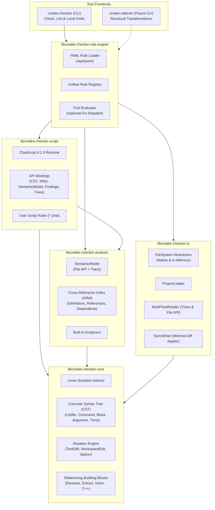
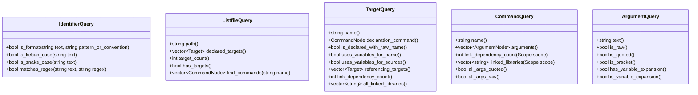

# Implementation Plan: `cmake-checker` v2 — Graph-Based Analysis, Declarative Rules & Extensible Scripting

## Goal Description

Evolve `cmake-checker` (v1, see [CMAKE_STYLE_CHECKER_PLAN.md](file:///home/fapablaza/Desktop/nativedevcl/Xenoide/docs/plans/CMAKE_STYLE_CHECKER_PLAN.md)) from a **checker-only** tool with hardcoded rules into a **fix-capable, rule-driven, and scriptable** platform. The architecture is centered on an **in-memory Concrete Syntax Tree (CST) and Semantic Cross-Reference (XRef) Graph** of the CMake project structure.

This platform encompasses two primary capabilities:
1. **Capability 1: Check & Local Fix (`cmake-checker`)** — The primary focus of this v2 plan. Validates style conventions, structure, and constraints via declarative YAML rules and embedded [ChaiScript](file:///home/fapablaza/Desktop/nativedevcl/Xenoide/src/cmake-checker/conanfile.py) scripts, producing diagnostics with **strictly optional** surgical fixits.
2. **Capability 2: Semantic Refactoring (`cmake-refactor`)** — A planned extension (separate CLI / future plan). Provides safe, structural transformations across the project (e.g. target renaming, extracting functions from blocks, inlining functions) implemented as C++ primitives and orchestrated through ChaiScript. The graph model, analyzer, and mutation engine in v2 are explicitly architected to support this future capability.

---

## User Review Required (Locked Decisions)

> [!IMPORTANT]
> **Locked decisions** (confirmed during design review):

| Decision | Choice | Details |
| :--- | :--- | :--- |
| **Rule Definition** | **Hybrid YAML DSL + ChaiScript** | Users declare common rules in a YAML DSL or write custom matchers/fixers in ChaiScript without recompiling the binary. |
| **Scripting Engine** | **ChaiScript 6.1.0** | Available via ConanCenter (`chaiscript/6.1.0`, header-only, C++17 compatible). |
| **Fixit Philosophy** | **Strictly Optional Fixits** | Rules detect violations; providing an automatic fix (`fix:`) is optional. Findings without fixits report as diagnostics requiring manual intervention. |
| **Graph Model** | **Concrete Syntax Tree (CST) + XRef** | Lossless trivia preservation (comments, whitespace, exact spans) with parent/sibling pointers and project-wide cross-reference indices. |
| **Write-back** | **Surgical Minimal-Diff** | Untouched bytes stay identical; only mutated spans are spliced. Supports multi-file transactional edits (`WorkspaceEdit`). |
| **Two-Phase Tooling** | **Check (now) vs Refactor (future)** | `cmake-checker` handles style and local fixes. Refactoring primitives (rename, extract/inline function) reside in C++ building blocks, ready for future orchestration. |
| **Dependencies** | **Conan 2.x packages** | `chaiscript/6.1.0`, `rapidyaml/0.7.1`, `nlohmann_json/3.12.0`, `cxxopts/3.3.1`, `fmt/[>=11 <12]`, `catch2/3.14.0`. |
| **Migration** | **Big-Bang Rewrite** | Replace v1 internal architecture; verify against frozen v1 golden diagnostics. |

---

## Architecture & Layout Plan



### Dependency Hierarchy

`libcmake-checker-core <- libcmake-checker-io <- libcmake-checker-analysis <- libcmake-checker-script <- libcmake-checker-rule-engine <- cmake-checker`

- **`libcmake-checker-core`**: CST data structures, token stream, source spans, transactional mutations (`WorkspaceEdit`), pure text splice, and core refactoring algorithms in C++. No filesystem or scripting dependencies.
- **`libcmake-checker-io`**: Filesystem interfaces (`NativeFileSystem`, `InMemoryFileSystem`), file discovery, CMake trace/File-API readers, and disk write-back.
- **`libcmake-checker-analysis`**: Semantic facts, target dependency graph, reverse reference index, target classification (libraries, executables, tests).
- **`libcmake-checker-script`**: Embeds ChaiScript 6.1.0. Exposes the internal query, AST/CST, finding, and fix APIs to scripts.
- **`libcmake-checker-rule-engine`**: Loads YAML DSL rule specifications, combines declarative rules with ChaiScript rules, handles severity configuration, evaluates optional fixits.
- **`cmake-checker`**: Thin CLI entry point for checking, linting, golden testing, and applying `--fix`.

---

## Proposed Changes

### Component 1: Library Layout & Conan Dependencies

#### Conan Configuration (`src/cmake-checker/conanfile.py`)
Add `chaiscript/6.1.0` to requirements:
```python
def requirements(self):
    self.requires("nlohmann_json/3.12.0")
    self.requires("rapidyaml/0.7.1", options={"with_default_callback_uses_exceptions": True})
    self.requires("cxxopts/3.3.1")
    self.requires("fmt/[>=11 <12]")
    self.requires("chaiscript/6.1.0")
```

#### Directory Layout
```
src/cmake-checker/src/
├── libcmake-checker-core/            # CST, Lexer, Parser, Spans, Mutations, WorkspaceEdit, Refactoring Primitives
├── libcmake-checker-core-test/
├── libcmake-checker-io/              # FileSystem (native + in-mem), ProjectLoader, BuildTreeReader, SyncWriter
├── libcmake-checker-io-test/
├── libcmake-checker-analysis/        # SemanticModel, XRef Index, Dependency Graph, Semantic Facts
├── libcmake-checker-analysis-test/
├── libcmake-checker-script/          # ChaiScript runtime wrapper, C++ <-> ChaiScript bindings
├── libcmake-checker-script-test/     # ChaiScript script test fixtures
├── libcmake-checker-rule-engine/     # YAML DSL parser, Rule Registry, Diagnostic/Fixit coordinator
├── libcmake-checker-rule-engine-test/
├── cmake-checker/                    # Thin CLI application (check, diff, fix)
└── cmake-checker-test/               # Golden end-to-end regression tests
```

---

### Component 2: Core — CST, Mutations & Refactoring Foundations

#### Concrete Syntax Tree (CST)
To support both **surgical style checking** and **future refactoring**, the syntax tree is concrete and lossless:
- **`SourceSpan`**: Byte offset `[start, end)`, line/column coordinates.
- **`ArgumentNode`**:
  - `value()`: string content.
  - `quote_kind()`: `Raw` (unquoted), `Quoted` (`"..."`), `Bracket` (`[[...]]`).
  - `has_variable_expansion()`: detects presence of `${VAR}` or `ENV{VAR}` expressions.
  - `is_variable_expansion()`: indicates if the entire argument is a variable expansion.
- **`CommandNode`**:
  - `name()`: command name (e.g. `add_library`, `target_link_libraries`).
  - `arguments()`: vector of `ArgumentNode`.
  - `parent()`: pointer to parent `BlockNode` or `ListfileNode`.
  - `trivia_before()`, `trivia_after()`: attached whitespace and comments.
- **`BlockNode`**:
  - Structured statement container: `if/endif`, `foreach/endforeach`, `while/endwhile`, `function/endfunction`, `macro/endmacro`, `block/endblock`.
  - Preserves nested lexical scope for future function extraction/inlining.
- **`ListfileNode`**:
  - Represents a `CMakeLists.txt` or `*.cmake` file.
  - Statements list (interleaved commands, blocks, and trivia).

#### Mutations & WorkspaceEdit
- **`TextEdit`**: Replacement of a `SourceSpan` with replacement text.
- **`WorkspaceEdit`**: Multi-file map of `FilePath -> vector<TextEdit>`, sorted and verified for non-overlapping spans.
- **Pure Splicing**:
  `applyEditsToText(originalText, textEdits) -> updatedText`
  Guarantees byte-identical output for untouched segments.

---

### Component 3: Analysis — Semantic Model & Cross-Reference (XRef)

Combines CMake trace (`json-v1`) and File API (`codemodel-v2`, `cmakeFiles-v1`) data with CST references:
- **Target Declarations**: Links CST `CommandNode` (`add_library`, `add_executable`) to logical targets.
- **Cross-Reference (XRef) Index**:
  - Target-to-file mappings.
  - Target-to-dependencies mappings (resolving library names, imported targets, alias targets).
  - **Reverse Reference Lookup**: Given target $T$, return all targets $\{C_1, C_2, \dots\}$ that link to or depend on $T$.
- **Test Classification**: Flags test targets via folder conventions (`-test`), Catch2 linkage, or `catch_discover_tests`.

---

### Component 4: Internal API Exposed to DSL & ChaiScript

The internal C++ engine exposes a comprehensive query API to both the YAML DSL predicates and ChaiScript scripts. Specifically addressing the 6 required capabilities:



#### Detailed Capability Contract

1. **Identifier Format Check**:
   - `is_format(string identifier, string format_spec)`:
     Supports regex patterns (e.g. `^xe-[a-z0-9\-]+$`) and named conventions (`"kebab-case"`, `"snake_case"`, `"upper-case"`, `"lower-case"`).
2. **Targets in CMakeLists.txt**:
   - `listfile.declared_targets()`: Returns a list of target objects declared within the file.
   - `listfile.target_count()`: Integer count of declared targets.
   - `listfile.has_targets()`: Boolean check for one or more declared targets.
3. **Raw Strings vs. Variables in Target Declarations**:
   - `target.uses_variables_for_name()`: True if the target name argument is constructed using `${...}`.
   - `target.uses_variables_for_sources()`: True if source file lists in `add_executable`/`add_library`/`target_sources` contain variable references.
   - `arg.is_variable_expansion()`: True if the argument is a variable expression (e.g. `${MY_TARGET}`).
   - `arg.is_raw()`: True if the argument is an unquoted literal string.
4. **Library Dependency Counts (`target_link_libraries`)**:
   - **Statement-level**:
     - `cmd.link_dependency_count()`: Number of linked libraries declared in this single `target_link_libraries` command.
     - `cmd.linked_libraries(scope)`: Filter by `PUBLIC`, `PRIVATE`, `INTERFACE`, or all.
   - **Target-level (Aggregated)**:
     - `target.link_dependency_count()`: Total dependencies declared across all `target_link_libraries` commands targeting this entity.
     - `target.all_linked_libraries()`: Full list of referenced library names.
5. **Reverse Target Dependency Lookup**:
   - `target.referencing_targets()` / `graph.find_referencing_targets(target_name)`:
     Returns all targets across the entire project that reference, link to, or depend on the given target. Essential for dead-target detection, coupling metrics, and impact analysis.
6. **Raw Strings vs. Quoted Check**:
   - `arg.is_raw()`: Unquoted literal identifier/string.
   - `arg.is_quoted()`: Double-quoted string (`"..."`).
   - `arg.is_bracket()`: Bracket argument (`[[...]]`).
   - `cmd.arguments_quoted()` / `cmd.arguments_raw()`: Batch inspections for command arguments.

---

### Component 5: Optional Fixits & Rule Execution Engine

#### Decoupling Diagnostics from Fixits
A key architectural principle in v2 is that **catching an error is separate from providing an automated fix**:

- Every violation produces a `Finding`:
  ```cpp
  struct Finding {
      std::string rule_id;
      Severity severity; // Info, Warn, Error
      std::string message;
      SourceLocation location;
      SourceSpan span;
      std::optional<Fix> fix; // Optional!
  };
  ```
- If a rule detects an issue but cannot safely or deterministically fix it, `fix` is `std::nullopt`.
- In `--check` mode: All findings are reported.
- In `--fix` mode:
  - Findings with an attached `Fix` are checked for non-overlapping spans and applied via `WorkspaceEdit`.
  - Findings without a `Fix` are reported to the developer as requiring manual intervention.

#### 1. YAML-Based DSL
The declarative DSL supports optional fix blocks and conditional fix applicability:

```yaml
rules:
  # Check-only rule (no fixit possible or defined)
  - id: target_variable_usage
    severity: warn
    match: { node: target_declaration }
    when: "target.uses_variables_for_name or target.uses_variables_for_sources"
    message: "Target declaration uses variable expansions instead of explicit literals"
    # Note: 'fix:' is omitted completely -> Diagnostic only

  # Check with an optional, safe fixit
  - id: target_link_excessive_deps
    severity: warn
    match: { command: target_link_libraries }
    when: "cmd.link_dependency_count > 10"
    message: "Single target_link_libraries statement declares more than 10 dependencies"
    # Diagnostic only, since restructuring requires human design

  # Check with fixit
  - id: L1.space_before_paren
    severity: warn
    match: { node: command }
    when: "cmd.has_space_before_paren"
    message: "Unexpected space before opening parenthesis"
    fix:
      type: remove_space_before_paren
```

#### 2. ChaiScript Extensibility
Users can define rules and fixers in ChaiScript without modifying or recompiling `cmake-checker`:

```chai
// rules/custom_rules.chai

// Example 1: Check-only rule (Fixit omitted)
register_rule("custom.excessive-dependents", fun(ctx) {
    for (target in ctx.graph.targets()) {
        var consumers = target.referencing_targets();
        if (consumers.size() > 15) {
            ctx.report(Finding(
                "custom.excessive-dependents",
                Severity.Warn,
                "Target '" + target.name() + "' has " + to_string(consumers.size()) + " consumers; consider modularizing",
                target.declaration_command().span()
                // No fix attached -> strictly diagnostic!
            ));
        }
    }
});

// Example 2: Check with optional Fixit
register_rule("custom.quote-file-lists", fun(ctx) {
    for (cmd in ctx.graph.find_commands("set")) {
        for (arg in cmd.arguments()) {
            if (arg.is_raw() && arg.text().ends_with(".cpp")) {
                var fix = Fix("Quote source file path");
                fix.add_edit(TextEdit.replace(arg.span(), "\"" + arg.text() + "\""));

                ctx.report(Finding(
                    "custom.quote-file-lists",
                    Severity.Warn,
                    "Source file in set() must be quoted",
                    arg.span(),
                    fix // Fix attached!
                ));
            }
        }
    }
});
```

---

### Component 6: Future Refactoring Architecture (`cmake-refactor`)

While `cmake-checker` v2 focuses on linting and local fixes, the internal data model is architected to support full-scale CMake refactoring in a subsequent phase:

```
┌───────────────────────────────────────────────────────────┐
│                     Shared Core Engine                    │
│   (CST with Trivia, XRef Index, Scopes, WorkspaceEdits)   │
└─────────────────────────────┬─────────────────────────────┘
                              │
             ┌────────────────┴────────────────┐
             ▼                                 ▼
   ┌───────────────────┐             ┌───────────────────┐
   │   cmake-checker   │             │   cmake-refactor  │
   │    (Capability 1: │             │    (Capability 2: │
   │   Check & Fixits) │             │  Structural XForm)│
   └───────────────────┘             └───────────────────┘
```

#### Refactoring Building Blocks (C++)
Refactoring operations will be implemented in C++ in `libcmake-checker-core` / `libcmake-checker-analysis` to guarantee AST validity, hygiene, and safe transactional application:

1. **`RenameSymbolRefactoring`**:
   - Renames targets, functions, macros, or variables across the monorepo.
   - Uses the XRef index to update target definitions, `target_link_libraries`, alias targets, and export references simultaneously.
2. **`ExtractFunctionRefactoring`**:
   - Takes a contiguous range of statements/blocks.
   - Computes referenced and modified variables (input/output parameters).
   - Generates a new `function(...) ... endfunction()` block and replaces the original slice with the function call.
3. **`InlineFunctionRefactoring`**:
   - Replaces a function call with the function's body, substituting arguments into parameters and handling scope isolation.
4. **`MoveTargetRefactoring`**:
   - Moves target declaration and associated properties from one `CMakeLists.txt` to another, updating directory and target links.

#### ChaiScript Orchestration for Refactoring
In the future refactoring tool, ChaiScript will serve as an orchestration and scripting layer on top of these C++ primitives:
```chai
// Future: refactor_project.chai
var targets = project.find_targets_matching("^xe-legacy-(.*)");
for (t in targets) {
    var new_name = "xe-" + t.match_group(1);
    refactor.rename_target(t.name(), new_name); // Calls C++ RenameSymbolRefactoring
}
refactor.commit(); // Executes atomic WorkspaceEdit
```

---

### Component 7: CLI Frontends & Workflows

#### `cmake-checker` (Capability 1 — This Plan)
```bash
cmake-checker --project <path> [--project-build-dir <path>] [--config <path>] \
              [--rules-dir <path>] [--werror] [--fix] [--diff]
```

- `--project <path>`: Root directory of project to check.
- `--rules-dir <path>`: Directory containing custom `.chai` or `.yaml` rules.
- `--fix`: Apply fixits where available. Unfixable errors remain reported.
- `--diff`: Show unified diffs of proposed fixits without modifying files.
- Exit codes:
  - `0`: Success (no error findings).
  - `1`: Diagnostics present (errors, or warnings under `--werror`, or remaining unfixable findings).
  - `2`: System, syntax, or configuration error.

#### `cmake-refactor` (Capability 2 — Future Plan)
*(Architecture prepared in v2, CLI implemented in subsequent plan)*
```bash
cmake-refactor --project <path> --rename-target <old> <new> [--diff] [--apply]
cmake-refactor --project <path> --script <recipe.chai>
```

---

### Component 8: Testing Strategy

1. **`core-test`**:
   - Tokenizer / Lexer round-trips (including bracket comments and multi-line strings).
   - CST lossless reproduction: parsing unchanged files produces 100% byte-identical serialized text.
   - Pure splice and `WorkspaceEdit` multi-file transaction tests.
2. **`io-test`**:
   - In-memory filesystem tests (directory scans, read/write, concurrent updates).
   - Build-tree reader parsing trace and File-API data into semantic records.
3. **`analysis-test`**:
   - XRef index accuracy: target definitions, dependency counts, reverse reference lookup.
   - Quoting and variable usage detection.
4. **`script-test`**:
   - ChaiScript VM lifecycle and C++ binding evaluations.
   - ChaiScript queries against CST and XRef index.
   - ChaiScript rule registration and finding/fix generation.
5. **`rule-engine-test`**:
   - YAML DSL parsing, predicate evaluations, and rule activation.
   - Optional fixit detection: checking that rules without fixes report diagnostics cleanly.
6. **`cmake-checker-test` (End-to-End)**:
   - Golden regression tests ensuring compatibility with v1 diagnostics on `src/engine`.
   - Golden `--diff` and `--fix` tests on dedicated fixture repositories.

---

## Adoption & Verification Plan

```bash
# 1. Update Conan dependencies and install
mise run export-recipes
mise run install:cmake-check:release

# 2. Build the tool and test suite
mise run build:cmake-check:release

# 3. Run per-library unit tests
src/cmake-checker/build-cmake-check/Release/bin/cmake-checker-core-test
src/cmake-checker/build-cmake-check/Release/bin/cmake-checker-analysis-test
src/cmake-checker/build-cmake-check/Release/bin/cmake-checker-script-test
src/cmake-checker/build-cmake-check/Release/bin/cmake-checker-rule-engine-test
src/cmake-checker/build-cmake-check/Release/bin/cmake-checker-test

# 4. Run style check on engine (verification against v1 baseline)
mise run configure:cmake-check:release
mise run cmake-check:release

# 5. Verify optional fixits preview and apply
mise run cmake-check:release -- --fix --diff
```

---

## Risks & Mitigations

| Risk | Mitigation |
| :--- | :--- |
| **ChaiScript compile times & binary size** | ChaiScript 6.1.0 is header-only and template-heavy. Isolate ChaiScript includes strictly within `libcmake-checker-script` behind a Pimpl/facade so other libraries do not include ChaiScript headers. |
| **ChaiScript exception handling** | Catch ChaiScript runtime exceptions at the rule boundary and report clear script line/error messages rather than terminating the checker. |
| **Fixit conflicts and overlaps** | Sort mutations by file and reverse offset. Reject overlapping mutations in the same pass and report leftovers. |
| **Future refactoring complexity in script** | Keep refactoring primitives (AST surgery, multi-file splice) implemented and validated in C++; expose them to ChaiScript as simple high-level orchestration methods. |