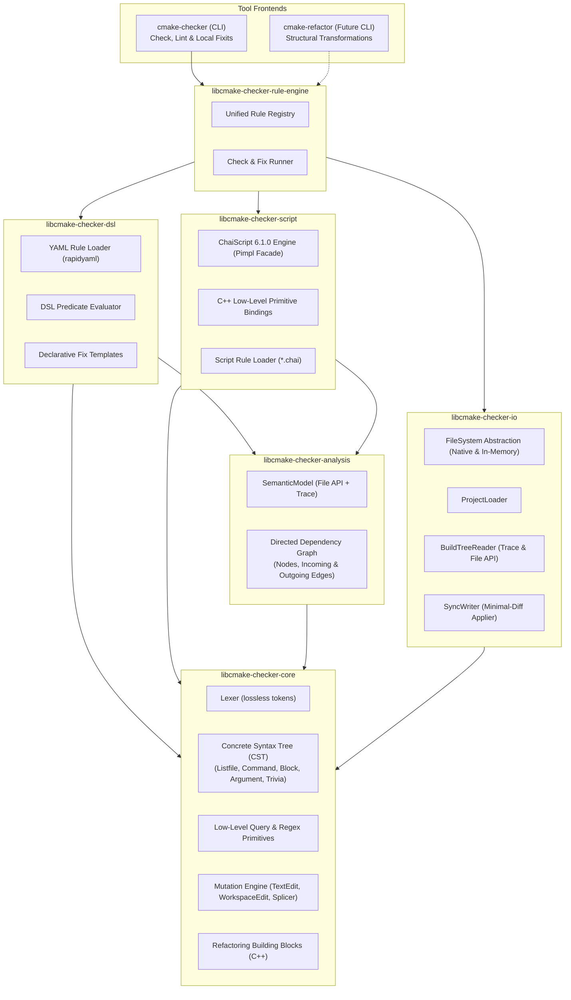

# Implementation Plan: `cmake-checker` v2.2 — Graph-Based Analysis, Declarative DSL & Extensible Scripting

## Goal Description

Evolve `cmake-checker` (v1, see [CMAKE_STYLE_CHECKER_PLAN.md](file:///home/fapablaza/Desktop/nativedevcl/Xenoide/docs/plans/CMAKE_STYLE_CHECKER_PLAN.md)) from a **checker-only** tool with hardcoded rules into an **extensible, rule-driven, and scriptable** platform. The architecture is centered on an **in-memory Concrete Syntax Tree (CST) and Directed Semantic Graph** of the CMake project structure.

The platform is designed around two main capabilities:
1. **Capability 1: Check & Local Fix (`cmake-checker`)** — The core scope of this v2.2 plan. Validates style conventions, target relationships, and syntax rules via declarative YAML rules (`cmake-checker-dsl`) and embedded [ChaiScript](file:///home/fapablaza/Desktop/nativedevcl/Xenoide/src/cmake-checker/conanfile.py) scripts (`cmake-checker-script`). Produces diagnostics with **strictly optional** surgical fixits.
2. **Capability 2: Semantic Refactoring (`cmake-refactor`)** — A planned extension (separate CLI / future plan). Provides safe, structural transformations across the project (e.g. target renaming, extracting functions from blocks, inlining functions) implemented as C++ primitives and orchestrated through ChaiScript. The graph model, analyzer, and mutation engine in v2.2 are explicitly architected to support this future capability.

---

## User Review Required (Locked Decisions)

> [!IMPORTANT]
> **Locked decisions** (confirmed during design review):

| Decision | Choice | Details |
| :--- | :--- | :--- |
| **Separation of Concerns** | **Dedicated DSL & Script Libraries** | `cmake-checker-dsl` owns all YAML DSL parsing and evaluation; `cmake-checker-script` owns ChaiScript embedding and script rule execution. |
| **Low-Level C++ Primitives** | **Lean C++ Core, Computed in Scripts/DSL** | C++ exposes low-level, orthogonal primitives (CST nodes, quotes, string/regex ops, generic directed graph edges). High-level checks are computed within DSL / ChaiScript. |
| **Scripting Engine** | **ChaiScript 6.1.0** | Available via ConanCenter (`chaiscript/6.1.0`, header-only, C++17 compatible). Isolated within `cmake-checker-script`. |
| **Fixit Philosophy** | **Strictly Optional Fixits** | Rules catch errors; providing an automated fix (`Fix`) is optional. Findings without fixes report as diagnostics requiring manual intervention. |
| **Graph Model** | **Concrete Syntax Tree (CST) + Directed Graph** | Lossless trivia preservation (comments, whitespace, exact spans) with parent/sibling pointers and generic directed dependency edges (incoming/outgoing). |
| **Write-back** | **Surgical Minimal-Diff** | Untouched bytes stay identical; only mutated spans are spliced. Supports multi-file transactional edits (`WorkspaceEdit`). |
| **Two-Phase Tooling** | **Check (now) vs Refactor (future)** | `cmake-checker` handles style and local fixes. Refactoring primitives (rename, extract/inline function) reside in C++ building blocks, ready for future orchestration. |
| **Dependencies** | **Conan 2.x packages** | `chaiscript/6.1.0`, `rapidyaml/0.7.1`, `nlohmann_json/3.12.0`, `cxxopts/3.3.1`, `fmt/[>=11 <12]`, `catch2/3.14.0`. |
| **Migration** | **Big-Bang Rewrite** | Replace v1 internal architecture; verify against frozen v1 golden diagnostics. |

---

## Architecture & Layout Plan



### Component Hierarchy & Responsibilities

1. **`libcmake-checker-core` (`cmake-checker-core`)**:
   - CST data structures (`ListfileNode`, `CommandNode`, `ArgumentNode`, `BlockNode`, `TriviaNode`).
   - Token stream, source spans (`SourceSpan`), trivia attachment.
   - Low-level primitives: node navigation (parent, children, siblings), string/regex helpers.
   - Mutation primitives: `TextEdit`, `WorkspaceEdit`, pure text splicer.
   - C++ refactoring building blocks (AST node replacement, subtree splicing).
   - Zero external library dependencies beyond standard C++17.
2. **`libcmake-checker-io` (`cmake-checker-io`)**:
   - `FileSystem` abstraction (`NativeFileSystem`, `InMemoryFileSystem`).
   - `ProjectLoader` (file discovery, listfile reading).
   - `BuildTreeReader` (CMake trace `json-v1` and File API `codemodel-v2` readers).
   - `SyncWriter` (surgical write-back of `WorkspaceEdit` to disk).
3. **`libcmake-checker-analysis` (`cmake-checker-analysis`)**:
   - `SemanticModel`: maps CMake File-API / trace facts to files and targets.
   - `DirectedGraph`: generic directed graph storing targets, files, and dependencies with incoming and outgoing edges.
4. **`libcmake-checker-dsl` (`cmake-checker-dsl`)**:
   - Contains all **YAML DSL code**.
   - YAML schema validation and parsing via `rapidyaml`.
   - Expression evaluator evaluating DSL predicates against the low-level C++ primitives.
   - Declarative fix template appliers.
5. **`libcmake-checker-script` (`cmake-checker-script`)**:
   - Contains all **ChaiScript scripting code**.
   - Embeds ChaiScript 6.1.0 behind an opaque `ScriptEngine` facade (isolating template instantiation and header overhead).
   - Binds low-level C++ primitives (CST nodes, Graph edges, `TextEdit`, `Finding`, `Fix`).
   - Discovers and loads custom `*.chai` rule files.
6. **`libcmake-checker-rule-engine` (`cmake-checker-rule-engine`)**:
   - Coordinates rules from both `cmake-checker-dsl` and `cmake-checker-script`.
   - Manages unified rule table, rule filtering, severity overrides (`error`, `warn`, `info`, `off`).
   - Executes rules across the CST/Graph and collects `Finding`s.
   - Dispatches optional `Fix`es, performing overlap detection and conflict resolution.
7. **`cmake-checker` (CLI application)**:
   - Thin command-line interface using `cxxopts`.
   - Orchestrates loading, checking, `--diff` preview, `--fix` application, and diagnostics reporting.

---

## Proposed Changes

### Component 1: Library Layout & Conan Dependencies

#### Conan Requirements (`src/cmake-checker/conanfile.py`)
```python
def requirements(self):
    self.requires("nlohmann_json/3.12.0")
    self.requires("rapidyaml/0.7.1", options={"with_default_callback_uses_exceptions": True})
    self.requires("cxxopts/3.3.1")
    self.requires("fmt/[>=11 <12]")
    self.requires("chaiscript/6.1.0")
```

#### Directory Layout
```
src/cmake-checker/src/
├── libcmake-checker-core/            # CST, Lexer, Parser, Spans, Mutations, WorkspaceEdit, Splicer
├── libcmake-checker-core-test/
├── libcmake-checker-io/              # FileSystem (native + in-mem), ProjectLoader, BuildTreeReader, SyncWriter
├── libcmake-checker-io-test/
├── libcmake-checker-analysis/        # SemanticModel, Generic Directed Graph (incoming/outgoing edges)
├── libcmake-checker-analysis-test/
├── libcmake-checker-dsl/             # YAML DSL loader (rapidyaml), DSL predicate evaluator
├── libcmake-checker-dsl-test/
├── libcmake-checker-script/          # ChaiScript 6.1.0 runtime, C++ primitive bindings, *.chai loader
├── libcmake-checker-script-test/
├── libcmake-checker-rule-engine/     # Unified rule registry & coordinator, fixit dispatcher
├── libcmake-checker-rule-engine-test/
├── cmake-checker/                    # Thin CLI application (check, diff, fix)
└── cmake-checker-test/               # Golden end-to-end regression tests
```

---

### Component 2: Low-Level C++ Primitives vs. Computed Checks

Rather than hardcoding high-level, opinionated domain checks in C++, the C++ core and analysis layers provide lean, orthogonal **primitives**. The DSL and ChaiScript compose these primitives into high-level rules.

#### 1. Low-Level C++ Primitives Exposed

```mermaid
classDiagram
    class QuoteKind {
        <<enumeration>>
        Raw
        Quoted
        Bracket
    }

    class ArgumentNode {
        +string text()
        +QuoteKind quote_kind()
        +SourceSpan span()
    }

    class CommandNode {
        +string name()
        +vector~ArgumentNode~ arguments()
        +size_t argument_count()
        +ArgumentNode argument(size_t index)
        +SourceSpan span()
        +string file_path()
        +Node* parent()
    }

    class ListfileNode {
        +string path()
        +vector~StatementNode~ statements()
        +vector~CommandNode~ commands()
    }

    class DirectedGraph {
        +vector~string~ node_ids()
        +vector~GraphEdge~ outgoing_edges(string node_id)
        +vector~GraphEdge~ incoming_edges(string node_id)
    }

    class GraphEdge {
        +string source()
        +string target()
        +string attribute(string key)
    }

    class StringPrimitives {
        +bool regex_match(string text, string pattern)
        +bool regex_search(string text, string pattern)
        +bool str_contains(string text, string substr)
        +bool str_starts_with(string text, string prefix)
        +bool str_ends_with(string text, string suffix)
        +vector~string~ str_split(string text, string delim)
    }

    class MutationPrimitives {
        +TextEdit replace(SourceSpan span, string new_text)
        +TextEdit insert_before(size_t offset, string text)
        +TextEdit insert_after(size_t offset, string text)
        +TextEdit remove(SourceSpan span)
    }
```



#### 2. How the 6 Required Checks are Computed in DSL & ChaiScript

| # | Required Check | Low-Level C++ Primitives Used | How Computed in DSL / ChaiScript |
| :--- | :--- | :--- | :--- |
| **1** | **Identifier format check** | `cmd.name()`, `arg.text()`, `regex_match(text, pattern)` | Script/DSL runs regex or prefix/suffix checks on the identifier string. |
| **2** | **One or more targets in CMakeLists.txt** | `file.commands()`, `cmd.name()`, list `size()` | Filter commands where `name in ["add_library", "add_executable", "add_custom_target"]`, then evaluate count (`count > 1` or `count == 0`). |
| **3** | **Target declared via raw strings vs. variables** | `cmd.arguments()`, `arg.text()`, `str_contains(text, "${")` | Inspect target declaration command: check whether target name argument or source arguments contain variable markers (`"${"`). |
| **4** | **Library dependency counts (`target_link_libraries`)** | `cmd.arguments()`, `arg.text()`, `file.commands()` | **Single statement**: iterate `cmd.arguments()` (skipping target at index 0 and scope keywords `PUBLIC`/`PRIVATE`/`INTERFACE`), counting arguments.<br/>**Across statements**: filter all `target_link_libraries` commands in the file/project matching the target, summing dependency counts. |
| **5** | **List all targets referencing a given target** | `graph.incoming_edges(target_name)`, `edge.source()`, `edge.attribute("kind")` | Query incoming edges in the directed graph where edge kind is `"target_link"`. Each `edge.source()` is a consumer/referencing target. |
| **6** | **Names / files specified as raw strings or quoted** | `arg.quote_kind()`, `QuoteKind::Raw`, `QuoteKind::Quoted` | Check `arg.quote_kind() == QuoteKind.Quoted` (or `QuoteKind.Raw`) for specific argument indices (e.g. source files in `add_library` or `set`). |

---

### Component 3: Optional Fixits Architecture

Every rule catches a violation and generates a `Finding`. Attaching an automated fix (`Fix`) is **strictly optional**:

```cpp
// libcmake-checker-core
struct Finding {
    std::string rule_id;
    Severity severity; // Info, Warn, Error
    std::string message;
    std::string file_path;
    SourceSpan span;
    std::optional<Fix> fix; // Optional!
};

struct Fix {
    std::string description;
    std::vector<TextEdit> edits;
};
```

#### How the DSL and Script Layers Handle Optional Fixits

1. **In `cmake-checker-dsl` (YAML)**:
   - **Check-Only Rule**: Omit the `fix:` block entirely. The rule produces diagnostics without a fixit.
   - **Check with Fixit**: Include the `fix:` block referencing a fix template.
   - **Conditional Fixit**: Fix template specifies applicability conditions (e.g., only fixable if the argument is a raw string, not a complex macro expansion). If inapplicable, `fix` remains `nullopt`.

   ```yaml
   rules:
     # 1. Check-Only: Multiple targets declared in single file (cannot be safely auto-split)
     - id: structure.one-target-per-file
       severity: warn
       match: { node: file }
       when: "count(file.commands, c -> c.name in ['add_library', 'add_executable']) > 1"
       message: "CMakeLists.txt declares more than one target; split into separate folders"
       # 'fix:' is omitted -> Diagnostic only

     # 2. Check with Fixit: Space before parenthesis
     - id: style.space-before-paren
       severity: warn
       match: { node: command }
       when: "str_contains(cmd.trivia_before_paren, ' ')"
       message: "Unexpected space before opening parenthesis"
       fix:
         template: remove_space_before_paren
   ```

2. **In `cmake-checker-script` (ChaiScript)**:
   - To report a **diagnostic only**:
     ```chai
     ctx.report(Finding(
         "custom.dependency-budget",
         Severity.Warn,
         "Target '" + target_name + "' has too many dependencies (" + to_string(dep_count) + ")",
         cmd.span()
         // No Fix argument -> Strictly diagnostic!
     ));
     ```
   - To report a **diagnostic with an optional fix**:
     ```chai
     var fix = Fix("Quote source file path");
     fix.add_edit(TextEdit.replace(arg.span(), "\"" + arg.text() + "\""));

     ctx.report(Finding(
         "custom.quote-sources",
         Severity.Warn,
         "Source file should be quoted",
         arg.span(),
         fix // Fix attached!
     ));
     ```

3. **In the CLI Runner (`cmake-checker`)**:
   - In `--check` mode: All findings are formatted and reported.
   - In `--fix` mode:
     - Findings with an attached `Fix` are checked for non-overlapping spans and applied via `WorkspaceEdit`.
     - Findings without an attached `Fix` are displayed with `[manual intervention required]`.
     - Non-zero exit code is returned if unfixable errors remain.

---

### Component 4: Future Refactoring Foundations (`cmake-checker` vs `cmake-refactor`)

The system separates **Capability 1 (Check & Local Fix)** from **Capability 2 (Semantic Refactoring)**:

```
┌─────────────────────────────────────────────────────────────────┐
│                       Shared Core Engine                        │
│   (CST with Trivia, Directed Dependency Graph, WorkspaceEdit)   │
└───────────────────────────────┬─────────────────────────────────┘
                                │
               ┌────────────────┴────────────────┐
               ▼                                 ▼
     ┌───────────────────┐             ┌───────────────────┐
     │   cmake-checker   │             │   cmake-refactor  │
     │   (Capability 1:  │             │   (Capability 2:  │
     │  Style, Lint, Fix)│             │ Refactoring CLI)  │
     └───────────────────┘             └───────────────────┘
```

#### Architectural Readiness in v2.2
To prepare for future refactoring without having to redesign the core later:
1. **Concrete Syntax Tree (CST)**: Full trivia (comments, blank lines, indentation) is preserved on every node. Nodes maintain parent and sibling pointers.
2. **Directed Graph & Cross-References**: The generic directed graph tracks definitions and references (target declarations, link edges, consumers). Reverse edges (`incoming_edges`) allow instantaneous consumer lookups for renames.
3. **Transactional WorkspaceEdit**: Multi-file edits are collected into an atomic transaction (`FilePath -> vector<TextEdit>`), sorted in reverse-offset order to maintain coordinate validity.
4. **C++ Refactoring Primitives**: High-complexity AST surgeries are implemented in C++ in `libcmake-checker-core`:
   - `RenameSymbolRefactoring`: Renames target definitions, `target_link_libraries`, alias targets, and export sets across all project listfiles.
   - `ExtractFunctionRefactoring`: Takes a contiguous statement range, identifies variable inputs/outputs, generates a `function(...)` block, and replaces the call site.
   - `InlineFunctionRefactoring`: Inlines a function body into call sites with parameter substitution.
5. **ChaiScript Orchestration (Future)**:
   In the future `cmake-refactor` tool, ChaiScript scripts can orchestrate these C++ primitives dynamically:
   ```chai
   // Future recipe: refactor_targets.chai
   for (target in project.find_targets("^legacy_(.*)")) {
       refactor.rename_target(target, "xe_" + target.match_group(1));
   }
   refactor.commit();
   ```

---

### Component 5: Tests & Verification Strategy

1. **`core-test`**:
   - Lossless CST round-trip (unmutated parsing produces 100% byte-identical text).
   - Low-level primitives: quote kinds, spans, string/regex helper accuracy.
   - Splicer: verified against single-span and multi-span mutations.
2. **`io-test`**:
   - In-memory filesystem reads, writes, and directory walking.
   - Trace (`json-v1`) and File API (`codemodel-v2`) parsing into semantic records.
3. **`analysis-test`**:
   - Directed graph construction: verifying nodes, outgoing edges, and incoming reverse edges.
4. **`dsl-test` (`libcmake-checker-dsl-test`)**:
   - YAML rule parsing via `rapidyaml`.
   - DSL predicate evaluations over low-level primitives.
   - Diagnostic generation for rules without fixits.
5. **`script-test` (`libcmake-checker-script-test`)**:
   - ChaiScript engine isolation and C++ primitive bindings.
   - ChaiScript computing the 6 required checks (identifier formats, target counts, variable usages, link dependency counts, consumer lookups, quoting styles).
   - Reporting findings with and without fixes.
6. **`rule-engine-test`**:
   - Unified registry loading rules from both DSL and ChaiScript.
   - Overlap detection and optional fix execution.
7. **`cmake-checker-test` (End-to-End)**:
   - Golden regression tests against the current baseline of `src/engine` findings.
   - Golden `--diff` and `--fix` tests on mock CMake project fixtures.

---

## Adoption & Verification Plan

```bash
# 1. Update Conan dependencies
mise run export-recipes
mise run install:cmake-check:release

# 2. Build the tool and test suite
mise run build:cmake-check:release

# 3. Run per-library unit tests
src/cmake-checker/build-cmake-check/Release/bin/cmake-checker-core-test
src/cmake-checker/build-cmake-check/Release/bin/cmake-checker-io-test
src/cmake-checker/build-cmake-check/Release/bin/cmake-checker-analysis-test
src/cmake-checker/build-cmake-check/Release/bin/cmake-checker-dsl-test
src/cmake-checker/build-cmake-check/Release/bin/cmake-checker-script-test
src/cmake-checker/build-cmake-check/Release/bin/cmake-checker-rule-engine-test
src/cmake-checker/build-cmake-check/Release/bin/cmake-checker-test

# 4. Run style check on engine (verification against v1 baseline)
mise run configure:cmake-check:release
mise run cmake-check:release

# 5. Verify optional fixits preview and apply
mise run cmake-check:release -- --fix --diff
```

---

## Risks & Mitigations

| Risk | Mitigation |
| :--- | :--- |
| **ChaiScript compile times & template overhead** | ChaiScript 6.1.0 is header-only and template-heavy. Isolate ChaiScript strictly within `libcmake-checker-script` behind a Pimpl facade (`ScriptEngine`), ensuring no ChaiScript headers leak into other targets. |
| **Complex rules in DSL vs Script** | Keep the YAML DSL focused on declarative patterns. Complex multi-step checks (like aggregating dependencies across multiple commands or graph traversals) are delegated to `.chai` scripts. |
| **Overlapping fix mutations** | Sort text edits in reverse offset order; reject overlapping edits within the same pass and report remaining unapplied findings. |
| **Refactoring complexity** | Keep refactoring primitives in C++ with unit-tested AST transformations; ChaiScript is strictly the orchestration layer. |
