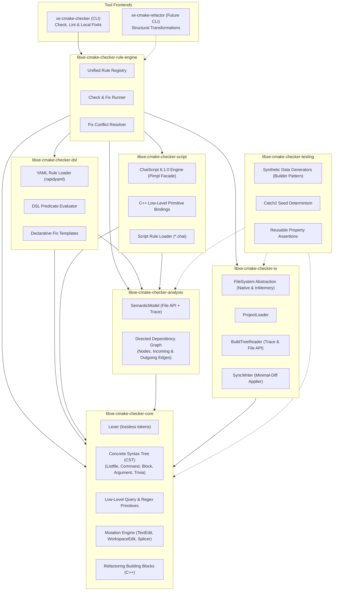

# Implementation Plan: `xe-cmake-checker` v2.2 — Graph-Based Analysis, Declarative DSL & Extensible Scripting

## Goal Description

Evolve the in-house CMake validation tooling from a hardcoded checker into an **extensible, rule-driven, and scriptable** platform for the Xenoide repository. The architecture is centered on an **in-memory Concrete Syntax Tree (CST) and Directed Semantic Graph** of the CMake project structure.

All components, libraries, and executables are prefixed with `libxe-cmake-*` and `xe-cmake*` to make explicit that this is an **in-house custom tool** tailored for the Xenoide codebase, rather than an upstream or official CMake component.

The platform is designed around two main capabilities:
1. **Capability 1: Check & Local Fix (`xe-cmake-checker`)** — The core scope of this v2.2 plan. Validates style conventions, target relationships, and syntax rules via declarative YAML rules (`libxe-cmake-checker-dsl`) and embedded ChaiScript scripts (`libxe-cmake-checker-script`). Produces diagnostics with **strictly optional** surgical fixits.
2. **Capability 2: Semantic Refactoring (`xe-cmake-refactor`)** — A planned extension (separate CLI / future plan). Provides safe, structural transformations across the project (e.g. target renaming, extracting functions from blocks, inlining functions) implemented as C++ primitives and orchestrated through ChaiScript. The graph model, analyzer, and mutation engine in v2.2 are explicitly architected to support this future capability.

An accompanying **Structurizr Architecture Model** is maintained alongside this plan at [docs/plans/CMAKE_STYLE_CHECKER_V2.2.dsl](file:///home/fapablaza/Desktop/nativedevcl/Xenoide/docs/plans/CMAKE_STYLE_CHECKER_V2.2.dsl). The component names in the model serve as keys between the architecture specification and the implementation.

---

## User Review Required (Locked Decisions)

> [!IMPORTANT]
> **Locked decisions** (confirmed during design review):

| Decision | Choice | Details |
| :--- | :--- | :--- |
| **Component Naming Scheme** | **`xe-cmake*` & `libxe-cmake-*`** | All CLI tools (`xe-cmake-checker`, `xe-cmake-refactor`), libraries (`libxe-cmake-checker-*`), and tests (`*-test`) use the `xe-` / `libxe-` prefix to explicitly denote custom in-tree Xenoide tooling. |
| **Architecture Specification** | **Structurizr Model (`CMAKE_STYLE_CHECKER_V2.2.dsl`)** | Authoritative C4 model at [CMAKE_STYLE_CHECKER_V2.2.dsl](file:///home/fapablaza/Desktop/nativedevcl/Xenoide/docs/plans/CMAKE_STYLE_CHECKER_V2.2.dsl). Component names in the diagram act as keys synchronized with CMake targets and folders. |
| **Separation of Concerns** | **Dedicated DSL & Script Libraries** | `libxe-cmake-checker-dsl` owns all YAML DSL parsing and evaluation; `libxe-cmake-checker-script` owns ChaiScript embedding and script rule execution. |
| **Low-Level C++ Primitives** | **Lean C++ Core, Computed in Scripts/DSL** | C++ exposes low-level, orthogonal primitives (CST nodes, quotes, string/regex ops, generic directed graph edges). High-level checks are computed within DSL / ChaiScript. |
| **Scripting Engine** | **ChaiScript 6.1.0** | Available via ConanCenter (`chaiscript/6.1.0`, header-only, C++17 compatible). Isolated strictly within `libxe-cmake-checker-script` behind an opaque Pimpl facade. |
| **Fixit Philosophy** | **Strictly Optional Fixits & Isolated Testing** | Rules catch errors; providing an automated fix (`Fix`) is optional. Findings without fixes report as diagnostics requiring manual intervention. **Engine runs are strictly check-only (`--check`, no fixits applied).** Fixits are tested exclusively within an isolated synthetic sandbox project via a separate plan artifact (`docs/plans/CMAKE_CHECKER_FIXIT_TESTING_PLAN.md`) to avoid corrupting repository CMake projects. |
| **Graph Model** | **Concrete Syntax Tree (CST) + Directed Graph** | Lossless trivia preservation (comments, whitespace, exact spans) with parent/sibling pointers and generic directed dependency edges (incoming/outgoing). |
| **Write-back** | **Surgical Minimal-Diff** | Untouched bytes stay identical; only mutated spans are spliced. Supports multi-file transactional edits (`WorkspaceEdit`). |
| **CMake Target Standards** | **Strict `docs/CMAKE.md` Compliance** | One target per folder, target name matches folder name (`libxe-cmake-checker-*`), one line per dependency in `target_link_libraries`, alias targets `xe::cmake-checker-*`. |
| **C++ Standards** | **Strict `docs/CPP.md` Compliance** | C++17, zero warnings (`-Werror`), explicit types (no `auto` for primitives), `std::string_view` for views, namespace `xe::cmake::*`, constructor DI for orchestrators. |
| **Testing Strategy** | **Strict `docs/TESTING.md` Compliance** | Catch2 v3, property-based synthetic builders, Catch2 seed determinism (`Catch::rngSeed()`), reusable entity-prefixed assertions (`requireCstProperty`, `requireCstValidSpans`, `requireWorkspaceEditNonOverlapping`, `requireGraphAcyclic`), in-memory filesystem tests, shared `libxe-cmake-checker-testing` library. |
| **Dependencies** | **Conan 2.x packages** | `chaiscript/6.1.0`, `rapidyaml/0.7.1`, `nlohmann_json/3.12.0`, `cxxopts/3.3.1`, `fmt/[>=11 <12]`, `catch2/3.14.0`. |
| **Migration** | **Big-Bang Rewrite** | Replace v1 internal architecture; verify against frozen v1 golden diagnostics. Existing tree outside `src/cmake-checker` remains untouched. |

---

## Architecture & Layout Plan



### Structurizr Architecture Model Reference

The complete architectural specification is formalized in [docs/plans/CMAKE_STYLE_CHECKER_V2.2.dsl](file:///home/fapablaza/Desktop/nativedevcl/Xenoide/docs/plans/CMAKE_STYLE_CHECKER_V2.2.dsl). 

The table below establishes the **1:1 synchronization key** between the architecture model, CMake targets, directories, and C++ namespaces:

| Structurizr Component Key | CMake Target Name | Target Alias | Source Directory | C++ Namespace |
| :--- | :--- | :--- | :--- | :--- |
| `xe-cmake-checker` | `xe-cmake-checker` | N/A (Executable) | `src/cmake-checker/src/xe-cmake-checker` | `xe::cmake` |
| `xe-cmake-refactor` | `xe-cmake-refactor` | N/A (Executable) | `src/cmake-checker/src/xe-cmake-refactor` | `xe::cmake` |
| `libxe-cmake-checker-rule-engine` | `libxe-cmake-checker-rule-engine` | `xe::cmake-checker-rule-engine` | `src/cmake-checker/src/libxe-cmake-checker-rule-engine` | `xe::cmake::rules` |
| `libxe-cmake-checker-dsl` | `libxe-cmake-checker-dsl` | `xe::cmake-checker-dsl` | `src/cmake-checker/src/libxe-cmake-checker-dsl` | `xe::cmake::dsl` |
| `libxe-cmake-checker-script` | `libxe-cmake-checker-script` | `xe::cmake-checker-script` | `src/cmake-checker/src/libxe-cmake-checker-script` | `xe::cmake::script` |
| `libxe-cmake-checker-analysis` | `libxe-cmake-checker-analysis` | `xe::cmake-checker-analysis` | `src/cmake-checker/src/libxe-cmake-checker-analysis` | `xe::cmake::analysis` |
| `libxe-cmake-checker-io` | `libxe-cmake-checker-io` | `xe::cmake-checker-io` | `src/cmake-checker/src/libxe-cmake-checker-io` | `xe::cmake::io` |
| `libxe-cmake-checker-core` | `libxe-cmake-checker-core` | `xe::cmake-checker-core` | `src/cmake-checker/src/libxe-cmake-checker-core` | `xe::cmake::core` |
| `libxe-cmake-checker-testing` | `libxe-cmake-checker-testing` | `xe::cmake-checker-testing` | `src/cmake-checker/src/libxe-cmake-checker-testing` | `xe::cmake::testing` |

---

### Component Hierarchy & Responsibilities

1. **`libxe-cmake-checker-core`**:
   - CST data structures (`ListfileNode`, `CommandNode`, `ArgumentNode`, `BlockNode`, `TriviaNode`).
   - Token stream, source coordinates, byte-exact source spans (`SourceSpan`), trivia attachment.
   - Low-level primitives: node navigation (parent, children, siblings), string/regex helpers taking `std::string_view`.
   - Mutation primitives: `TextEdit`, `WorkspaceEdit`, pure text splicer.
   - C++ refactoring building blocks (AST node replacement, subtree splicing).
   - Zero external library dependencies beyond standard C++17.
2. **`libxe-cmake-checker-io`**:
   - `FileSystem` abstraction (`IFileSystem` interface with `NativeFileSystem` and `InMemoryFileSystem`).
   - `ProjectLoader` (file discovery, listfile reading).
   - `BuildTreeReader` (CMake trace `json-v1` and File API `codemodel-v2` readers using `nlohmann_json`).
   - `SyncWriter` (surgical write-back of `WorkspaceEdit` to disk or in-memory filesystem).
   - Uses constructor dependency injection for testability.
3. **`libxe-cmake-checker-analysis`**:
   - `SemanticModel`: maps CMake File-API / trace facts to files and targets.
   - `DirectedGraph`: generic directed graph storing targets, files, and dependencies with incoming and outgoing edges.
4. **`libxe-cmake-checker-dsl`**:
   - Contains all **YAML DSL code**.
   - YAML schema validation and parsing via `rapidyaml`.
   - Expression evaluator evaluating DSL predicates against the low-level C++ primitives.
   - Declarative fix template appliers.
5. **`libxe-cmake-checker-script`**:
   - Contains all **ChaiScript scripting code**.
   - Embeds ChaiScript 6.1.0 behind an opaque `ScriptEngine` facade (isolating template instantiation and header overhead).
   - Binds low-level C++ primitives (CST nodes, Graph edges, `TextEdit`, `Finding`, `Fix`).
   - Discovers and loads custom `*.chai` rule files.
6. **`libxe-cmake-checker-rule-engine`**:
   - Coordinates rules from both `libxe-cmake-checker-dsl` and `libxe-cmake-checker-script`.
   - Manages unified rule table, rule filtering, severity overrides (`error`, `warn`, `info`, `off`).
   - Executes rules across the CST/Graph and collects `Finding`s.
   - Dispatches optional `Fix`es, performing overlap detection and reverse-offset conflict resolution.
7. **`libxe-cmake-checker-testing`**:
   - Shared test infrastructure complying with `docs/TESTING.md`.
   - Parametric synthetic data generators (Builder pattern) for CST nodes, dependency graphs, and mock CMake projects.
   - Deterministic execution using Catch2's active execution seed (`Catch::rngSeed()`).
   - Reusable Catch2 property assertions with entity-prefixed naming (`requireCstProperty`, `requireCstLosslessRoundTrip`, `requireCstValidSpans`, `requireWorkspaceEditNonOverlapping`, `requireGraphAcyclic`).
8. **`xe-cmake-checker` (CLI application)**:
   - Thin command-line interface using `cxxopts` and `fmt`.
   - Orchestrates loading, checking, `--diff` preview, `--fix` application, and diagnostics reporting.
9. **`xe-cmake-refactor` (Future CLI application)**:
   - Command-line interface for multi-file semantic refactoring recipes.

---

## Proposed Changes

### Component 1: Library Layout & Conan Dependencies

#### Conan Requirements (`src/cmake-checker/conanfile.py`)
```python
def requirements(self):
    self.requires("nlohmann_json/3.12.0")
    self.requires("rapidyaml/0.7.1", options={"with_default_callback_uses_exceptions": True})
    self.requires("cxxopts/3.3.1")
    self.requires("fmt/[>=11 <12]")
    self.requires("chaiscript/6.1.0")

def build_requirements(self):
    if self.options.with_tests:
        self.test_requires("catch2/3.14.0")
```

#### Directory Layout

The directory layout adheres strictly to `docs/CMAKE.md` and `docs/TESTING.md`:
- Each target lives in its own directory matching the target name.
- Each library has a sibling test directory named `[target-name]-test`.
- Unit test files follow the `TranslationUnitTest.cpp` naming convention.

```
src/cmake-checker/src/
├── libxe-cmake-checker-core/                 # Core CST, Lexer, Parser, Spans, Mutations
│   ├── src/xe/cmake/core/
│   │   ├── ConcreteSyntaxTree.h/.cpp
│   │   ├── Lexer.h/.cpp
│   │   ├── QueryPrimitives.h/.cpp
│   │   ├── MutationEngine.h/.cpp
│   │   └── RefactoringPrimitives.h/.cpp
│   └── CMakeLists.txt
├── libxe-cmake-checker-core-test/            # Sibling unit test suite
│   ├── src/
│   │   ├── ConcreteSyntaxTreeTest.cpp
│   │   ├── LexerTest.cpp
│   │   ├── QueryPrimitivesTest.cpp
│   │   └── MutationEngineTest.cpp
│   └── CMakeLists.txt
├── libxe-cmake-checker-io/                   # FileSystem, ProjectLoader, BuildTreeReader, SyncWriter
│   ├── src/xe/cmake/io/
│   │   ├── FileSystem.h/.cpp
│   │   ├── ProjectLoader.h/.cpp
│   │   ├── BuildTreeReader.h/.cpp
│   │   └── SyncWriter.h/.cpp
│   └── CMakeLists.txt
├── libxe-cmake-checker-io-test/              # Sibling unit test suite
│   ├── src/
│   │   ├── FileSystemTest.cpp
│   │   ├── ProjectLoaderTest.cpp
│   │   ├── BuildTreeReaderTest.cpp
│   │   └── SyncWriterTest.cpp
│   └── CMakeLists.txt
├── libxe-cmake-checker-analysis/             # SemanticModel, Generic Directed Graph
│   ├── src/xe/cmake/analysis/
│   │   ├── SemanticModel.h/.cpp
│   │   └── DirectedDependencyGraph.h/.cpp
│   └── CMakeLists.txt
├── libxe-cmake-checker-analysis-test/         # Sibling unit test suite
│   ├── src/
│   │   ├── SemanticModelTest.cpp
│   │   └── DirectedDependencyGraphTest.cpp
│   └── CMakeLists.txt
├── libxe-cmake-checker-dsl/                  # YAML DSL loader (rapidyaml), evaluator
│   ├── src/xe/cmake/dsl/
│   │   ├── YamlRuleLoader.h/.cpp
│   │   ├── DslPredicateEvaluator.h/.cpp
│   │   └── FixTemplateEngine.h/.cpp
│   └── CMakeLists.txt
├── libxe-cmake-checker-dsl-test/             # Sibling unit test suite
│   ├── src/
│   │   ├── YamlRuleLoaderTest.cpp
│   │   └── DslPredicateEvaluatorTest.cpp
│   └── CMakeLists.txt
├── libxe-cmake-checker-script/               # ChaiScript runtime facade, primitive bindings
│   ├── src/xe/cmake/script/
│   │   ├── ScriptEngineFacade.h/.cpp
│   │   ├── ScriptBindings.h/.cpp
│   │   └── ScriptRuleLoader.h/.cpp
│   └── CMakeLists.txt
├── libxe-cmake-checker-script-test/          # Sibling unit test suite
│   ├── src/
│   │   ├── ScriptEngineFacadeTest.cpp
│   │   └── ScriptBindingsTest.cpp
│   └── CMakeLists.txt
├── libxe-cmake-checker-rule-engine/          # Unified rule registry & coordinator, fix conflict resolver
│   ├── src/xe/cmake/rules/
│   │   ├── RuleRegistry.h/.cpp
│   │   ├── CheckRunner.h/.cpp
│   │   └── FixConflictResolver.h/.cpp
│   └── CMakeLists.txt
├── libxe-cmake-checker-rule-engine-test/     # Sibling unit test suite
│   ├── src/
│   │   ├── RuleRegistryTest.cpp
│   │   ├── CheckRunnerTest.cpp
│   │   └── FixConflictResolverTest.cpp
│   └── CMakeLists.txt
├── libxe-cmake-checker-testing/              # Shared test generators & assertions
│   ├── src/xe/cmake/testing/
│   │   ├── CstSyntheticGenerator.h/.cpp
│   │   ├── GraphSyntheticGenerator.h/.cpp
│   │   └── PropertyAssertions.h/.cpp
│   └── CMakeLists.txt
├── xe-cmake-checker/                         # Thin CLI application (check, diff, fix)
│   ├── src/
│   │   ├── CliOptionsParser.h/.cpp
│   │   ├── DiagnosticsReporter.h/.cpp
│   │   ├── CheckerDriver.h/.cpp
│   │   └── main.cpp
│   └── CMakeLists.txt
└── xe-cmake-checker-test/                    # Golden end-to-end regression tests
    ├── src/
    │   ├── GoldenRegressionTest.cpp
    │   └── CliIntegrationTest.cpp
    └── CMakeLists.txt
```

#### CMake Target Specification Conforming to `docs/CMAKE.md`

All targets follow the specification:
1. Target name strictly matches directory name (`set (target "...")`).
2. Public headers located under `src/xe/cmake/...`.
3. Alias targets defined (`xe::cmake-checker-*`).
4. `target_link_libraries` formatted strictly **one line per dependency**.

**Static Library Template (`libxe-cmake-checker-core/CMakeLists.txt`)**:
```cmake
set (target "libxe-cmake-checker-core")

set (headers
    "src/xe/cmake/core/SourceSpan.h"
    "src/xe/cmake/core/Trivia.h"
    "src/xe/cmake/core/ConcreteSyntaxTree.h"
    "src/xe/cmake/core/Lexer.h"
    "src/xe/cmake/core/QueryPrimitives.h"
    "src/xe/cmake/core/MutationEngine.h"
    "src/xe/cmake/core/RefactoringPrimitives.h"
)

set (sources
    ${headers}
    "src/xe/cmake/core/ConcreteSyntaxTree.cpp"
    "src/xe/cmake/core/Lexer.cpp"
    "src/xe/cmake/core/QueryPrimitives.cpp"
    "src/xe/cmake/core/MutationEngine.cpp"
    "src/xe/cmake/core/RefactoringPrimitives.cpp"
)

add_library(${target} ${sources})
add_library(xe::cmake-checker-core ALIAS ${target})

target_include_directories(${target} PUBLIC "src")

# one line per dependency
target_link_libraries(${target} PUBLIC xe::interface)
```

**Catch2 v3 Test Executable Template (`libxe-cmake-checker-core-test/CMakeLists.txt`)**:
```cmake
find_package(Catch2 REQUIRED)

set (target "libxe-cmake-checker-core-test")

set (sources
    "src/ConcreteSyntaxTreeTest.cpp"
    "src/LexerTest.cpp"
    "src/QueryPrimitivesTest.cpp"
    "src/MutationEngineTest.cpp"
)

add_executable(${target} ${sources})

target_include_directories(${target} PUBLIC "src")

# one line per dependency
target_link_libraries(${target} PRIVATE Catch2::Catch2WithMain)
target_link_libraries(${target} PUBLIC xe::cmake-checker-core)
target_link_libraries(${target} PUBLIC xe::cmake-checker-testing)

# Enable autodiscovering
include(Catch)
catch_discover_tests(${target})
```

**Executable Target Specification (`xe-cmake-checker/CMakeLists.txt`)**:
```cmake
find_package(cxxopts REQUIRED)
find_package(fmt REQUIRED)

set (target "xe-cmake-checker")

set (sources
    "src/CliOptionsParser.cpp"
    "src/DiagnosticsReporter.cpp"
    "src/CheckerDriver.cpp"
    "src/main.cpp"
)

add_executable(${target} ${sources})

target_include_directories(${target} PUBLIC "src")

# one line per dependency
target_link_libraries(${target} PRIVATE xe::cmake-checker-rule-engine)
target_link_libraries(${target} PRIVATE xe::cmake-checker-io)
target_link_libraries(${target} PRIVATE xe::cmake-checker-core)
target_link_libraries(${target} PRIVATE cxxopts::cxxopts)
target_link_libraries(${target} PRIVATE fmt::fmt)
```

---

### Component 2: Low-Level C++ Primitives vs. Computed Checks

Adhering strictly to `docs/CPP.md`:
- All read-only string parameters accept `std::string_view`.
- Types are explicit: no `auto` for primitive types (`int`, `size_t`, `std::string`, `std::string_view`).
- No magic numbers or strings (constants defined `constexpr`).
- Code resides in `namespace xe::cmake::core`.

#### 1. Low-Level C++ Primitives Exposed

```mermaid
classDiagram
    class QuoteKind {
        <<enumeration>>
        Raw
        Quoted
        Bracket
    }

    class ArgumentNode {
        +std::string_view text()
        +QuoteKind quote_kind()
        +SourceSpan span()
    }

    class CommandNode {
        +std::string_view name()
        +const std::vector~ArgumentNode~& arguments()
        +size_t argument_count()
        +const ArgumentNode& argument(size_t index)
        +SourceSpan span()
        +std::string_view file_path()
        +const SyntaxNode* parent()
    }

    class ListfileNode {
        +std::string_view path()
        +const std::vector~StatementNode~& statements()
        +std::vector~const CommandNode*~ commands()
    }

    class DirectedDependencyGraph {
        +std::vector~std::string~ node_ids()
        +std::vector~GraphEdge~ outgoing_edges(std::string_view node_id)
        +std::vector~GraphEdge~ incoming_edges(std::string_view node_id)
    }

    class GraphEdge {
        +std::string_view source()
        +std::string_view target()
        +std::string_view attribute(std::string_view key)
    }

    class StringPrimitives {
        +bool regex_match(std::string_view text, std::string_view pattern)
        +bool regex_search(std::string_view text, std::string_view pattern)
        +bool str_contains(std::string_view text, std::string_view substr)
        +bool str_starts_with(std::string_view text, std::string_view prefix)
        +bool str_ends_with(std::string_view text, std::string_view suffix)
        +std::vector~std::string~ str_split(std::string_view text, std::string_view delim)
    }

    class MutationPrimitives {
        +TextEdit replace(SourceSpan span, std::string_view new_text)
        +TextEdit insert_before(size_t offset, std::string_view text)
        +TextEdit insert_after(size_t offset, std::string_view text)
        +TextEdit remove(SourceSpan span)
    }
```



#### 2. How the 6 Required Checks are Computed in DSL & ChaiScript

The checks are updated to validate the project conventions codified in `docs/CMAKE.md`:

| # | Required Check | Low-Level C++ Primitives Used | How Computed in DSL / ChaiScript |
| :--- | :--- | :--- | :--- |
| **1** | **Identifier format check** | `cmd.name()`, `arg.text()`, `regex_match(text, pattern)` | Script/DSL verifies target/variable names adhere to project naming rules (`libxe-*`, `xe-*`, snake_case/kebab-case). |
| **2** | **Single target per folder (`docs/CMAKE.md`)** | `file.commands()`, `cmd.name()`, list `size()` | Filter commands where `name in ["add_library", "add_executable"]`. Report warning if `count > 1` or error if target declaration is absent. |
| **3** | **Target declared via variable matching folder (`docs/CMAKE.md`)** | `file.commands()`, `cmd.name()`, `arg.text()` | Verify `set (target "...")` defines target name equal to folder name, and `add_library(${target} ...)` / `add_executable(${target} ...)` uses `${target}`. |
| **4** | **One dependency per line in `target_link_libraries` (`docs/CMAKE.md`)** | `cmd.arguments()`, `arg.span()`, `file.commands()` | Verify each `target_link_libraries` statement links exactly one dependency argument (excluding the target and scope keyword). Multitarget link calls produce diagnostics with optional split fixits. |
| **5** | **List all targets referencing a given target** | `graph.incoming_edges(target_name)`, `edge.source()`, `edge.attribute("kind")` | Query incoming edges in the directed graph where edge kind is `"target_link"`. Each `edge.source()` is a consumer/referencing target. |
| **6** | **Names / files specified as raw strings or quoted** | `arg.quote_kind()`, `QuoteKind::Raw`, `QuoteKind::Quoted` | Check `arg.quote_kind() == QuoteKind.Quoted` (or `QuoteKind.Raw`) for specific argument indices (e.g. source files in `set (sources ...)` must be quoted). |

---

### Component 3: Optional Fixits Architecture

Every rule catches a violation and generates a `Finding`. Attaching an automated fix (`Fix`) is **strictly optional**:

```cpp
namespace xe::cmake::core {

enum class Severity : uint8_t {
    Info,
    Warn,
    Error
};

struct Finding {
    std::string rule_id;
    Severity severity = Severity::Warn;
    std::string message;
    std::string file_path;
    SourceSpan span;
    std::optional<Fix> fix; // Strictly optional!
};

struct Fix {
    std::string description;
    std::vector<TextEdit> edits;
};

} // namespace xe::cmake::core
```

#### How the DSL and Script Layers Handle Optional Fixits

1. **In `libxe-cmake-checker-dsl` (YAML)**:
   - **Check-Only Rule**: Omit the `fix:` block entirely. The rule produces diagnostics without a fixit.
   - **Check with Fixit**: Include the `fix:` block referencing a fix template.
   - **Conditional Fixit**: Fix template specifies applicability conditions. If inapplicable, `fix` remains empty.

   ```yaml
   rules:
     # 1. Check-Only: Single target per folder convention (cannot be auto-split safely)
     - id: structure.single-target-per-folder
       severity: error
       match: { node: file }
       when: "count(file.commands, c -> c.name in ['add_library', 'add_executable']) > 1"
       message: "A single CMake target should be stored in a given folder (docs/CMAKE.md)"
       # 'fix:' omitted -> Diagnostic only

     # 2. Check with Fixit: One line per dependency in target_link_libraries
     - id: formatting.target-link-single-dependency
       severity: warn
       match: { node: command }
       when: "cmd.name == 'target_link_libraries' && count_dependencies(cmd) > 1"
       message: "target_link_libraries should have one line per dependency (docs/CMAKE.md)"
       fix:
         template: split_target_link_libraries_per_line
   ```

2. **In `libxe-cmake-checker-script` (ChaiScript)**:
   - To report a **diagnostic only**:
     ```chai
     ctx.report(Finding(
         "custom.dependency-budget",
         Severity.Warn,
         "Target '" + target_name + "' has too many dependencies (" + to_string(dep_count) + ")",
         cmd.span()
         // No Fix argument -> Strictly diagnostic!
     ));
     ```
   - To report a **diagnostic with an optional fix**:
     ```chai
     var fix = Fix("Quote source file path");
     fix.add_edit(TextEdit.replace(arg.span(), "\"" + arg.text() + "\""));

     ctx.report(Finding(
         "formatting.quote-source-path",
         Severity.Warn,
         "Source file should be quoted in set(sources ...)",
         arg.span(),
         fix // Fix attached!
     ));
     ```

3. **In the CLI Runner (`xe-cmake-checker`)**:
   - In `--check` mode: All findings are formatted and reported.
   - In `--diff` mode: Computes and displays unified diff of all fixable findings without writing to disk.
   - In `--fix` mode:
     - Findings with an attached `Fix` are checked for non-overlapping spans and applied atomically via `WorkspaceEdit`.
     - Findings without an attached `Fix` are displayed with `[manual intervention required]`.
     - Non-zero exit code is returned if unfixable errors remain.

---

### Component 4: Future Refactoring Foundations (`xe-cmake-checker` vs `xe-cmake-refactor`)

The system separates **Capability 1 (Check & Local Fix)** from **Capability 2 (Semantic Refactoring)**:

```
┌─────────────────────────────────────────────────────────────────┐
│                    Shared xe-cmake Core Engine                  │
│   (CST with Trivia, Directed Dependency Graph, WorkspaceEdit)   │
└───────────────────────────────┬─────────────────────────────────┘
                                │
               ┌────────────────┴────────────────┐
               ▼                                 ▼
     ┌───────────────────┐             ┌───────────────────┐
     │  xe-cmake-checker │             │  xe-cmake-refactor│
     │   (Capability 1:  │             │   (Capability 2:  │
     │  Style, Lint, Fix)│             │ Refactoring CLI)  │
     └───────────────────┘             └───────────────────┘
```

#### Architectural Readiness in v2.2
1. **Concrete Syntax Tree (CST)**: Full trivia (comments, blank lines, indentation) is preserved on every node. Nodes maintain parent and sibling pointers.
2. **Directed Graph & Cross-References**: Generic directed graph tracks target declarations, link edges, and consumers. Reverse edges (`incoming_edges`) allow instantaneous consumer lookups for renames.
3. **Transactional WorkspaceEdit**: Multi-file edits are collected into an atomic transaction (`FilePath -> std::vector<TextEdit>`), sorted in reverse-offset order to maintain coordinate validity.
4. **C++ Refactoring Primitives**: Implemented in C++ in `libxe-cmake-checker-core`:
   - `RenameSymbolRefactoring`: Renames target definitions, `target_link_libraries`, alias targets, and export sets across all project listfiles.
   - `ExtractFunctionRefactoring`: Takes a contiguous statement range, identifies variable inputs/outputs, generates a `function(...)` block, and replaces the call site.
   - `InlineFunctionRefactoring`: Inlines a function body into call sites with parameter substitution.
5. **ChaiScript Orchestration (Future)**:
   In the future `xe-cmake-refactor` tool, ChaiScript recipes can orchestrate these C++ primitives dynamically:
   ```chai
   // Future recipe: rename_prefix.chai
   for (target in project.find_targets("^legacy_(.*)")) {
       refactor.rename_target(target, "libxe_" + target.match_group(1));
   }
   refactor.commit();
   ```

---

### Component 5: Tests & Verification Strategy (Aligned with `docs/TESTING.md`)

In strict accordance with `docs/TESTING.md`:
1. **Translation Unit Naming**: All test translation units are named `TranslationUnitTest.cpp` matching the SUT (e.g., `LexerTest.cpp`, `ConcreteSyntaxTreeTest.cpp`, `DirectedDependencyGraphTest.cpp`).
2. **High-Performance In-Memory Testing**: All tests generate input data in memory and execute against `InMemoryFileSystem` without disk I/O.
3. **Property-Based Testing with Shared Test Library (`libxe-cmake-checker-testing`)**:
   - **Dynamic Data Generators**: Input CSTs, graphs, and project files are generated using custom parametric builders:
     ```cpp
     const ConcreteSyntaxTree cst = generate(CstBuilder()
         .withCommand("add_library", {"libxe-core", "STATIC", "src/Core.cpp"})
         .withTrivia("# Comment header\n")
         .build());
     ```
   - **Determinism**: Synthetic random generators use Catch2's active execution seed via `Catch::rngSeed()` for reproducible test failures.
   - **Reusable Property Assertions (Entity-Prefixed Naming)**: All assertion utilities explicitly embed their target entity in the function name to eliminate ambiguity and enforce strict domain type checking:
     - `requireCstProperty(cst, predicate, description)`: Verifies structural and semantic invariants on CST nodes.
     - `requireCstLosslessRoundTrip(cst, original_bytes)`: Verifies byte-for-byte serialization matches original source text.
     - `requireCstValidSpans(cst)`: Verifies all token and node source spans are monotonic, non-inverting, and within buffer bounds.
     - `requireWorkspaceEditNonOverlapping(workspace_edit)`: Verifies multi-file transactional text edits contain zero overlapping intervals.
     - `requireWorkspaceEditSplicingValid(workspace_edit, source_text)`: Verifies text edits splice cleanly without corrupting boundaries.
     - `requireGraphAcyclic(directed_graph)`: Verifies dependency graph contains no circular references.
     - `requireFindingMatches(finding, expected_rule_id, expected_severity)`: Verifies diagnostic reporter output properties.
     - `requireFixApplicable(fix, cst)`: Verifies automated fixits cleanly apply to the target syntax tree.
4. **Precondition & Postcondition Checks**: Every test checks preconditions on generated test data before invoking the SUT.
5. **Sibling Test Targets**:
   - `libxe-cmake-checker-core-test`: Lossless CST round-trips, span validity, mutation splicer reversibility.
   - `libxe-cmake-checker-io-test`: `InMemoryFileSystem` operations, trace and File-API parser correctness.
   - `libxe-cmake-checker-analysis-test`: Dependency graph edge indexing and cycle detection.
   - `libxe-cmake-checker-dsl-test`: RapidYAML rule schema parsing and predicate evaluations.
   - `libxe-cmake-checker-script-test`: ChaiScript engine facade isolation and primitive bindings.
   - `libxe-cmake-checker-rule-engine-test`: Multi-rule coordination and reverse-offset conflict resolution.
   - `xe-cmake-checker-test`: End-to-end golden CLI regression tests on mock fixtures.

---

## Rule Authoring API Reference: DSL & ChaiScript

This reference details the full programming model and API available to rule authors for both the Declarative YAML DSL (`libxe-cmake-checker-dsl`) and the Procedural ChaiScript Engine (`libxe-cmake-checker-script`).

### 1. Declarative YAML DSL API Reference

The declarative DSL is optimized for concise, pattern-based validation of CMake syntax trees and simple graph queries. Rules are stored in `.yaml` files under `src/cmake-checker/rules/`.

#### Schema & Rule Structure

```yaml
rules:
  - id: "<category>.<rule-slug>"              # Unique rule identifier (e.g., formatting.quote-sources)
    severity: "error" | "warn" | "info" | "off" # Diagnostic severity
    description: "<Human readable summary>"   # Short explanation of what the rule enforces
    match:
      node: "file" | "command" | "argument" | "block" # Target CST node type
      name: "<command_name_or_regex>"         # Optional filter for 'command' nodes
      pattern: "<regex_pattern>"              # Optional filter for 'argument' nodes
    when: "<expression>"                      # Boolean predicate evaluated against matched node
    message: "<Diagnostic text>"              # Output message; supports ${expr} string interpolations
    fix:                                      # STRICTLY OPTIONAL
      template: "<builtin_template_name>"     # Predefined C++ fix template
      parameters:                             # Template arguments
        <param_name>: "<value>"
      # OR custom declarative text edit:
      description: "<Fix summary>"
      edits:
        - action: "replace" | "insert_before" | "insert_after" | "remove"
          span: "<span_expression>"
          content: "<replacement_or_inserted_text>"
```

#### Node Contexts & Property Accessors

| Context Object | Available In | Properties / Methods | Description |
| :--- | :--- | :--- | :--- |
| `file` | `file`, `command`, `argument` | `file.path` | Full normalized absolute path to the listfile (`string`) |
| | | `file.directory` | Directory path containing the listfile (`string`) |
| | | `file.folder_name` | Name of the parent directory (e.g. `"libxe-core"`) (`string`) |
| | | `file.commands` | Read-only sequence of all `cmd` objects in the file |
| | | `file.has_command(name)` | Returns `true` if a command with `name` exists (`bool`) |
| | | `file.count_commands(name)` | Returns count of commands matching `name` (`int`) |
| `cmd` | `command`, `argument` | `cmd.name` | Lowercase command name (e.g., `"add_library"`) (`string`) |
| | | `cmd.arguments` | Sequence of all `arg` objects in the command |
| | | `cmd.argument_count` | Number of arguments (`int`) |
| | | `cmd.argument(idx)` | Retrieves `arg` at 0-based `idx` |
| | | `cmd.first_arg` | First argument node, or `null` if empty |
| | | `cmd.last_arg` | Last argument node, or `null` if empty |
| | | `cmd.span` | Exact byte-range span of the full command statement (`span`) |
| | | `cmd.file_path` | Source file containing the command (`string`) |
| | | `cmd.parent` | Parent node reference (`block` or `file`) |
| `arg` | `argument` | `arg.text` | Unescaped text content of the argument (`string`) |
| | | `arg.quote_kind` | Quote classification: `"raw"`, `"quoted"`, `"bracket"` (`string`) |
| | | `arg.is_quoted` | `true` if enclosed in double quotes (`bool`) |
| | | `arg.is_raw` | `true` if unquoted token (`bool`) |
| | | `arg.is_bracket` | `true` if enclosed in `[=[...]=]` bracket (`bool`) |
| | | `arg.span` | Source byte span of the argument token (`span`) |
| | | `arg.index` | 0-based argument position within the command (`int`) |
| `graph` | Global query | `graph.node_ids` | Sequence of all target identifiers (`string`) |
| | | `graph.has_target(name)` | Returns `true` if target `name` is declared in project (`bool`) |
| | | `graph.incoming_edges(target)` | Sequence of `edge`s leading into `target` (consumers) |
| | | `graph.outgoing_edges(target)` | Sequence of `edge`s from `target` (dependencies) |
| | | `graph.is_dependency(from, to)`| Returns `true` if `from` links or depends on `to` (`bool`) |
| `edge` | Edge queries | `edge.source` | Identifier of source target (`string`) |
| | | `edge.target` | Identifier of destination target (`string`) |
| | | `edge.attribute(key)` | Edge metadata (e.g., `"kind"`: `"target_link"`) (`string`) |
| `span` | Span properties | `span.start_offset`, `span.end_offset` | Byte offsets in file buffer (`int`) |
| | | `span.start_line`, `span.start_column` | 1-based source coordinate at start |
| | | `span.end_line`, `span.end_column` | 1-based source coordinate at end |

#### Built-in DSL Functions & Operators

- **Higher-Order Sequences**:
  - `count(seq, item -> boolean_expr)`: Counts matching elements.
  - `exists(seq, item -> boolean_expr)`: Returns `true` if any element matches.
  - `all(seq, item -> boolean_expr)`: Returns `true` if every element matches.
  - `filter(seq, item -> boolean_expr)`: Filters sequence to matching items.
  - `first(seq, item -> boolean_expr)`: Returns first matching item or `null`.
  - `len(seq)`: Length of sequence.
- **String & Regex Primitives**:
  - `regex_match(text, pattern)`: Exact regex match.
  - `regex_search(text, pattern)`: Substring regex search.
  - `starts_with(text, prefix)`: Substring prefix check.
  - `ends_with(text, suffix)`: Substring suffix check.
  - `contains(text, substr)`: Substring containment check.
  - `split(text, delimiter)`: Splits string into list of strings.
  - `to_lower(text)` / `to_upper(text)`: Casing transformations.
- **Path Utilities**:
  - `path_basename(path)`: Returns filename or terminal directory name.
  - `path_dirname(path)`: Returns directory path.
  - `path_stem(path)`: Returns filename without extension.
  - `path_extension(path)`: Returns file extension including leading dot.
- **Comparison & Logical Operators**:
  - `==`, `!=`, `<`, `<=`, `>`, `>=`
  - `in`, `not in`
  - `&&`, `||`, `!`

#### Built-in Declarative Fix Templates

| Template Name | Parameters | Behavior |
| :--- | :--- | :--- |
| `split_target_link_libraries_per_line` | None | Slices multi-target `target_link_libraries(target scope dep1 dep2 ...)` into one command per dependency: `target_link_libraries(${target} scope depN)`. |
| `quote_argument` | `span` (default: `arg.span`) | Wraps the target unquoted argument in double quotes: `"text"`. |
| `unquote_argument` | `span` (default: `arg.span`) | Removes bounding double quotes if raw token is safe. |
| `replace_command_name` | `new_name: string` | Replaces command identifier token while preserving argument spans and trivia. |
| `set_variable_value` | `var_name: string`, `new_value: string` | Replaces target expression in `set(<var> <value>)`. |
| `append_command_after` | `target_cmd`, `command_text: string` | Slices a new formatted command statement directly after the matched command. |

---

### 2. ChaiScript Scripting API Reference

For non-trivial structural validations, cross-file analysis, or multi-statement traversals, rules are authored in ChaiScript (`rules/*.chai`). ChaiScript rules run within an isolated sandbox managed by `libxe-cmake-checker-script`.

#### Script Discovery & Hook Entry Points

Rule files can define one or more standard hook functions:

```chai
// Invoked once for each parsed CMakeLists.txt file
def check_file(ctx, file) {
    // Structural, ordering, and target-level validations
}

// Invoked for each command statement
def check_command(ctx, cmd) {
    // Statement-level syntax and argument validations
}

// Invoked once per project with complete global dependency graph
def check_project(ctx, project, graph) {
    // Global graph, cycle, and reachability validations
}
```

#### Core Classes & Method Bindings

##### 1. `ExecutionContext` (`ctx`)
- `ctx.report(Finding finding)`: Reports a diagnostic finding.
- `ctx.file_path()` -> `std::string`: Returns path of current listfile being analyzed.

##### 2. `Severity`
- `Severity.Info`: Informational note.
- `Severity.Warn`: Style or convention violation (default).
- `Severity.Error`: Severe structural or correctness violation.

##### 3. `Finding`
- `Finding(rule_id: string, severity: Severity, message: string, span: SourceSpan)`: Constructs diagnostic-only finding (**no fixit**).
- `Finding(rule_id: string, severity: Severity, message: string, span: SourceSpan, fix: Fix)`: Constructs finding with attached optional fix.
- `finding.rule_id()` -> `string`
- `finding.severity()` -> `Severity`
- `finding.message()` -> `string`
- `finding.span()` -> `SourceSpan`
- `finding.has_fix()` -> `bool`
- `finding.fix()` -> `Fix`

##### 4. `Fix` & `TextEdit`
- `Fix(description: string)`: Constructs automated fix container.
- `fix.description()` -> `string`
- `fix.add_edit(TextEdit edit)`: Appends an atomic text edit.
- `fix.edits()` -> `Vector<TextEdit>`
- `TextEdit.replace(span: SourceSpan, new_text: string)` -> `TextEdit`
- `TextEdit.insert_before(offset: int, text: string)` -> `TextEdit`
- `TextEdit.insert_after(offset: int, text: string)` -> `TextEdit`
- `TextEdit.remove(span: SourceSpan)` -> `TextEdit`

##### 5. `SourceSpan`
- `span.start_offset()` -> `int`: 0-based buffer start offset.
- `span.end_offset()` -> `int`: 0-based buffer end offset.
- `span.start_line()` -> `int`: 1-based start line.
- `span.start_column()` -> `int`: 1-based start column.
- `span.end_line()` -> `int`: 1-based end line.
- `span.end_column()` -> `int`: 1-based end column.

##### 6. `ListfileNode` (`file`)
- `file.path()` -> `string`: Full path to file.
- `file.directory()` -> `string`: Parent directory path.
- `file.folder_name()` -> `string`: Basename of parent folder.
- `file.commands()` -> `Vector<CommandNode>`: All top-level commands in order.
- `file.find_commands(name: string)` -> `Vector<CommandNode>`: Filtered commands matching name.

##### 7. `CommandNode` (`cmd`)
- `cmd.name()` -> `string`: Lowercase command name.
- `cmd.arguments()` -> `Vector<ArgumentNode>`: All argument nodes.
- `cmd.argument_count()` -> `int`: Total arguments count.
- `cmd.argument(index: int)` -> `ArgumentNode`: Argument at 0-based index.
- `cmd.span()` -> `SourceSpan`: Full span of command statement.
- `cmd.file_path()` -> `string`: Enclosing listfile path.

##### 8. `ArgumentNode` (`arg`)
- `arg.text()` -> `string`: Unescaped argument text.
- `arg.quote_kind()` -> `QuoteKind`: Quoting classification.
- `arg.span()` -> `SourceSpan`: Exact token span.
- `arg.index()` -> `int`: Position in argument list.

##### 9. `QuoteKind`
- `QuoteKind.Raw`: Unquoted token (e.g. `STATIC`, `${target}`).
- `QuoteKind.Quoted`: Double-quoted string (e.g. `"src/Source.cpp"`).
- `QuoteKind.Bracket`: Bracket-quoted string (`[=[...]=]`).

##### 10. `DirectedDependencyGraph` (`graph`)
- `graph.node_ids()` -> `Vector<string>`: All target names in project.
- `graph.outgoing_edges(node_id: string)` -> `Vector<GraphEdge>`: Dependencies required by `node_id`.
- `graph.incoming_edges(node_id: string)` -> `Vector<GraphEdge>`: Targets consuming `node_id`.
- `graph.has_edge(source: string, target: string)` -> `bool`: Direct link existence check.
- `graph.find_cycles()` -> `Vector<Vector<string>>`: Returns detected circular dependency cycles.

##### 11. `GraphEdge` (`edge`)
- `edge.source()` -> `string`: Consumer target name.
- `edge.target()` -> `string`: Dependency target name.
- `edge.attribute(key: string)` -> `string`: Edge metadata (e.g. `"kind"`: `"target_link"`).

##### 12. `ProjectContext` (`project`)
- `project.files()` -> `Vector<ListfileNode>`: All discovered project listfiles.
- `project.find_targets(regex: string)` -> `Vector<string>`: Target names matching regex.
- `project.find_commands(name_regex: string)` -> `Vector<CommandNode>`: Commands matching regex project-wide.

##### 13. Primitive Helper Functions
- `regex_match(text: string, pattern: string)` -> `bool`
- `regex_search(text: string, pattern: string)` -> `bool`
- `str_contains(text: string, substr: string)` -> `bool`
- `str_starts_with(text: string, prefix: string)` -> `bool`
- `str_ends_with(text: string, suffix: string)` -> `bool`
- `str_split(text: string, delim: string)` -> `Vector<string>`
- `to_string(val)` -> `string`

---

## Materialized Rule Catalog from `docs/CMAKE.md` (Output Artifacts)

The repository conventions defined in [docs/CMAKE.md](file:///home/fapablaza/Desktop/nativedevcl/Xenoide/docs/CMAKE.md) are materialized into two concrete rule output artifacts:
1. **`src/cmake-checker/rules/cmake_guidelines.yaml`** (Declarative DSL rules)
2. **`src/cmake-checker/rules/cmake_guidelines.chai`** (ChaiScript procedural & graph rules)

### Rule Mapping Summary

| # | `docs/CMAKE.md` Convention | Rule Identifier | Implementation Layer | Automated Fixit |
| :- | :--- | :--- | :--- | :--- |
| **1** | A single CMake target should be stored in a given folder | `structure.single-target-per-folder` | DSL & ChaiScript | Diagnostic only (no safe split) |
| **2** | Target name should have the same name as the folder | `naming.target-matches-folder` | ChaiScript | Optional rename fix |
| **3** | A Target can exist in either `src/engine` or `src/ide` | `structure.target-location` | ChaiScript | Diagnostic only |
| **4** | Target name declared via `set (target "...")` | `target.variable-definition` | DSL & ChaiScript | Optional template fix |
| **5** | Target declaration uses `${target}` variable | `target.declaration-uses-variable` | DSL | Optional replace fix |
| **6** | Source files declared via `set (sources ...)` | `sources.variable-definition` | DSL | Diagnostic only |
| **7** | Source files in `set (sources ...)` must be quoted | `formatting.quote-source-paths` | DSL & ChaiScript | Optional quote fix |
| **8** | `# one line per dependency` in `target_link_libraries` | `formatting.target-link-single-dependency`| DSL | Optional split template fix |
| **9** | Static libraries declare `add_library(prefix::name ALIAS ${target})` | `library.alias-specification` | ChaiScript | Diagnostic only |
| **10** | Static libraries declare `target_include_directories(${target} PUBLIC "src")` | `library.include-directories-src` | ChaiScript | Optional append fix |
| **11** | Catch2 tests declare `find_package(Catch2 REQUIRED)`, `PRIVATE Catch2::Catch2WithMain`, `include(Catch)`, and `catch_discover_tests(${target})` | `testing.catch2-structure` | ChaiScript | Diagnostic only |

---

### Output Artifact 1: `src/cmake-checker/rules/cmake_guidelines.yaml`

```yaml
# Materialized DSL rules generated from docs/CMAKE.md
rules:
  # 1. Target declaration uses ${target} variable
  - id: target.declaration-uses-variable
    severity: error
    description: "add_library and add_executable must use ${target} as the first argument"
    match:
      node: command
    when: "cmd.name in ['add_library', 'add_executable'] && cmd.argument_count > 0 && cmd.argument(0).text != '${target}'"
    message: "Target declaration in ${file.path} must use '\${target}' as its first argument (docs/CMAKE.md)"
    fix:
      description: "Replace target identifier with ${target}"
      edits:
        - action: replace
          span: cmd.argument(0).span
          content: "${target}"

  # 2. Source file paths in set(sources ...) must be double-quoted
  - id: formatting.quote-source-paths
    severity: warn
    description: "Source files declared in set(sources ...) must be enclosed in quotes"
    match:
      node: argument
    when: "cmd.name == 'set' && cmd.argument_count > 1 && cmd.argument(0).text == 'sources' && arg.index > 0 && !arg.is_quoted"
    message: "Source file '${arg.text}' in set(sources ...) must be quoted (docs/CMAKE.md)"
    fix:
      template: quote_argument

  # 3. One line per dependency in target_link_libraries
  - id: formatting.target-link-single-dependency
    severity: warn
    description: "target_link_libraries must declare exactly one linked dependency per statement"
    match:
      node: command
      name: "target_link_libraries"
    when: "count(cmd.arguments, a -> a.index > 1 && a.text not in ['PUBLIC', 'PRIVATE', 'INTERFACE']) > 1"
    message: "target_link_libraries must have one line per dependency (docs/CMAKE.md)"
    fix:
      template: split_target_link_libraries_per_line

  # 4. Target variable definition check
  - id: target.variable-definition
    severity: error
    description: "Every target listfile must define set(target \"...\")"
    match:
      node: file
    when: "!file.has_command('set') || count(file.commands, c -> c.name == 'set' && c.argument_count >= 2 && c.argument(0).text == 'target') == 0"
    message: "Listfile ${file.path} is missing mandatory set(target \"...\") declaration (docs/CMAKE.md)"
    # Diagnostic only - fix requires human decision
```

---

### Output Artifact 2: `src/cmake-checker/rules/cmake_guidelines.chai`

```chai
// Materialized ChaiScript rules generated from docs/CMAKE.md

def check_file(ctx, file) {
    var path = file.path();
    var folder_name = file.folder_name();
    
    // Ignore top-level root or non-target directories
    if (folder_name == "src" || folder_name == "cmake" || folder_name == "engine" || folder_name == "ide") {
        return;
    }

    // 1. Target location check: A Target can exist in either src/engine or src/ide
    if (!str_contains(path, "src/engine/") && !str_contains(path, "src/ide/") && !str_contains(path, "src/cmake-checker/")) {
        ctx.report(Finding(
            "structure.target-location",
            Severity.Warn,
            "Target directory '" + folder_name + "' must exist under src/engine or src/ide (docs/CMAKE.md)",
            SourceSpan(0, 0, 1, 1, 1, 1)
        ));
    }

    // Collect target definitions
    var target_commands = Vector();
    var set_target_cmd = null;
    var set_sources_cmd = null;
    var alias_cmd = null;
    var include_dirs_cmd = null;
    var catch_discover_cmd = null;
    var find_catch2_cmd = null;

    for (cmd in file.commands()) {
        if (cmd.name() == "add_library" || cmd.name() == "add_executable") {
            if (cmd.argument_count() > 1 && cmd.argument(1).text() == "ALIAS") {
                alias_cmd = cmd;
            } else {
                target_commands.push_back(cmd);
            }
        } else if (cmd.name() == "set" && cmd.argument_count() >= 2) {
            if (cmd.argument(0).text() == "target") {
                set_target_cmd = cmd;
            } else if (cmd.argument(0).text() == "sources") {
                set_sources_cmd = cmd;
            }
        } else if (cmd.name() == "target_include_directories") {
            include_dirs_cmd = cmd;
        } else if (cmd.name() == "catch_discover_tests") {
            catch_discover_cmd = cmd;
        } else if (cmd.name() == "find_package" && cmd.argument_count() >= 1 && cmd.argument(0).text() == "Catch2") {
            find_catch2_cmd = cmd;
        }
    }

    // 2. Single CMake target per folder
    if (target_commands.size() > 1) {
        ctx.report(Finding(
            "structure.single-target-per-folder",
            Severity.Error,
            "Folder '" + folder_name + "' defines " + to_string(target_commands.size()) + 
            " targets; exactly one target per folder is permitted (docs/CMAKE.md)",
            target_commands[1].span()
        ));
    }

    // 3. Target name should have the same name as the folder
    if (set_target_cmd != null && set_target_cmd.argument_count() >= 2) {
        var declared_target = set_target_cmd.argument(1).text();
        if (declared_target != folder_name) {
            var fix = Fix("Set target name to match folder name");
            fix.add_edit(TextEdit.replace(set_target_cmd.argument(1).span(), "\"" + folder_name + "\""));

            ctx.report(Finding(
                "naming.target-matches-folder",
                Severity.Error,
                "Target name '" + declared_target + "' does not match folder name '" + folder_name + "' (docs/CMAKE.md)",
                set_target_cmd.argument(1).span(),
                fix
            ));
        }
    }

    // If target is a static library: verify ALIAS and target_include_directories
    var is_library = (target_commands.size() == 1 && target_commands[0].name() == "add_library");
    var is_test = str_ends_with(folder_name, "-test");

    if (is_library && !is_test) {
        if (alias_cmd == null) {
            ctx.report(Finding(
                "library.alias-specification",
                Severity.Warn,
                "Static library in '" + folder_name + "' must declare an ALIAS target (docs/CMAKE.md)",
                target_commands[0].span()
            ));
        }

        if (include_dirs_cmd == null) {
            ctx.report(Finding(
                "library.include-directories-src",
                Severity.Warn,
                "Static library in '" + folder_name + "' must declare target_include_directories(${target} PUBLIC \"src\") (docs/CMAKE.md)",
                target_commands[0].span()
            ));
        }
    }

    // If target is a Catch2 test target: verify Catch2 specification
    if (is_test) {
        if (find_catch2_cmd == null) {
            ctx.report(Finding(
                "testing.catch2-specification",
                Severity.Error,
                "Test target '" + folder_name + "' is missing find_package(Catch2 REQUIRED) (docs/CMAKE.md)",
                file.commands()[0].span()
            ));
        }
        if (catch_discover_cmd == null) {
            ctx.report(Finding(
                "testing.catch2-specification",
                Severity.Error,
                "Test target '" + folder_name + "' is missing catch_discover_tests(${target}) (docs/CMAKE.md)",
                file.commands()[file.commands().size() - 1].span()
            ));
        }
    }
}
```

---

## Engine Verification & FixIt Testing Strategy (Isolated Sandbox Plan)

To eliminate any possibility of corrupting the live repository codebase, adoption follows a strict **two-track execution strategy**:

### Track 1: Safe Engine Verification (`src/engine`) — Check-Only (Zero Fixits)

1. The `xe-cmake-checker` tool is executed against `src/engine` **strictly in read-only check mode**:
   ```bash
   mise run cmake-check:release
   # Evaluates all engine listfiles with zero write operations
   ```
2. **Strict Invariant**: No `--fix` option is supplied. Zero modifications or text splices will be performed against any listfile in `src/engine` or `src/ide`.
3. **Verification**: Tool execution is verified against the v1 baseline to ensure zero regressions, zero false positives, and clear diagnostic reporting.

### Track 2: Dedicated Plan Artifact for FixIt Verification (`CMAKE_CHECKER_FIXIT_TESTING_PLAN.md`)

Automated text edits and AST splicing are high-risk mutations. Running untested fixits directly on real project CMake files risks silent corruption, destroyed trivia, invalid spans, or broken builds.

Therefore, as part of plan execution, an independent dedicated plan artifact is created:
**`docs/plans/CMAKE_CHECKER_FIXIT_TESTING_PLAN.md`**

#### Key Provisions of the FixIt Testing Plan:
1. **Isolated Sandbox Test Project**:
   A dedicated synthetic CMake fixture project is created at `tests/fixtures/cmake-fixit-sandbox/`. This sandbox is completely decoupled from repository build targets and intentionally incorporates violations of every guideline in `docs/CMAKE.md`:
   - Multiple targets declared within a single directory.
   - Target names conflicting with folder names.
   - Unquoted source files in `set (sources ...)`.
   - Multi-argument `target_link_libraries` calls.
   - Missing library ALIAS and missing `target_include_directories`.
   - Incomplete Catch2 test setups.
2. **DSL Fix Template Validation in Sandbox**:
   - Executes `split_target_link_libraries_per_line` against sandbox listfiles.
   - Executes `quote_argument` on unquoted source paths.
   - Enforces `requireWorkspaceEditNonOverlapping` and `requireWorkspaceEditSplicingValid`.
3. **ChaiScript Procedural Fixit Validation in Sandbox**:
   - Executes ChaiScript rules generating `Fix` objects with `TextEdit.replace`, `insert_before`, and `remove`.
   - Validates that reverse-offset text splicing preserves byte-exact formatting trivia and produces clean git diffs.
4. **Idempotency & Build Integrity Verification**:
   - **Pass 1**: Applying fixits resolves the target diagnostics.
   - **Pass 2**: A subsequent run produces **zero diffs** (idempotency).
   - **Build Validation**: Invoking `cmake -B <build_dir>` on the repaired sandbox project executes without configuration errors.
5. **Production Gate**: Under no circumstances will `--fix` be executed on `src/engine` or `src/ide` until the entire verification matrix in `CMAKE_CHECKER_FIXIT_TESTING_PLAN.md` has been successfully executed and approved.

---

## Adoption & Verification Plan

All verification steps adhere strictly to the zero-warning policy (`-Werror`) and dev tasks orchestration via Mise:

```bash
# 1. Update Conan dependencies
mise run export-recipes
mise run install:cmake-check:release

# 2. Build the toolsuite and unit test suites (Release)
mise run build:cmake-check:release

# 3. Run per-library unit tests (verifying entity-prefixed Catch2 assertions)
src/cmake-checker/build-cmake-check/Release/bin/libxe-cmake-checker-core-test
src/cmake-checker/build-cmake-check/Release/bin/libxe-cmake-checker-io-test
src/cmake-checker/build-cmake-check/Release/bin/libxe-cmake-checker-analysis-test
src/cmake-checker/build-cmake-check/Release/bin/libxe-cmake-checker-dsl-test
src/cmake-checker/build-cmake-check/Release/bin/libxe-cmake-checker-script-test
src/cmake-checker/build-cmake-check/Release/bin/libxe-cmake-checker-rule-engine-test
src/cmake-checker/build-cmake-check/Release/bin/xe-cmake-checker-test

# 4. Verify Debug build and tests
mise run install:cmake-check:debug
mise run build:cmake-check:debug
src/cmake-checker/build-cmake-check/Debug/bin/libxe-cmake-checker-core-test

# 5. Static Analysis & Formatting
mise run tidy:release --fix
mise run format

# 6. Materialize Output Artifacts from docs/CMAKE.md
# Generates src/cmake-checker/rules/cmake_guidelines.yaml
# Generates src/cmake-checker/rules/cmake_guidelines.chai

# 7. Safe Engine Verification (Check-Only, NO fixits applied)
mise run configure:cmake-check:release
mise run cmake-check:release

# 8. Create Plan Artifact: docs/plans/CMAKE_CHECKER_FIXIT_TESTING_PLAN.md
# Prepares the isolated sandbox project (tests/fixtures/cmake-fixit-sandbox/)
# and specifies full DSL & ChaiScript fixit verification before any live fixits.
```

---

## Risks & Mitigations

| Risk | Mitigation |
| :--- | :--- |
| **ChaiScript compile times & template overhead** | ChaiScript 6.1.0 is header-only and template-heavy. Isolate ChaiScript strictly within `libxe-cmake-checker-script` behind a Pimpl facade (`ScriptEngineFacade`), ensuring zero ChaiScript headers leak into any other library or executable. |
| **Complex rules in DSL vs Script** | Keep YAML DSL focused on single-node declarative predicates. Multi-command aggregations and graph traversals are authored in `*.chai` script rules. |
| **Overlapping fix mutations** | Sort text edits in reverse offset order; reject overlapping edits within the same pass and report remaining unapplied findings as requiring manual intervention. |
| **Test flake & reproducibility** | Seed all synthetic property-based random generators with `Catch::rngSeed()`; test exclusively against `InMemoryFileSystem` to eliminate OS filesystem timing/locking issues. |
| **Refactoring complexity** | Keep refactoring primitives in C++ inside `libxe-cmake-checker-core` with unit-tested AST transformations; ChaiScript is strictly the orchestration layer. |
