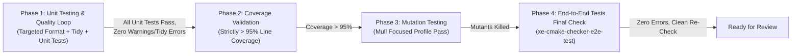
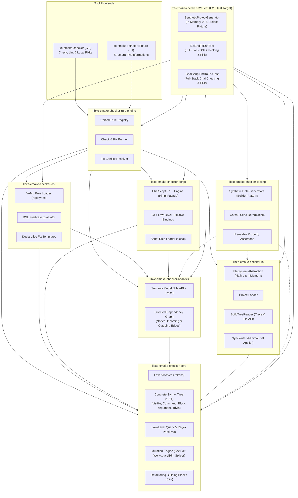
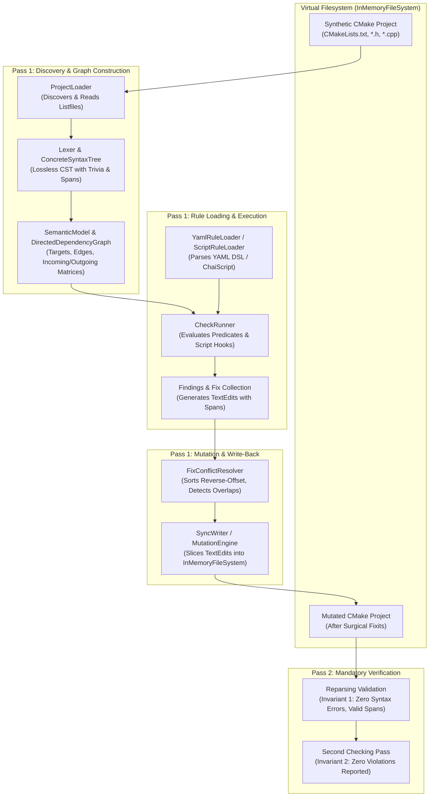
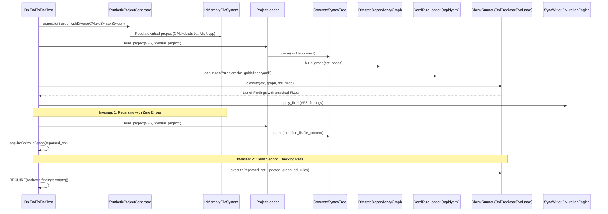
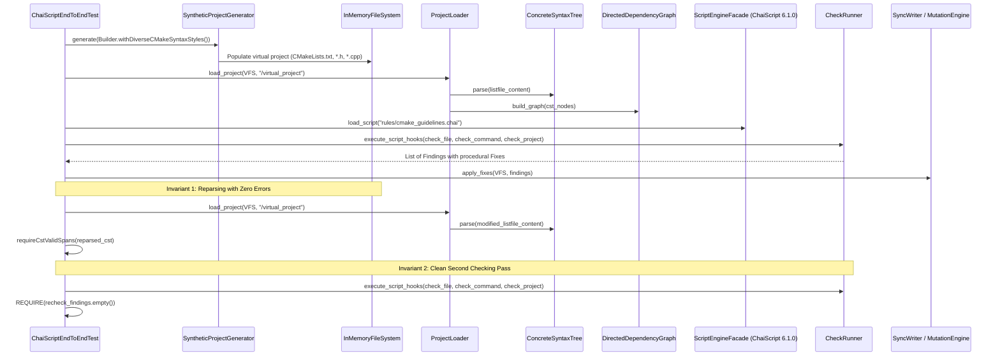

# Implementation Plan: `xe-cmake-checker` v2.2 — Graph-Based Analysis, Declarative DSL & Extensible Scripting

## Goal Description

Evolve the in-house CMake validation tooling from a hardcoded checker into an **extensible, rule-driven, and scriptable** platform for the Xenoide repository. The architecture is centered on an **in-memory Concrete Syntax Tree (CST) and Directed Semantic Graph** of the CMake project structure.

All components, libraries, and executables are prefixed with `libxe-cmake-*` and `xe-cmake*` to make explicit that this is an **in-house custom tool** tailored for the Xenoide codebase, rather than an upstream or official CMake component.

The platform is designed around two main capabilities:
1. **Capability 1: Check & Local Fix (`xe-cmake-checker`)** — The core scope of this v2.2 plan. Validates style conventions, target relationships, and syntax rules via declarative YAML rules (`libxe-cmake-checker-dsl`) and embedded ChaiScript scripts (`libxe-cmake-checker-script`). Produces diagnostics with **strictly optional** surgical fixits.
2. **Capability 2: Semantic Refactoring (`xe-cmake-refactor`)** — A planned extension (separate CLI / future plan). Provides safe, structural transformations across the project (e.g. target renaming, extracting functions from blocks, inlining functions) implemented as C++ primitives and orchestrated through ChaiScript. The graph model, analyzer, and mutation engine in v2.2 are explicitly architected to support this future capability.

An accompanying **Structurizr Architecture Model** is maintained alongside this plan at [docs/plans/CMAKE_STYLE_CHECKER_V2.2.dsl](file:///home/fapablaza/Desktop/nativedevcl/Xenoide/docs/plans/CMAKE_STYLE_CHECKER_V2.2.dsl). The component names in the model serve as keys between the architecture specification and the implementation.

---

## Quality Assurance Tooling Verification & Strict Quality Gates

To guarantee enterprise-grade software robustness, eliminate regressions, and enforce repository standards (`docs/CPP.md`, `docs/TESTING.md`, `AGENTS.md`), the implementation workflow mandates **pre-implementation tooling verification** followed by a strict **four-phase post-implementation quality sequence**.

### 1. Pre-Implementation Quality Tooling Verification

Before writing or modifying any implementation code, the developer/agent must verify that dev tasks orchestration (`mise`) and underlying analysis, formatting, coverage, and mutation tools are operational:

1. **Targeted Code Formatting Tooling (`clang-format`)**:
   - Verify `clang-format` is installed and can target a specific subproject rather than formatting the whole codebase:
     ```bash
     ./mise/format.sh src/cmake-checker
     ```
   - **Crucial Rule on Formatting Scope**: We do **not** run an unconstrained whole-repository format (`mise run format` with default `all`), as that would modify unrelated files across `src/engine` and `src/ide`. Formatting must always explicitly target only the active project directory (`./mise/format.sh src/cmake-checker` or `mise run format --project engine`).
2. **Static Code Analysis Tooling (`clang-tidy`)**:
   - Verify `clang-tidy` binary availability and compilation database generation:
     ```bash
     mise run configure:tidy:release
     mise run configure:tidy:debug
     ```
   - Perform a pre-flight execution to verify `compile_commands.json` is generated correctly:
     ```bash
     mise run tidy:release
     ```
3. **Code Coverage Tooling (`llvm-cov` / `gcov`)**:
   - Verify compiler profile instrumentation and report extraction via Mise:
     ```bash
     mise run coverage:llvm-cov:release --help
     mise run coverage:gcov:release --help
     ```
   - Confirm threshold verification flag (`--check <threshold>`) is supported and functions correctly to halt execution if minimum line coverage is not met.
4. **Performance-Optimized Mutation Testing Tooling (`Mull`)**:
   - Verify Mull mutation testing runner integration via Mise:
     ```bash
     mise run mutation:mull --help
     ```
   - **Mutation Testing Performance Profile**: Mutation testing across a full codebase can lead to combinatorial runtime explosion. To maintain rapid execution while providing rigorous mutant killing, Mull is configured with a **focused performance profile**:
     - **Target Scoping (`--target <test-target>`)**: Test targets are mutated individually (e.g. `--target libxe-cmake-checker-core-test`, `--target libxe-cmake-checker-dsl-test`), eliminating redundant mutation of unrelated libraries.
     - **Execution Timeout per Mutant (`--timeout <ms>`)**: Constrain per-mutant execution to `500ms` (`--timeout 500`) to swiftly abort runaway loops without stalling the test runner.
     - **Fast Debug Compilation (`--config Debug`)**: Build in Debug configuration with `-O0 -g` for optimal Mull bitcode instrumentation speed.
     - **Curated Mutator Set**: Focus Mull mutations on high-value semantic transformations (arithmetic `cxx_add_to_sub`, relational comparisons `cxx_comparison`, and boolean logic `cxx_logical_invert`), excluding noisy/redundant mutator classes.
     - **Third-Party Code Exclusion**: Third-party headers and packages (`Catch2`, `rapidyaml`, `chaiscript`, `fmt`, `nlohmann_json`) are strictly excluded from mutation instrumentation.

---

### 2. Mandatory Post-Implementation Quality Sequence (The 4 Phases)

Once code is written, execution proceeds through a strict, linear gate pipeline. You must **not** skip ahead to coverage, mutation, or e2e testing until earlier gates are completely satisfied:



#### Phase 1: Iterative Unit Testing & Quality Fix Loop
- **Targeted Formatting**: Reformat only the modified project:
  ```bash
  ./mise/format.sh src/cmake-checker
  ```
- **Static Analysis**: Run `clang-tidy` with automated fixit application:
  ```bash
  mise run tidy:release --fix
  mise run tidy:debug
  ```
  All warnings are treated as errors (`-Werror`). Apply conservative manual C++17 fixes for any remaining findings.
- **Unit Test Execution**: Run the sibling unit test suites:
  ```bash
  src/cmake-checker/build-cmake-check/Release/bin/libxe-cmake-checker-core-test
  src/cmake-checker/build-cmake-check/Release/bin/libxe-cmake-checker-io-test
  src/cmake-checker/build-cmake-check/Release/bin/libxe-cmake-checker-analysis-test
  src/cmake-checker/build-cmake-check/Release/bin/libxe-cmake-checker-dsl-test
  src/cmake-checker/build-cmake-check/Release/bin/libxe-cmake-checker-script-test
  src/cmake-checker/build-cmake-check/Release/bin/libxe-cmake-checker-rule-engine-test
  ```
- **Loop Invariant**: Continue fixing format and tidy issues while re-running unit tests until **all unit tests pass with zero warnings, zero tidy diagnostics, and zero unformatted files**.

#### Phase 2: Code Coverage Validation Gate (> 95% Threshold)
- Once all unit tests pass, validate comprehensive line coverage across all new libraries:
  ```bash
  mise run coverage:llvm-cov --check 95
  ```
- **Line coverage must strictly exceed 95%**. Any uncovered branches or edge cases must be addressed with dedicated property or unit tests before advancing.

#### Phase 3: Mutation Testing Validation Gate (Mull Pass)
- Once coverage is validated, run Mull mutation testing using the performance profile:
  ```bash
  mise run mutation:mull --kill --threshold 85 --timeout 500 --target libxe-cmake-checker-core-test
  mise run mutation:mull --kill --threshold 85 --timeout 500 --target libxe-cmake-checker-dsl-test
  mise run mutation:mull --kill --threshold 85 --timeout 500 --target libxe-cmake-checker-script-test
  mise run mutation:mull --kill --threshold 85 --timeout 500 --target libxe-cmake-checker-rule-engine-test
  ```
- Mutation tests must pass with all generated mutants killed. No surviving mutations in critical AST parsing, span slicing, graph traversal, or fix conflict resolution are permitted.

#### Phase 4: End-to-End Tests Final Check Gate (`xe-cmake-checker-e2e-test`)
- Once mutation testing has passed, execute the comprehensive in-memory integration test target:
  ```bash
  src/cmake-checker/build-cmake-check/Release/bin/xe-cmake-checker-e2e-test
  ```
- Serves as the ultimate systemic verification of the entire programmatic stack (parsing, graph building, ChaiScript and DSL execution, surgical fixit application, reparsing with zero errors, and clean second pass).

---

## User Review Required (Locked Decisions)

> [!IMPORTANT]
> **Locked decisions** (confirmed during design review):

| Decision | Choice | Details |
| :--- | :--- | :--- |
| **Component Naming Scheme** | **`xe-cmake*` & `libxe-cmake-*`** | All CLI tools (`xe-cmake-checker`, `xe-cmake-refactor`), libraries (`libxe-cmake-checker-*`), and tests (`*-test`) use the `xe-` / `libxe-` prefix to explicitly denote custom in-tree Xenoide tooling. |
| **Architecture Specification** | **Structurizr Model (`CMAKE_STYLE_CHECKER_V2.2.dsl`)** | Authoritative C4 model at [CMAKE_STYLE_CHECKER_V2.2.dsl](file:///home/fapablaza/Desktop/nativedevcl/Xenoide/docs/plans/CMAKE_STYLE_CHECKER_V2.2.dsl). Component names in the diagram act as keys synchronized with CMake targets and folders. |
| **Separation of Concerns** | **Dedicated DSL & Script Libraries** | `libxe-cmake-checker-dsl` owns all YAML DSL parsing and evaluation; `libxe-cmake-checker-script` owns ChaiScript embedding and script rule execution. |
| **Low-Level C++ Primitives** | **Lean C++ Core, Computed in Scripts/DSL** | C++ exposes low-level, orthogonal primitives (CST nodes, quotes, string/regex ops, generic directed graph edges). High-level checks are computed within DSL / ChaiScript. |
| **Scripting Engine** | **ChaiScript 6.1.0** | Available via ConanCenter (`chaiscript/6.1.0`, header-only, C++17 compatible). Isolated strictly within `libxe-cmake-checker-script` behind an opaque Pimpl facade. |
| **Fixit Philosophy** | **Strictly Optional Fixits & Isolated Testing** | Rules catch errors; providing an automated fix (`Fix`) is optional. Findings without fixes report as diagnostics requiring manual intervention. **Engine runs are strictly check-only (`--check`, no fixits applied).** Fixits are tested exclusively within an isolated synthetic sandbox project via a separate plan artifact (`docs/plans/CMAKE_CHECKER_FIXIT_TESTING_PLAN.md`) to avoid corrupting repository CMake projects. |
| **Graph Model** | **Concrete Syntax Tree (CST) + Directed Graph** | Lossless trivia preservation (comments, whitespace, exact spans) with parent/sibling pointers and generic directed dependency edges (incoming/outgoing). |
| **Write-back** | **Surgical Minimal-Diff** | Untouched bytes stay identical; only mutated spans are spliced. Supports multi-file transactional edits (`WorkspaceEdit`). |
| **CMake Target Standards** | **Strict `docs/CMAKE.md` Compliance** | One target per folder, target name matches folder name (`libxe-cmake-checker-*`), one line per dependency in `target_link_libraries`, alias targets `xe::cmake-checker-*`. |
| **C++ Standards** | **Strict `docs/CPP.md` Compliance** | C++17, zero warnings (`-Werror`), explicit types (no `auto` for primitives), `std::string_view` for views, namespace `xe::cmake::*`, constructor DI for orchestrators. |
| **Testing Strategy** | **Strict `docs/TESTING.md` Compliance** | Catch2 v3, property-based synthetic builders, Catch2 seed determinism (`Catch::rngSeed()`), reusable entity-prefixed assertions (`requireCstProperty`, `requireCstValidSpans`, `requireWorkspaceEditNonOverlapping`, `requireGraphAcyclic`), in-memory filesystem tests, shared `libxe-cmake-checker-testing` library. |
| **End-to-End Test Target** | **`xe-cmake-checker-e2e-test`** | Dedicated test executable running wide in-memory full-stack integration tests for ChaiScript and DSL checking + fixits, evaluating synthetic multi-target CMake projects on `InMemoryFileSystem`. |
| **Code Coverage Gate** | **Strict > 95% Threshold** | Line coverage must strictly exceed 95% enforced by `mise run coverage:llvm-cov --check 95`. |
| **Mutation Testing Gate** | **Mull Mutation Testing Pass** | Mutation testing via Mull must pass (`mise run mutation:mull --kill`), killing all generated mutants. |
| **Dependencies** | **Conan 2.x packages** | `chaiscript/6.1.0`, `rapidyaml/0.7.1`, `nlohmann_json/3.12.0`, `cxxopts/3.3.1`, `fmt/[>=11 <12]`, `catch2/3.14.0`. |
| **Migration** | **Big-Bang Rewrite** | Replace v1 internal architecture; verify against frozen v1 golden diagnostics. Existing tree outside `src/cmake-checker` remains untouched. |

---

## Architecture & Layout Plan



### Structurizr Architecture Model Reference

The complete architectural specification is formalized in [docs/plans/CMAKE_STYLE_CHECKER_V2.2.dsl](file:///home/fapablaza/Desktop/nativedevcl/Xenoide/docs/plans/CMAKE_STYLE_CHECKER_V2.2.dsl). 

The table below establishes the **1:1 synchronization key** between the architecture model, CMake targets, directories, and C++ namespaces:

| Structurizr Component Key | CMake Target Name | Target Alias | Source Directory | C++ Namespace |
| :--- | :--- | :--- | :--- | :--- |
| `xe-cmake-checker` | `xe-cmake-checker` | N/A (Executable) | `src/cmake-checker/src/xe-cmake-checker` | `xe::cmake` |
| `xe-cmake-refactor` | `xe-cmake-refactor` | N/A (Executable) | `src/cmake-checker/src/xe-cmake-refactor` | `xe::cmake` |
| `libxe-cmake-checker-rule-engine` | `libxe-cmake-checker-rule-engine` | `xe::cmake-checker-rule-engine` | `src/cmake-checker/src/libxe-cmake-checker-rule-engine` | `xe::cmake::rules` |
| `libxe-cmake-checker-dsl` | `libxe-cmake-checker-dsl` | `xe::cmake-checker-dsl` | `src/cmake-checker/src/libxe-cmake-checker-dsl` | `xe::cmake::dsl` |
| `libxe-cmake-checker-script` | `libxe-cmake-checker-script` | `xe::cmake-checker-script` | `src/cmake-checker/src/libxe-cmake-checker-script` | `xe::cmake::script` |
| `libxe-cmake-checker-analysis` | `libxe-cmake-checker-analysis` | `xe::cmake-checker-analysis` | `src/cmake-checker/src/libxe-cmake-checker-analysis` | `xe::cmake::analysis` |
| `libxe-cmake-checker-io` | `libxe-cmake-checker-io` | `xe::cmake-checker-io` | `src/cmake-checker/src/libxe-cmake-checker-io` | `xe::cmake::io` |
| `libxe-cmake-checker-core` | `libxe-cmake-checker-core` | `xe::cmake-checker-core` | `src/cmake-checker/src/libxe-cmake-checker-core` | `xe::cmake::core` |
| `libxe-cmake-checker-testing` | `libxe-cmake-checker-testing` | `xe::cmake-checker-testing` | `src/cmake-checker/src/libxe-cmake-checker-testing` | `xe::cmake::testing` |
| `xe-cmake-checker-e2e-test` | `xe-cmake-checker-e2e-test` | N/A (Executable / Test) | `src/cmake-checker/src/xe-cmake-checker-e2e-test` | `xe::cmake::testing` |

---

### Component Hierarchy & Responsibilities

1. **`libxe-cmake-checker-core`**:
   - CST data structures (`ListfileNode`, `CommandNode`, `ArgumentNode`, `BlockNode`, `TriviaNode`).
   - Token stream, source coordinates, byte-exact source spans (`SourceSpan`), trivia attachment.
   - Low-level primitives: node navigation (parent, children, siblings), string/regex helpers taking `std::string_view`.
   - Mutation primitives: `TextEdit`, `WorkspaceEdit`, pure text splicer.
   - C++ refactoring building blocks (AST node replacement, subtree splicing).
   - Zero external library dependencies beyond standard C++17.
2. **`libxe-cmake-checker-io`**:
   - `FileSystem` abstraction (`IFileSystem` interface with `NativeFileSystem` and `InMemoryFileSystem`).
   - `ProjectLoader` (file discovery, listfile reading).
   - `BuildTreeReader` (CMake trace `json-v1` and File API `codemodel-v2` readers using `nlohmann_json`).
   - `SyncWriter` (surgical write-back of `WorkspaceEdit` to disk or in-memory filesystem).
   - Uses constructor dependency injection for testability.
3. **`libxe-cmake-checker-analysis`**:
   - `SemanticModel`: maps CMake File-API / trace facts to files and targets.
   - `DirectedGraph`: generic directed graph storing targets, files, and dependencies with incoming and outgoing edges.
4. **`libxe-cmake-checker-dsl`**:
   - Contains all **YAML DSL code**.
   - YAML schema validation and parsing via `rapidyaml`.
   - Expression evaluator evaluating DSL predicates against the low-level C++ primitives.
   - Declarative fix template appliers.
5. **`libxe-cmake-checker-script`**:
   - Contains all **ChaiScript scripting code**.
   - Embeds ChaiScript 6.1.0 behind an opaque `ScriptEngine` facade (isolating template instantiation and header overhead).
   - Binds low-level C++ primitives (CST nodes, Graph edges, `TextEdit`, `Finding`, `Fix`).
   - Discovers and loads custom `*.chai` rule files.
6. **`libxe-cmake-checker-rule-engine`**:
   - Coordinates rules from both `libxe-cmake-checker-dsl` and `libxe-cmake-checker-script`.
   - Manages unified rule table, rule filtering, severity overrides (`error`, `warn`, `info`, `off`).
   - Executes rules across the CST/Graph and collects `Finding`s.
   - Dispatches optional `Fix`es, performing overlap detection and reverse-offset conflict resolution.
7. **`libxe-cmake-checker-testing`**:
   - Shared test infrastructure complying with `docs/TESTING.md`.
   - Parametric synthetic data generators (Builder pattern) for CST nodes, dependency graphs, and mock CMake projects.
   - Deterministic execution using Catch2's active execution seed (`Catch::rngSeed()`).
   - Reusable Catch2 property assertions with entity-prefixed naming (`requireCstProperty`, `requireCstLosslessRoundTrip`, `requireCstValidSpans`, `requireWorkspaceEditNonOverlapping`, `requireGraphAcyclic`).
8. **`xe-cmake-checker` (CLI application)**:
   - Thin command-line interface using `cxxopts` and `fmt`.
   - Orchestrates loading, checking, `--diff` preview, `--fix` application, and diagnostics reporting.
9. **`xe-cmake-refactor` (Future CLI application)**:
   - Command-line interface for multi-file semantic refactoring recipes.

---

## Proposed Changes

### Component 1: Library Layout & Conan Dependencies

#### Conan Requirements (`src/cmake-checker/conanfile.py`)
```python
def requirements(self):
    self.requires("nlohmann_json/3.12.0")
    self.requires("rapidyaml/0.7.1", options={"with_default_callback_uses_exceptions": True})
    self.requires("cxxopts/3.3.1")
    self.requires("fmt/[>=11 <12]")
    self.requires("chaiscript/6.1.0")

def build_requirements(self):
    if self.options.with_tests:
        self.test_requires("catch2/3.14.0")
```

#### Directory Layout

The directory layout adheres strictly to `docs/CMAKE.md` and `docs/TESTING.md`:
- Each target lives in its own directory matching the target name.
- Each library has a sibling test directory named `[target-name]-test`.
- Unit test files follow the `TranslationUnitTest.cpp` naming convention.

```
src/cmake-checker/src/
├── libxe-cmake-checker-core/                 # Core CST, Lexer, Parser, Spans, Mutations
│   ├── src/xe/cmake/core/
│   │   ├── ConcreteSyntaxTree.h/.cpp
│   │   ├── Lexer.h/.cpp
│   │   ├── QueryPrimitives.h/.cpp
│   │   ├── MutationEngine.h/.cpp
│   │   └── RefactoringPrimitives.h/.cpp
│   └── CMakeLists.txt
├── libxe-cmake-checker-core-test/            # Sibling unit test suite
│   ├── src/
│   │   ├── ConcreteSyntaxTreeTest.cpp
│   │   ├── LexerTest.cpp
│   │   ├── QueryPrimitivesTest.cpp
│   │   └── MutationEngineTest.cpp
│   └── CMakeLists.txt
├── libxe-cmake-checker-io/                   # FileSystem, ProjectLoader, BuildTreeReader, SyncWriter
│   ├── src/xe/cmake/io/
│   │   ├── FileSystem.h/.cpp
│   │   ├── ProjectLoader.h/.cpp
│   │   ├── BuildTreeReader.h/.cpp
│   │   └── SyncWriter.h/.cpp
│   └── CMakeLists.txt
├── libxe-cmake-checker-io-test/              # Sibling unit test suite
│   ├── src/
│   │   ├── FileSystemTest.cpp
│   │   ├── ProjectLoaderTest.cpp
│   │   ├── BuildTreeReaderTest.cpp
│   │   └── SyncWriterTest.cpp
│   └── CMakeLists.txt
├── libxe-cmake-checker-analysis/             # SemanticModel, Generic Directed Graph
│   ├── src/xe/cmake/analysis/
│   │   ├── SemanticModel.h/.cpp
│   │   └── DirectedDependencyGraph.h/.cpp
│   └── CMakeLists.txt
├── libxe-cmake-checker-analysis-test/         # Sibling unit test suite
│   ├── src/
│   │   ├── SemanticModelTest.cpp
│   │   └── DirectedDependencyGraphTest.cpp
│   └── CMakeLists.txt
├── libxe-cmake-checker-dsl/                  # YAML DSL loader (rapidyaml), evaluator
│   ├── src/xe/cmake/dsl/
│   │   ├── YamlRuleLoader.h/.cpp
│   │   ├── DslPredicateEvaluator.h/.cpp
│   │   └── FixTemplateEngine.h/.cpp
│   └── CMakeLists.txt
├── libxe-cmake-checker-dsl-test/             # Sibling unit test suite
│   ├── src/
│   │   ├── YamlRuleLoaderTest.cpp
│   │   └── DslPredicateEvaluatorTest.cpp
│   └── CMakeLists.txt
├── libxe-cmake-checker-script/               # ChaiScript runtime facade, primitive bindings
│   ├── src/xe/cmake/script/
│   │   ├── ScriptEngineFacade.h/.cpp
│   │   ├── ScriptBindings.h/.cpp
│   │   └── ScriptRuleLoader.h/.cpp
│   └── CMakeLists.txt
├── libxe-cmake-checker-script-test/          # Sibling unit test suite
│   ├── src/
│   │   ├── ScriptEngineFacadeTest.cpp
│   │   └── ScriptBindingsTest.cpp
│   └── CMakeLists.txt
├── libxe-cmake-checker-rule-engine/          # Unified rule registry & coordinator, fix conflict resolver
│   ├── src/xe/cmake/rules/
│   │   ├── RuleRegistry.h/.cpp
│   │   ├── CheckRunner.h/.cpp
│   │   └── FixConflictResolver.h/.cpp
│   └── CMakeLists.txt
├── libxe-cmake-checker-rule-engine-test/     # Sibling unit test suite
│   ├── src/
│   │   ├── RuleRegistryTest.cpp
│   │   ├── CheckRunnerTest.cpp
│   │   └── FixConflictResolverTest.cpp
│   └── CMakeLists.txt
├── libxe-cmake-checker-testing/              # Shared test generators & assertions
│   ├── src/xe/cmake/testing/
│   │   ├── CstSyntheticGenerator.h/.cpp
│   │   ├── GraphSyntheticGenerator.h/.cpp
│   │   └── PropertyAssertions.h/.cpp
│   └── CMakeLists.txt
├── xe-cmake-checker/                         # Thin CLI application (check, diff, fix)
│   ├── src/
│   │   ├── CliOptionsParser.h/.cpp
│   │   ├── DiagnosticsReporter.h/.cpp
│   │   ├── CheckerDriver.h/.cpp
│   │   └── main.cpp
│   └── CMakeLists.txt
├── xe-cmake-checker-test/                    # Golden end-to-end regression tests
│   ├── src/
│   │   ├── GoldenRegressionTest.cpp
│   │   └── CliIntegrationTest.cpp
│   └── CMakeLists.txt
└── xe-cmake-checker-e2e-test/                # In-memory full-stack integration test suite (DSL & ChaiScript)
    ├── src/
    │   ├── SyntheticProjectGenerator.h/.cpp
    │   ├── DslEndToEndTest.cpp
    │   └── ChaiScriptEndToEndTest.cpp
    └── CMakeLists.txt
```

#### CMake Target Specification Conforming to `docs/CMAKE.md`

All targets follow the specification:
1. Target name strictly matches directory name (`set (target "...")`).
2. Public headers located under `src/xe/cmake/...`.
3. Alias targets defined (`xe::cmake-checker-*`).
4. `target_link_libraries` formatted strictly **one line per dependency**.

**Static Library Template (`libxe-cmake-checker-core/CMakeLists.txt`)**:
```cmake
set (target "libxe-cmake-checker-core")

set (headers
    "src/xe/cmake/core/SourceSpan.h"
    "src/xe/cmake/core/Trivia.h"
    "src/xe/cmake/core/ConcreteSyntaxTree.h"
    "src/xe/cmake/core/Lexer.h"
    "src/xe/cmake/core/QueryPrimitives.h"
    "src/xe/cmake/core/MutationEngine.h"
    "src/xe/cmake/core/RefactoringPrimitives.h"
)

set (sources
    ${headers}
    "src/xe/cmake/core/ConcreteSyntaxTree.cpp"
    "src/xe/cmake/core/Lexer.cpp"
    "src/xe/cmake/core/QueryPrimitives.cpp"
    "src/xe/cmake/core/MutationEngine.cpp"
    "src/xe/cmake/core/RefactoringPrimitives.cpp"
)

add_library(${target} ${sources})
add_library(xe::cmake-checker-core ALIAS ${target})

target_include_directories(${target} PUBLIC "src")

# one line per dependency
target_link_libraries(${target} PUBLIC xe::interface)
```

**Catch2 v3 Test Executable Template (`libxe-cmake-checker-core-test/CMakeLists.txt`)**:
```cmake
find_package(Catch2 REQUIRED)

set (target "libxe-cmake-checker-core-test")

set (sources
    "src/ConcreteSyntaxTreeTest.cpp"
    "src/LexerTest.cpp"
    "src/QueryPrimitivesTest.cpp"
    "src/MutationEngineTest.cpp"
)

add_executable(${target} ${sources})

target_include_directories(${target} PUBLIC "src")

# one line per dependency
target_link_libraries(${target} PRIVATE Catch2::Catch2WithMain)
target_link_libraries(${target} PUBLIC xe::cmake-checker-core)
target_link_libraries(${target} PUBLIC xe::cmake-checker-testing)

# Enable autodiscovering
include(Catch)
catch_discover_tests(${target})
```

**Executable Target Specification (`xe-cmake-checker/CMakeLists.txt`)**:
```cmake
find_package(cxxopts REQUIRED)
find_package(fmt REQUIRED)

set (target "xe-cmake-checker")

set (sources
    "src/CliOptionsParser.cpp"
    "src/DiagnosticsReporter.cpp"
    "src/CheckerDriver.cpp"
    "src/main.cpp"
)

add_executable(${target} ${sources})

target_include_directories(${target} PUBLIC "src")

# one line per dependency
target_link_libraries(${target} PRIVATE xe::cmake-checker-rule-engine)
target_link_libraries(${target} PRIVATE xe::cmake-checker-io)
target_link_libraries(${target} PRIVATE xe::cmake-checker-core)
target_link_libraries(${target} PRIVATE cxxopts::cxxopts)
target_link_libraries(${target} PRIVATE fmt::fmt)
```

**End-to-End Test Target Specification (`xe-cmake-checker-e2e-test/CMakeLists.txt`)**:
```cmake
find_package(Catch2 REQUIRED)

set (target "xe-cmake-checker-e2e-test")

set (sources
    "src/SyntheticProjectGenerator.cpp"
    "src/DslEndToEndTest.cpp"
    "src/ChaiScriptEndToEndTest.cpp"
)

add_executable(${target} ${sources})

target_include_directories(${target} PUBLIC "src")

# one line per dependency
target_link_libraries(${target} PRIVATE Catch2::Catch2WithMain)
target_link_libraries(${target} PUBLIC xe::cmake-checker-rule-engine)
target_link_libraries(${target} PUBLIC xe::cmake-checker-dsl)
target_link_libraries(${target} PUBLIC xe::cmake-checker-script)
target_link_libraries(${target} PUBLIC xe::cmake-checker-analysis)
target_link_libraries(${target} PUBLIC xe::cmake-checker-io)
target_link_libraries(${target} PUBLIC xe::cmake-checker-core)
target_link_libraries(${target} PUBLIC xe::cmake-checker-testing)

# Enable autodiscovering
include(Catch)
catch_discover_tests(${target})
```

---

### Component 2: Low-Level C++ Primitives vs. Computed Checks

Adhering strictly to `docs/CPP.md`:
- All read-only string parameters accept `std::string_view`.
- Types are explicit: no `auto` for primitive types (`int`, `size_t`, `std::string`, `std::string_view`).
- No magic numbers or strings (constants defined `constexpr`).
- Code resides in `namespace xe::cmake::core`.

#### 1. Low-Level C++ Primitives Exposed

```mermaid
classDiagram
    class QuoteKind {
        <<enumeration>>
        Raw
        Quoted
        Bracket
    }

    class ArgumentNode {
        +std::string_view text()
        +QuoteKind quote_kind()
        +SourceSpan span()
    }

    class CommandNode {
        +std::string_view name()
        +const std::vector~ArgumentNode~& arguments()
        +size_t argument_count()
        +const ArgumentNode& argument(size_t index)
        +SourceSpan span()
        +std::string_view file_path()
        +const SyntaxNode* parent()
    }

    class ListfileNode {
        +std::string_view path()
        +const std::vector~StatementNode~& statements()
        +std::vector~const CommandNode*~ commands()
    }

    class DirectedDependencyGraph {
        +std::vector~std::string~ node_ids()
        +std::vector~GraphEdge~ outgoing_edges(std::string_view node_id)
        +std::vector~GraphEdge~ incoming_edges(std::string_view node_id)
    }

    class GraphEdge {
        +std::string_view source()
        +std::string_view target()
        +std::string_view attribute(std::string_view key)
    }

    class StringPrimitives {
        +bool regex_match(std::string_view text, std::string_view pattern)
        +bool regex_search(std::string_view text, std::string_view pattern)
        +bool str_contains(std::string_view text, std::string_view substr)
        +bool str_starts_with(std::string_view text, std::string_view prefix)
        +bool str_ends_with(std::string_view text, std::string_view suffix)
        +std::vector~std::string~ str_split(std::string_view text, std::string_view delim)
    }

    class MutationPrimitives {
        +TextEdit replace(SourceSpan span, std::string_view new_text)
        +TextEdit insert_before(size_t offset, std::string_view text)
        +TextEdit insert_after(size_t offset, std::string_view text)
        +TextEdit remove(SourceSpan span)
    }
```



#### 2. How the 6 Required Checks are Computed in DSL & ChaiScript

The checks are updated to validate the project conventions codified in `docs/CMAKE.md`:

| # | Required Check | Low-Level C++ Primitives Used | How Computed in DSL / ChaiScript |
| :--- | :--- | :--- | :--- |
| **1** | **Identifier format check** | `cmd.name()`, `arg.text()`, `regex_match(text, pattern)` | Script/DSL verifies target/variable names adhere to project naming rules (`libxe-*`, `xe-*`, snake_case/kebab-case). |
| **2** | **Single target per folder (`docs/CMAKE.md`)** | `file.commands()`, `cmd.name()`, list `size()` | Filter commands where `name in ["add_library", "add_executable"]`. Report warning if `count > 1` or error if target declaration is absent. |
| **3** | **Target declared via variable matching folder (`docs/CMAKE.md`)** | `file.commands()`, `cmd.name()`, `arg.text()` | Verify `set (target "...")` defines target name equal to folder name, and `add_library(${target} ...)` / `add_executable(${target} ...)` uses `${target}`. |
| **4** | **One dependency per line in `target_link_libraries` (`docs/CMAKE.md`)** | `cmd.arguments()`, `arg.span()`, `file.commands()` | Verify each `target_link_libraries` statement links exactly one dependency argument (excluding the target and scope keyword). Multitarget link calls produce diagnostics with optional split fixits. |
| **5** | **List all targets referencing a given target** | `graph.incoming_edges(target_name)`, `edge.source()`, `edge.attribute("kind")` | Query incoming edges in the directed graph where edge kind is `"target_link"`. Each `edge.source()` is a consumer/referencing target. |
| **6** | **Names / files specified as raw strings or quoted** | `arg.quote_kind()`, `QuoteKind::Raw`, `QuoteKind::Quoted` | Check `arg.quote_kind() == QuoteKind.Quoted` (or `QuoteKind.Raw`) for specific argument indices (e.g. source files in `set (sources ...)` must be quoted). |

---

### Component 3: Optional Fixits Architecture

Every rule catches a violation and generates a `Finding`. Attaching an automated fix (`Fix`) is **strictly optional**:

```cpp
namespace xe::cmake::core {

enum class Severity : uint8_t {
    Info,
    Warn,
    Error
};

struct Finding {
    std::string rule_id;
    Severity severity = Severity::Warn;
    std::string message;
    std::string file_path;
    SourceSpan span;
    std::optional<Fix> fix; // Strictly optional!
};

struct Fix {
    std::string description;
    std::vector<TextEdit> edits;
};

} // namespace xe::cmake::core
```

#### How the DSL and Script Layers Handle Optional Fixits

1. **In `libxe-cmake-checker-dsl` (YAML)**:
   - **Check-Only Rule**: Omit the `fix:` block entirely. The rule produces diagnostics without a fixit.
   - **Check with Fixit**: Include the `fix:` block referencing a fix template.
   - **Conditional Fixit**: Fix template specifies applicability conditions. If inapplicable, `fix` remains empty.

   ```yaml
   rules:
     # 1. Check-Only: Single target per folder convention (cannot be auto-split safely)
     - id: structure.single-target-per-folder
       severity: error
       match: { node: file }
       when: "count(file.commands, c -> c.name in ['add_library', 'add_executable']) > 1"
       message: "A single CMake target should be stored in a given folder (docs/CMAKE.md)"
       # 'fix:' omitted -> Diagnostic only

     # 2. Check with Fixit: One line per dependency in target_link_libraries
     - id: formatting.target-link-single-dependency
       severity: warn
       match: { node: command }
       when: "cmd.name == 'target_link_libraries' && count_dependencies(cmd) > 1"
       message: "target_link_libraries should have one line per dependency (docs/CMAKE.md)"
       fix:
         template: split_target_link_libraries_per_line
   ```

2. **In `libxe-cmake-checker-script` (ChaiScript)**:
   - To report a **diagnostic only**:
     ```chai
     ctx.report(Finding(
         "custom.dependency-budget",
         Severity.Warn,
         "Target '" + target_name + "' has too many dependencies (" + to_string(dep_count) + ")",
         cmd.span()
         // No Fix argument -> Strictly diagnostic!
     ));
     ```
   - To report a **diagnostic with an optional fix**:
     ```chai
     var fix = Fix("Quote source file path");
     fix.add_edit(TextEdit.replace(arg.span(), "\"" + arg.text() + "\""));

     ctx.report(Finding(
         "formatting.quote-source-path",
         Severity.Warn,
         "Source file should be quoted in set(sources ...)",
         arg.span(),
         fix // Fix attached!
     ));
     ```

3. **In the CLI Runner (`xe-cmake-checker`)**:
   - In `--check` mode: All findings are formatted and reported.
   - In `--diff` mode: Computes and displays unified diff of all fixable findings without writing to disk.
   - In `--fix` mode:
     - Findings with an attached `Fix` are checked for non-overlapping spans and applied atomically via `WorkspaceEdit`.
     - Findings without an attached `Fix` are displayed with `[manual intervention required]`.
     - Non-zero exit code is returned if unfixable errors remain.

---

### Component 4: Future Refactoring Foundations (`xe-cmake-checker` vs `xe-cmake-refactor`)

The system separates **Capability 1 (Check & Local Fix)** from **Capability 2 (Semantic Refactoring)**:

```
┌─────────────────────────────────────────────────────────────────┐
│                    Shared xe-cmake Core Engine                  │
│   (CST with Trivia, Directed Dependency Graph, WorkspaceEdit)   │
└───────────────────────────────┬─────────────────────────────────┘
                                │
               ┌────────────────┴────────────────┐
               ▼                                 ▼
     ┌───────────────────┐             ┌───────────────────┐
     │  xe-cmake-checker │             │  xe-cmake-refactor│
     │   (Capability 1:  │             │   (Capability 2:  │
     │  Style, Lint, Fix)│             │ Refactoring CLI)  │
     └───────────────────┘             └───────────────────┘
```

#### Architectural Readiness in v2.2
1. **Concrete Syntax Tree (CST)**: Full trivia (comments, blank lines, indentation) is preserved on every node. Nodes maintain parent and sibling pointers.
2. **Directed Graph & Cross-References**: Generic directed graph tracks target declarations, link edges, and consumers. Reverse edges (`incoming_edges`) allow instantaneous consumer lookups for renames.
3. **Transactional WorkspaceEdit**: Multi-file edits are collected into an atomic transaction (`FilePath -> std::vector<TextEdit>`), sorted in reverse-offset order to maintain coordinate validity.
4. **C++ Refactoring Primitives**: Implemented in C++ in `libxe-cmake-checker-core`:
   - `RenameSymbolRefactoring`: Renames target definitions, `target_link_libraries`, alias targets, and export sets across all project listfiles.
   - `ExtractFunctionRefactoring`: Takes a contiguous statement range, identifies variable inputs/outputs, generates a `function(...)` block, and replaces the call site.
   - `InlineFunctionRefactoring`: Inlines a function body into call sites with parameter substitution.
5. **ChaiScript Orchestration (Future)**:
   In the future `xe-cmake-refactor` tool, ChaiScript recipes can orchestrate these C++ primitives dynamically:
   ```chai
   // Future recipe: rename_prefix.chai
   for (target in project.find_targets("^legacy_(.*)")) {
       refactor.rename_target(target, "libxe_" + target.match_group(1));
   }
   refactor.commit();
   ```

---

### Component 5: Tests & Verification Strategy (Aligned with `docs/TESTING.md`)

In strict accordance with `docs/TESTING.md`:
1. **Translation Unit Naming**: All test translation units are named `TranslationUnitTest.cpp` matching the SUT (e.g., `LexerTest.cpp`, `ConcreteSyntaxTreeTest.cpp`, `DirectedDependencyGraphTest.cpp`).
2. **High-Performance In-Memory Testing**: All tests generate input data in memory and execute against `InMemoryFileSystem` without disk I/O.
3. **Property-Based Testing with Shared Test Library (`libxe-cmake-checker-testing`)**:
   - **Dynamic Data Generators**: Input CSTs, graphs, and project files are generated using custom parametric builders:
     ```cpp
     const ConcreteSyntaxTree cst = generate(CstBuilder()
         .withCommand("add_library", {"libxe-core", "STATIC", "src/Core.cpp"})
         .withTrivia("# Comment header\n")
         .build());
     ```
   - **Determinism**: Synthetic random generators use Catch2's active execution seed via `Catch::rngSeed()` for reproducible test failures.
   - **Reusable Property Assertions (Entity-Prefixed Naming)**: All assertion utilities explicitly embed their target entity in the function name to eliminate ambiguity and enforce strict domain type checking:
     - `requireCstProperty(cst, predicate, description)`: Verifies structural and semantic invariants on CST nodes.
     - `requireCstLosslessRoundTrip(cst, original_bytes)`: Verifies byte-for-byte serialization matches original source text.
     - `requireCstValidSpans(cst)`: Verifies all token and node source spans are monotonic, non-inverting, and within buffer bounds.
     - `requireWorkspaceEditNonOverlapping(workspace_edit)`: Verifies multi-file transactional text edits contain zero overlapping intervals.
     - `requireWorkspaceEditSplicingValid(workspace_edit, source_text)`: Verifies text edits splice cleanly without corrupting boundaries.
     - `requireGraphAcyclic(directed_graph)`: Verifies dependency graph contains no circular references.
     - `requireFindingMatches(finding, expected_rule_id, expected_severity)`: Verifies diagnostic reporter output properties.
     - `requireFixApplicable(fix, cst)`: Verifies automated fixits cleanly apply to the target syntax tree.
4. **Precondition & Postcondition Invariant Enforcements**:
   In strict compliance with `docs/TESTING.md`, tests assert explicit preconditions on generated test data before invoking the SUT, and postconditions on transformed data:
   - **Precondition Invariants (Before Invoking SUT / Mutating)**:
     - `requireCstValidSpans(cst)`: Pre-execution check verifying initial token and node spans are strictly monotonic and within buffer bounds.
     - `requireGraphAcyclic(graph)`: Pre-execution check confirming synthetic dependency graph contains zero illegal cycles prior to analysis.
     - `requireViolationPresent(findings, expected_rule_id)`: Anti-false-positive check verifying that the violation being tested is genuinely present in the initial fixture prior to applying fixes.
     - `requireWorkspaceEditNonOverlapping(workspace_edit)`: Pre-mutation check verifying all generated `TextEdit` intervals are disjoint before splicing into the virtual filesystem.
   - **Postcondition Invariants (After Invoking SUT / Mutating)**:
     - `requireCstLosslessRoundTrip(cst, original_bytes)`: Confirms AST re-serialization preserves original text.
     - `requireCstValidSpans(reparsed_cst)`: Post-mutation check confirming re-parsed CST retains monotonic, valid bounds without inversions.
     - `requireWorkspaceEditSplicingValid(workspace_edit, source_text)`: Confirms edits spliced cleanly without corrupting node boundaries.
     - `requireCleanSecondPass(recheck_findings, repaired_rule_ids)`: Confirms a subsequent check pass yields zero violations for all repaired rules.
5. **Sibling Test Targets**:
   - `libxe-cmake-checker-core-test`: Lossless CST round-trips, span validity, mutation splicer reversibility.
   - `libxe-cmake-checker-io-test`: `InMemoryFileSystem` operations, trace and File-API parser correctness.
   - `libxe-cmake-checker-analysis-test`: Dependency graph edge indexing and cycle detection.
   - `libxe-cmake-checker-dsl-test`: RapidYAML rule schema parsing and predicate evaluations.
   - `libxe-cmake-checker-script-test`: ChaiScript engine facade isolation and primitive bindings.
   - `libxe-cmake-checker-rule-engine-test`: Multi-rule coordination and reverse-offset conflict resolution.
   - `xe-cmake-checker-test`: End-to-end golden CLI regression tests on mock fixtures.
   - `xe-cmake-checker-e2e-test`: Dedicated standalone test executable performing in-memory full-stack integration testing (excluding CLI) of ChaiScript checking/fixits and Declarative DSL checking/fixits against synthetic CMake projects.

---

## End-to-End In-Memory Integration Testing Architecture (`xe-cmake-checker-e2e-test`)

### 1. Purpose & Architectural Isolation

To thoroughly validate the checking and automated fixit capabilities of both the **Declarative YAML DSL** (`libxe-cmake-checker-dsl`) and the **Embedded ChaiScript Engine** (`libxe-cmake-checker-script`), a dedicated end-to-end integration test suite is established in:
**`xe-cmake-checker-e2e-test`** (`src/cmake-checker/src/xe-cmake-checker-e2e-test/`)

#### Why a Dedicated Test Target (`xe-cmake-checker-e2e-test`)?
- **Combinatorial Scope**: These tests synthesize multi-target project hierarchies with varied, non-standard CMake syntax, parse complete project listfiles, build multi-graph dependency representations, execute script interpreters, perform multi-file text splices, re-parse from memory, and re-execute analysis passes.
- **Execution Profile**: Slower and broader than fast, localized unit tests (`*-test`). Isolating wide tests into a separate target prevents impacting inner-loop developer test cycles while ensuring thorough systemic verification.
- **Zero Disk I/O Risk**: All operations execute strictly against `xe::cmake::io::InMemoryFileSystem` (our virtual filesystem abstraction). Not a single file on physical disk is created or modified, completely eliminating disk contention, OS locking, or repository pollution risks.

---

### 2. Whole-Stack Execution Pipeline (Excluding CLI Frontend)

The end-to-end test validates the entire programmatic C++ engine stack directly, bypassing only CLI options parsing and stdout formatting:



#### Step-by-Step Whole-Stack Pipeline:
1. **CMake Project Parsing**:
   - `ProjectLoader` discovers and reads listfiles directly from `InMemoryFileSystem`.
   - `Lexer` and `ConcreteSyntaxTree` parse tokens, comments, and commands into a lossless Concrete Syntax Tree (CST) with byte-exact `SourceSpan`s.
2. **Traversal & Semantic Graph Construction**:
   - `DirectedDependencyGraph` and `SemanticModel` traverse the CSTs, cataloging target definitions, link dependencies, and file relationships.
   - Directed edges (incoming and outgoing) are populated for all target interactions.
3. **DSL / ChaiScript Loading**:
   - **For DSL**: `YamlRuleLoader` parses YAML specifications into declarative rule ASTs.
   - **For ChaiScript**: `ScriptRuleLoader` initializes `ScriptEngineFacade` and loads `*.chai` files, binding C++ primitives into the ChaiScript VM.
4. **Analysis & Finding Collection**:
   - `CheckRunner` evaluates rule criteria against CST nodes and graph edges.
   - Any violation produces a `Finding`. If the rule provides a remedy, a `Fix` containing atomic `TextEdit`s is attached.
5. **Precondition Invariant Enforcement (Before Applying Fixes)**:
   Prior to mutating in-memory project files, the test harness verifies strict structural preconditions:
   - **Precondition 1: Syntactic Validity & Spans**: The generated synthetic project listfiles must be successfully parsed into lossless CSTs with zero syntax errors, and all token spans must be valid and monotonic (`requireCstValidSpans(initial_cst)`).
   - **Precondition 2: Target Graph DAG Invariant**: The initial dependency graph must be an acyclic multigraph without circular dependencies or unresolvable targets (`requireGraphAcyclic(graph)`).
   - **Precondition 3: Violation Presence / Anti-False-Positive Invariant**: The test harness verifies that the targeted violation is affirmatively detected (`REQUIRE(!initial_findings.empty())`). This guarantees that fixes are only tested against genuinely non-compliant fixtures, eliminating false-positive test passes.
   - **Precondition 4: Non-Overlapping Edit Intervals**: All edits in the proposed `WorkspaceEdit` must have disjoint spans without inverting coordinates (`requireWorkspaceEditNonOverlapping(workspace_edit)`).
6. **Conflict Resolution & In-Memory Splicing**:
   - `FixConflictResolver` validates edit intervals, verifies non-overlapping spans, and sorts edits in descending reverse-offset order to preserve line/column coordinates.
   - `SyncWriter` splices the text replacements directly into `InMemoryFileSystem`.
7. **Postcondition Invariant Enforcement (Validation After Mutations)**:
   - **Postcondition 1: Reparsing with Zero Errors**:
     The mutated listfiles in `InMemoryFileSystem` MUST be completely re-parsed by `ConcreteSyntaxTree` and `ProjectLoader` with **zero syntax errors**. All tokens, command blocks, and trivia must form a valid CST, and all `SourceSpan`s must be monotonic and within buffer boundaries (`requireCstValidSpans(reparsed_cst)`).
   - **Postcondition 2: Clean Second Checking Pass**:
     A subsequent full analysis pass (traversal, graph construction, rule execution) executed against the repaired in-memory project MUST pass **cleanly with zero diagnostic findings** for all repaired rules.
   - **Postcondition 3: Multi-File Graph Consistency**:
     The re-parsed graph must reflect all applied renames, aliases, and updated target links without dangling target nodes or orphan dependencies.
   - **Postcondition 4: Trivia & Untouched Content Preservation**:
     Byte-exact equality is asserted for all listfile spans outside the mutated regions, ensuring zero loss of comments, indentation, or surrounding statements.

---

### 3. Parametric Synthetic Project Generator (`SyntheticProjectGenerator`)

Conforming strictly to `docs/TESTING.md`, synthetic projects are generated programmatically using the Builder Pattern:

```cpp
const InMemoryProject project = generate(CMakeProjectFixtureBuilder()
    .withExecutableCount(num_exes)
    .withLibraryCount(num_libs)
    .withTestCount(num_tests)
    .withRandomDependencies()
    .withDiverseCMakeSyntaxStyles()
    .withSeed(Catch::rngSeed())
    .build());
```

#### Synthetic Generation Parameters:
1. **Target Counts**:
   - Number of executable targets (`exe_count`, e.g., 1–5).
   - Number of static/shared library targets (`lib_count`, e.g., 2–10).
   - Number of unit test targets (`test_count`, e.g., 1–5).
2. **Trivial Source & Header Code Generation**:
   - The associated `.h` and `.cpp` files are intentionally minimal: each library declares and defines a trivial function returning a distinct constant:
     ```cpp
     // virtual_project/lib_alpha/src/Alpha.h
     #pragma once
     int lib_alpha_calculate_constant();

     // virtual_project/lib_alpha/src/Alpha.cpp
     #include "Alpha.h"
     int lib_alpha_calculate_constant() {
         return 107;
     }
     ```
   - Executable targets generate a minimal `main.cpp` that calls the linked library functions:
     ```cpp
     // virtual_project/exe_app/src/main.cpp
     #include "Alpha.h"
     #include "Beta.h"
     int main() {
         return lib_alpha_calculate_constant() + lib_beta_calculate_constant();
     }
     ```
   - Test targets generate a minimal Catch2 test translation unit:
     ```cpp
     // virtual_project/lib_alpha-test/src/AlphaTest.cpp
     #include <catch2/catch_test_macros.hpp>
     #include "Alpha.h"
     TEST_CASE("Alpha constant verification") {
         REQUIRE(lib_alpha_calculate_constant() == 107);
     }
     ```
3. **Random Dependency Assignment**:
   - Exe targets randomly select 1 to $N$ library targets to link against.
   - Inter-library dependencies are randomly generated while enforcing a Directed Acyclic Graph (DAG) without circular link cycles.
4. **Diverse Valid CMake Constructs (Different from Repository Guidelines)**:
   The generator purposefully produces diverse styles of syntactically valid CMake constructs inspired by the official CMake Reference Documentation, intentionally violating Xenoide's strict guidelines (`docs/CMAKE.md`) to challenge the checkers and fixers:
   - **Style 1: Direct Inline Sources in Target Declarations**:
     `add_executable(my_app src/main.cpp src/helper.cpp)` or `add_library(my_lib STATIC src/lib.cpp)` (omitting `set (sources ...)` and `${target}`).
   - **Style 2: Multi-Library `target_link_libraries` Statements**:
     `target_link_libraries(my_app PRIVATE lib_alpha lib_beta PUBLIC lib_gamma)` (multiple libraries in a single call, violating the one-dependency-per-line rule).
   - **Style 3: Legacy Unscoped `target_link_libraries`**:
     `target_link_libraries(my_app lib_alpha lib_beta)` (omitting scope keywords `PUBLIC`/`PRIVATE`/`INTERFACE`).
   - **Style 4: Unquoted Source Paths**:
     `set (sources src/file1.cpp src/file2.cpp)` without surrounding double quotes.
   - **Style 5: Target Name Diverging from Folder Name**:
     Folder is `rendering_core`, but CMake listfile declares `set (target "engine_graphics")` or `add_library(graphics_backend ...)`.
   - **Style 6: Multiple Targets Declared in a Single Directory**:
     A single `CMakeLists.txt` defining both an executable and a helper utility library.
   - **Style 7: Missing Library ALIAS Target**:
     Static library declaration without `add_library(prefix::name ALIAS ${target})`.
   - **Style 8: Missing `target_include_directories`**:
     Library target lacking `target_include_directories(${target} PUBLIC "src")`.
   - **Style 9: Incomplete or Non-Standard Catch2 Declarations**:
     Test target missing `find_package(Catch2 REQUIRED)` or missing `catch_discover_tests(${target})`.
   - **Style 10: Modern `target_sources` Declarations**:
     Attaching sources using `target_sources(my_target PRIVATE "src/alpha.cpp")` instead of `set(sources ...)`.

---

## DSL Checking & FixIt Support End-to-End Testing

### 1. Test Architecture (`DslEndToEndTest.cpp`)

The declarative DSL end-to-end test validates that declarative YAML rules loaded via `rapidyaml` correctly identify style violations in synthetic in-memory CMake projects and synthesize surgical `TextEdit`s that transform non-standard syntax into full compliance with `docs/CMAKE.md`.

### 2. Full-Stack Verification Workflow



### 3. Concrete DSL E2E Test Scenarios

#### Scenario A: Multi-Dependency `target_link_libraries` Splitting (`split_target_link_libraries_per_line`)
1. **Initial Synthetic State**:
   The generator injects valid multi-argument link commands:
   ```cmake
   target_link_libraries(${target} PRIVATE lib_alpha lib_beta PUBLIC lib_gamma)
   ```
2. **Whole-Stack Pass 1**:
   - `YamlRuleLoader` loads `formatting.target-link-single-dependency`.
   - `DslPredicateEvaluator` matches the command node having dependency count > 1.
   - `FixTemplateEngine` generates the replacement text:
     ```cmake
     # one line per dependency
     target_link_libraries(${target} PRIVATE lib_alpha)
     target_link_libraries(${target} PRIVATE lib_beta)
     target_link_libraries(${target} PUBLIC lib_gamma)
     ```
   - `SyncWriter` splices the replacement into `InMemoryFileSystem`.
3. **Precondition & Postcondition Invariant Enforcements**:
   - **Precondition Invariants**:
     - *Precondition 1 (Syntactic Validity)*: Initial listfile is parsable with strictly monotonic spans (`requireCstValidSpans(initial_cst)`).
     - *Precondition 2 (Violation Presence)*: Initial check pass confirms violation presence (`REQUIRE(initial_findings.size() == 1)` with rule `formatting.target-link-single-dependency`).
     - *Precondition 3 (Disjoint Edits)*: Generated fix edits contain zero overlapping spans (`requireWorkspaceEditNonOverlapping(workspace_edit)`).
   - **Postcondition Invariants**:
     - *Postcondition 1 (Parsability Without Errors)*: Re-parsing modified listfile yields valid CST nodes with monotonic spans (`requireCstValidSpans(reparsed_cst)`).
     - *Postcondition 2 (Clean Second Pass)*: Second check pass reports 0 violations of `formatting.target-link-single-dependency`.
     - *Postcondition 3 (Trivia Preservation)*: Comments and surrounding target declarations stay byte-identical.

#### Scenario B: Unquoted Source Paths (`quote_argument`)
1. **Initial Synthetic State**:
   Listfiles declare unquoted sources:
   ```cmake
   set (sources src/Alpha.cpp src/Beta.cpp)
   ```
2. **Whole-Stack Pass 1**:
   - `DslPredicateEvaluator` detects `arg.index > 0 && !arg.is_quoted` within `set(sources ...)`.
   - Instantiates `quote_argument` template, creating `TextEdit.replace` wrapping the span in `"..."`.
   - Spliced atomically into `InMemoryFileSystem`.
3. **Precondition & Postcondition Invariant Enforcements**:
   - **Precondition Invariants**:
     - *Precondition 1 (Syntactic Validity)*: Initial listfile parses into valid CST without lexer errors.
     - *Precondition 2 (Violation Presence)*: Initial check confirms all unquoted arguments are flagged (`REQUIRE(initial_findings.size() == 2)` with rule `formatting.quote-source-paths`).
     - *Precondition 3 (Disjoint Edits)*: Replacement edits for distinct argument spans are verified non-overlapping.
   - **Postcondition Invariants**:
     - *Postcondition 1 (Parsability Without Errors)*: Re-parsed CST verifies every source token has `quote_kind == QuoteKind::Quoted`.
     - *Postcondition 2 (Clean Second Pass)*: Second checking pass yields 0 unquoted path findings.
     - *Postcondition 3 (Trivia Preservation)*: Spaces, indentation, and variable identifiers outside quotes are completely preserved.

#### Scenario C: Direct Target Declaration Variable Substitution
1. **Initial Synthetic State**:
   Listfiles declare targets directly by name:
   ```cmake
   add_executable(my_synthetic_app ${sources})
   ```
2. **Whole-Stack Pass 1**:
   - Rule `target.declaration-uses-variable` matches first argument `!= '${target}'`.
   - Generates `TextEdit.replace(cmd.argument(0).span, "${target}")`.
   - Spliced into `InMemoryFileSystem`.
3. **Precondition & Postcondition Invariant Enforcements**:
   - **Precondition Invariants**:
     - *Precondition 1 (Syntactic Validity)*: Listfile parses cleanly into valid CST before transformation.
     - *Precondition 2 (Violation Presence)*: Initial check confirms violation `target.declaration-uses-variable` is flagged.
     - *Precondition 3 (Disjoint Edits)*: Target name edit span matches argument 0 bounds.
   - **Postcondition Invariants**:
     - *Postcondition 1 (Parsability Without Errors)*: Re-parsed CST shows argument 0 text is exactly `"${target}"`.
     - *Postcondition 2 (Clean Second Pass)*: Clean second pass with 0 target declaration findings.

---

## ChaiScript Checking & FixIt Support End-to-End Testing

### 1. Test Architecture (`ChaiScriptEndToEndTest.cpp`)

The ChaiScript end-to-end test validates procedural script rules (`rules/cmake_guidelines.chai`) executing within embedded ChaiScript 6.1.0 (`libxe-cmake-checker-script`). It exercises cross-file logic, global graph traversal, target renaming, and structural insertions.

### 2. Full-Stack Verification Workflow



### 3. Concrete ChaiScript E2E Test Scenarios

#### Scenario A: Graph-Aware Target Naming vs. Folder Synchronization (`naming.target-matches-folder`)
1. **Initial Synthetic State**:
   Generator creates folder `virtual_project/libxe-alpha/` where `CMakeLists.txt` declares:
   ```cmake
   set (target "alpha_legacy_internal")
   ```
   Downstream executable `virtual_project/xe-app/` links to `alpha_legacy_internal`.
2. **Whole-Stack Pass 1**:
   - `check_file(ctx, file)` detects `declared_target != folder_name`.
   - Procedural ChaiScript rule creates a `Fix("Rename target to match folder")`:
     - Edit 1: Replaces `set (target "alpha_legacy_internal")` with `set (target "libxe-alpha")`.
   - Script queries graph: `graph.incoming_edges("alpha_legacy_internal")` discovers `xe-app`.
     Adds edits to update link calls in `xe-app/CMakeLists.txt`.
   - `SyncWriter` applies multi-file `WorkspaceEdit` to `InMemoryFileSystem`.
3. **Precondition & Postcondition Invariant Enforcements**:
   - **Precondition Invariants**:
     - *Precondition 1 (Graph Acyclic)*: Initial dependency graph is a valid DAG linking `xe-app` to `alpha_legacy_internal` (`requireGraphAcyclic(initial_graph)`).
     - *Precondition 2 (Violation Presence)*: Initial check flags target naming mismatch (`REQUIRE(initial_findings.size() == 1)` with rule `naming.target-matches-folder`).
     - *Precondition 3 (Disjoint Multi-File Edits)*: Multi-file edits across both `libxe-alpha` and `xe-app` listfiles are verified non-overlapping (`requireWorkspaceEditNonOverlapping(workspace_edit)`).
   - **Postcondition Invariants**:
     - *Postcondition 1 (Parsability Without Errors)*: All modified files in `InMemoryFileSystem` re-parse without errors (`requireCstValidSpans(reparsed_cst)`).
     - *Postcondition 2 (Clean Second Pass)*: Re-running `check_file` and `check_project` confirms target name equals folder name project-wide, producing 0 diagnostics.
     - *Postcondition 3 (Graph Consistency)*: Re-indexed dependency graph shows `xe-app` now links to `libxe-alpha`, with zero dangling edges to obsolete `alpha_legacy_internal`.

#### Scenario B: Static Library Specification (`library.alias-specification` & `include-directories-src`)
1. **Initial Synthetic State**:
   Generator creates static library target lacking ALIAS and include directories:
   ```cmake
   set (target "libxe-math")
   set (sources "src/Math.cpp")
   add_library(${target} ${sources})
   ```
2. **Whole-Stack Pass 1**:
   - ChaiScript inspects target commands: identifies `is_library && !is_test`.
   - Detects `alias_cmd == null` and `include_dirs_cmd == null`.
   - Generates procedural `Fix` appending:
     ```cmake
     add_library(xe::math ALIAS ${target})

     target_include_directories(${target} PUBLIC "src")
     ```
   - Spliced cleanly after `add_library` statement.
3. **Precondition & Postcondition Invariant Enforcements**:
   - **Precondition Invariants**:
     - *Precondition 1 (Syntactic Validity)*: Static library listfile parses into valid CST without syntax errors.
     - *Precondition 2 (Violation Presence)*: Initial check pass flags missing alias and include directories (`REQUIRE(initial_findings.size() == 2)`).
     - *Precondition 3 (Disjoint Insertion Spans)*: Insertion offsets are confirmed at valid command statement boundaries.
   - **Postcondition Invariants**:
     - *Postcondition 1 (Parsability Without Errors)*: Re-parsed CST contains new `add_library` (ALIAS) and `target_include_directories` nodes with monotonic spans.
     - *Postcondition 2 (Clean Second Pass)*: Second checking pass reports 0 missing alias or include directory warnings.
     - *Postcondition 3 (Trivia Preservation)*: Preceding target declaration, source assignments, and comments stay byte-identical.

#### Scenario C: Catch2 Test Specification (`testing.catch2-structure`)
1. **Initial Synthetic State**:
   Generator creates test target `libxe-math-test` without `find_package(Catch2 REQUIRED)` or `catch_discover_tests(${target})`.
2. **Whole-Stack Pass 1**:
   - ChaiScript rule flags missing Catch2 initialization and discovery.
   - Generates procedural text edits inserting `find_package(Catch2 REQUIRED)` at top and `include(Catch)` / `catch_discover_tests(${target})` at bottom.
   - Spliced into `InMemoryFileSystem`.
3. **Precondition & Postcondition Invariant Enforcements**:
   - **Precondition Invariants**:
     - *Precondition 1 (Syntactic Validity)*: Test target listfile parses into valid CST prior to fix application.
     - *Precondition 2 (Violation Presence)*: Check pass detects missing Catch2 declarations (`REQUIRE(initial_findings.size() == 2)` with rule `testing.catch2-specification`).
     - *Precondition 3 (Disjoint Edits)*: Top and bottom insertions are confirmed non-overlapping.
   - **Postcondition Invariants**:
     - *Postcondition 1 (Parsability Without Errors)*: Modified test listfile re-parses with zero errors and valid monotonic spans.
     - *Postcondition 2 (Clean Second Pass)*: Second checking pass confirms complete compliance with `docs/CMAKE.md`, producing 0 diagnostics.

---

## Rule Authoring API Reference: DSL & ChaiScript

This reference details the full programming model and API available to rule authors for both the Declarative YAML DSL (`libxe-cmake-checker-dsl`) and the Procedural ChaiScript Engine (`libxe-cmake-checker-script`).

### 1. Declarative YAML DSL API Reference

The declarative DSL is optimized for concise, pattern-based validation of CMake syntax trees and simple graph queries. Rules are stored in `.yaml` files under `src/cmake-checker/rules/`.

#### Schema & Rule Structure

```yaml
rules:
  - id: "<category>.<rule-slug>"              # Unique rule identifier (e.g., formatting.quote-sources)
    severity: "error" | "warn" | "info" | "off" # Diagnostic severity
    description: "<Human readable summary>"   # Short explanation of what the rule enforces
    match:
      node: "file" | "command" | "argument" | "block" # Target CST node type
      name: "<command_name_or_regex>"         # Optional filter for 'command' nodes
      pattern: "<regex_pattern>"              # Optional filter for 'argument' nodes
    when: "<expression>"                      # Boolean predicate evaluated against matched node
    message: "<Diagnostic text>"              # Output message; supports ${expr} string interpolations
    fix:                                      # STRICTLY OPTIONAL
      template: "<builtin_template_name>"     # Predefined C++ fix template
      parameters:                             # Template arguments
        <param_name>: "<value>"
      # OR custom declarative text edit:
      description: "<Fix summary>"
      edits:
        - action: "replace" | "insert_before" | "insert_after" | "remove"
          span: "<span_expression>"
          content: "<replacement_or_inserted_text>"
```

#### Node Contexts & Property Accessors

| Context Object | Available In | Properties / Methods | Description |
| :--- | :--- | :--- | :--- |
| `file` | `file`, `command`, `argument` | `file.path` | Full normalized absolute path to the listfile (`string`) |
| | | `file.directory` | Directory path containing the listfile (`string`) |
| | | `file.folder_name` | Name of the parent directory (e.g. `"libxe-core"`) (`string`) |
| | | `file.commands` | Read-only sequence of all `cmd` objects in the file |
| | | `file.has_command(name)` | Returns `true` if a command with `name` exists (`bool`) |
| | | `file.count_commands(name)` | Returns count of commands matching `name` (`int`) |
| `cmd` | `command`, `argument` | `cmd.name` | Lowercase command name (e.g., `"add_library"`) (`string`) |
| | | `cmd.arguments` | Sequence of all `arg` objects in the command |
| | | `cmd.argument_count` | Number of arguments (`int`) |
| | | `cmd.argument(idx)` | Retrieves `arg` at 0-based `idx` |
| | | `cmd.first_arg` | First argument node, or `null` if empty |
| | | `cmd.last_arg` | Last argument node, or `null` if empty |
| | | `cmd.span` | Exact byte-range span of the full command statement (`span`) |
| | | `cmd.file_path` | Source file containing the command (`string`) |
| | | `cmd.parent` | Parent node reference (`block` or `file`) |
| `arg` | `argument` | `arg.text` | Unescaped text content of the argument (`string`) |
| | | `arg.quote_kind` | Quote classification: `"raw"`, `"quoted"`, `"bracket"` (`string`) |
| | | `arg.is_quoted` | `true` if enclosed in double quotes (`bool`) |
| | | `arg.is_raw` | `true` if unquoted token (`bool`) |
| | | `arg.is_bracket` | `true` if enclosed in `[=[...]=]` bracket (`bool`) |
| | | `arg.span` | Source byte span of the argument token (`span`) |
| | | `arg.index` | 0-based argument position within the command (`int`) |
| `graph` | Global query | `graph.node_ids` | Sequence of all target identifiers (`string`) |
| | | `graph.has_target(name)` | Returns `true` if target `name` is declared in project (`bool`) |
| | | `graph.incoming_edges(target)` | Sequence of `edge`s leading into `target` (consumers) |
| | | `graph.outgoing_edges(target)` | Sequence of `edge`s from `target` (dependencies) |
| | | `graph.is_dependency(from, to)`| Returns `true` if `from` links or depends on `to` (`bool`) |
| `edge` | Edge queries | `edge.source` | Identifier of source target (`string`) |
| | | `edge.target` | Identifier of destination target (`string`) |
| | | `edge.attribute(key)` | Edge metadata (e.g., `"kind"`: `"target_link"`) (`string`) |
| `span` | Span properties | `span.start_offset`, `span.end_offset` | Byte offsets in file buffer (`int`) |
| | | `span.start_line`, `span.start_column` | 1-based source coordinate at start |
| | | `span.end_line`, `span.end_column` | 1-based source coordinate at end |

#### Built-in DSL Functions & Operators

- **Higher-Order Sequences**:
  - `count(seq, item -> boolean_expr)`: Counts matching elements.
  - `exists(seq, item -> boolean_expr)`: Returns `true` if any element matches.
  - `all(seq, item -> boolean_expr)`: Returns `true` if every element matches.
  - `filter(seq, item -> boolean_expr)`: Filters sequence to matching items.
  - `first(seq, item -> boolean_expr)`: Returns first matching item or `null`.
  - `len(seq)`: Length of sequence.
- **String & Regex Primitives**:
  - `regex_match(text, pattern)`: Exact regex match.
  - `regex_search(text, pattern)`: Substring regex search.
  - `starts_with(text, prefix)`: Substring prefix check.
  - `ends_with(text, suffix)`: Substring suffix check.
  - `contains(text, substr)`: Substring containment check.
  - `split(text, delimiter)`: Splits string into list of strings.
  - `to_lower(text)` / `to_upper(text)`: Casing transformations.
- **Path Utilities**:
  - `path_basename(path)`: Returns filename or terminal directory name.
  - `path_dirname(path)`: Returns directory path.
  - `path_stem(path)`: Returns filename without extension.
  - `path_extension(path)`: Returns file extension including leading dot.
- **Comparison & Logical Operators**:
  - `==`, `!=`, `<`, `<=`, `>`, `>=`
  - `in`, `not in`
  - `&&`, `||`, `!`

#### Built-in Declarative Fix Templates

| Template Name | Parameters | Behavior |
| :--- | :--- | :--- |
| `split_target_link_libraries_per_line` | None | Slices multi-target `target_link_libraries(target scope dep1 dep2 ...)` into one command per dependency: `target_link_libraries(${target} scope depN)`. |
| `quote_argument` | `span` (default: `arg.span`) | Wraps the target unquoted argument in double quotes: `"text"`. |
| `unquote_argument` | `span` (default: `arg.span`) | Removes bounding double quotes if raw token is safe. |
| `replace_command_name` | `new_name: string` | Replaces command identifier token while preserving argument spans and trivia. |
| `set_variable_value` | `var_name: string`, `new_value: string` | Replaces target expression in `set(<var> <value>)`. |
| `append_command_after` | `target_cmd`, `command_text: string` | Slices a new formatted command statement directly after the matched command. |

---

### 2. ChaiScript Scripting API Reference

For non-trivial structural validations, cross-file analysis, or multi-statement traversals, rules are authored in ChaiScript (`rules/*.chai`). ChaiScript rules run within an isolated sandbox managed by `libxe-cmake-checker-script`.

#### Script Discovery & Hook Entry Points

Rule files can define one or more standard hook functions:

```chai
// Invoked once for each parsed CMakeLists.txt file
def check_file(ctx, file) {
    // Structural, ordering, and target-level validations
}

// Invoked for each command statement
def check_command(ctx, cmd) {
    // Statement-level syntax and argument validations
}

// Invoked once per project with complete global dependency graph
def check_project(ctx, project, graph) {
    // Global graph, cycle, and reachability validations
}
```

#### Core Classes & Method Bindings

##### 1. `ExecutionContext` (`ctx`)
- `ctx.report(Finding finding)`: Reports a diagnostic finding.
- `ctx.file_path()` -> `std::string`: Returns path of current listfile being analyzed.

##### 2. `Severity`
- `Severity.Info`: Informational note.
- `Severity.Warn`: Style or convention violation (default).
- `Severity.Error`: Severe structural or correctness violation.

##### 3. `Finding`
- `Finding(rule_id: string, severity: Severity, message: string, span: SourceSpan)`: Constructs diagnostic-only finding (**no fixit**).
- `Finding(rule_id: string, severity: Severity, message: string, span: SourceSpan, fix: Fix)`: Constructs finding with attached optional fix.
- `finding.rule_id()` -> `string`
- `finding.severity()` -> `Severity`
- `finding.message()` -> `string`
- `finding.span()` -> `SourceSpan`
- `finding.has_fix()` -> `bool`
- `finding.fix()` -> `Fix`

##### 4. `Fix` & `TextEdit`
- `Fix(description: string)`: Constructs automated fix container.
- `fix.description()` -> `string`
- `fix.add_edit(TextEdit edit)`: Appends an atomic text edit.
- `fix.edits()` -> `Vector<TextEdit>`
- `TextEdit.replace(span: SourceSpan, new_text: string)` -> `TextEdit`
- `TextEdit.insert_before(offset: int, text: string)` -> `TextEdit`
- `TextEdit.insert_after(offset: int, text: string)` -> `TextEdit`
- `TextEdit.remove(span: SourceSpan)` -> `TextEdit`

##### 5. `SourceSpan`
- `span.start_offset()` -> `int`: 0-based buffer start offset.
- `span.end_offset()` -> `int`: 0-based buffer end offset.
- `span.start_line()` -> `int`: 1-based start line.
- `span.start_column()` -> `int`: 1-based start column.
- `span.end_line()` -> `int`: 1-based end line.
- `span.end_column()` -> `int`: 1-based end column.

##### 6. `ListfileNode` (`file`)
- `file.path()` -> `string`: Full path to file.
- `file.directory()` -> `string`: Parent directory path.
- `file.folder_name()` -> `string`: Basename of parent folder.
- `file.commands()` -> `Vector<CommandNode>`: All top-level commands in order.
- `file.find_commands(name: string)` -> `Vector<CommandNode>`: Filtered commands matching name.

##### 7. `CommandNode` (`cmd`)
- `cmd.name()` -> `string`: Lowercase command name.
- `cmd.arguments()` -> `Vector<ArgumentNode>`: All argument nodes.
- `cmd.argument_count()` -> `int`: Total arguments count.
- `cmd.argument(index: int)` -> `ArgumentNode`: Argument at 0-based index.
- `cmd.span()` -> `SourceSpan`: Full span of command statement.
- `cmd.file_path()` -> `string`: Enclosing listfile path.

##### 8. `ArgumentNode` (`arg`)
- `arg.text()` -> `string`: Unescaped argument text.
- `arg.quote_kind()` -> `QuoteKind`: Quoting classification.
- `arg.span()` -> `SourceSpan`: Exact token span.
- `arg.index()` -> `int`: Position in argument list.

##### 9. `QuoteKind`
- `QuoteKind.Raw`: Unquoted token (e.g. `STATIC`, `${target}`).
- `QuoteKind.Quoted`: Double-quoted string (e.g. `"src/Source.cpp"`).
- `QuoteKind.Bracket`: Bracket-quoted string (`[=[...]=]`).

##### 10. `DirectedDependencyGraph` (`graph`)
- `graph.node_ids()` -> `Vector<string>`: All target names in project.
- `graph.outgoing_edges(node_id: string)` -> `Vector<GraphEdge>`: Dependencies required by `node_id`.
- `graph.incoming_edges(node_id: string)` -> `Vector<GraphEdge>`: Targets consuming `node_id`.
- `graph.has_edge(source: string, target: string)` -> `bool`: Direct link existence check.
- `graph.find_cycles()` -> `Vector<Vector<string>>`: Returns detected circular dependency cycles.

##### 11. `GraphEdge` (`edge`)
- `edge.source()` -> `string`: Consumer target name.
- `edge.target()` -> `string`: Dependency target name.
- `edge.attribute(key: string)` -> `string`: Edge metadata (e.g. `"kind"`: `"target_link"`).

##### 12. `ProjectContext` (`project`)
- `project.files()` -> `Vector<ListfileNode>`: All discovered project listfiles.
- `project.find_targets(regex: string)` -> `Vector<string>`: Target names matching regex.
- `project.find_commands(name_regex: string)` -> `Vector<CommandNode>`: Commands matching regex project-wide.

##### 13. Primitive Helper Functions
- `regex_match(text: string, pattern: string)` -> `bool`
- `regex_search(text: string, pattern: string)` -> `bool`
- `str_contains(text: string, substr: string)` -> `bool`
- `str_starts_with(text: string, prefix: string)` -> `bool`
- `str_ends_with(text: string, suffix: string)` -> `bool`
- `str_split(text: string, delim: string)` -> `Vector<string>`
- `to_string(val)` -> `string`

---

## Materialized Rule Catalog from `docs/CMAKE.md` (Output Artifacts)

The repository conventions defined in [docs/CMAKE.md](file:///home/fapablaza/Desktop/nativedevcl/Xenoide/docs/CMAKE.md) are materialized into two concrete rule output artifacts:
1. **`src/cmake-checker/rules/cmake_guidelines.yaml`** (Declarative DSL rules)
2. **`src/cmake-checker/rules/cmake_guidelines.chai`** (ChaiScript procedural & graph rules)

### Rule Mapping Summary

| # | `docs/CMAKE.md` Convention | Rule Identifier | Implementation Layer | Automated Fixit |
| :- | :--- | :--- | :--- | :--- |
| **1** | A single CMake target should be stored in a given folder | `structure.single-target-per-folder` | DSL & ChaiScript | Diagnostic only (no safe split) |
| **2** | Target name should have the same name as the folder | `naming.target-matches-folder` | ChaiScript | Optional rename fix |
| **3** | A Target can exist in either `src/engine` or `src/ide` | `structure.target-location` | ChaiScript | Diagnostic only |
| **4** | Target name declared via `set (target "...")` | `target.variable-definition` | DSL & ChaiScript | Optional template fix |
| **5** | Target declaration uses `${target}` variable | `target.declaration-uses-variable` | DSL | Optional replace fix |
| **6** | Source files declared via `set (sources ...)` | `sources.variable-definition` | DSL | Diagnostic only |
| **7** | Source files in `set (sources ...)` must be quoted | `formatting.quote-source-paths` | DSL & ChaiScript | Optional quote fix |
| **8** | `# one line per dependency` in `target_link_libraries` | `formatting.target-link-single-dependency`| DSL | Optional split template fix |
| **9** | Static libraries declare `add_library(prefix::name ALIAS ${target})` | `library.alias-specification` | ChaiScript | Diagnostic only |
| **10** | Static libraries declare `target_include_directories(${target} PUBLIC "src")` | `library.include-directories-src` | ChaiScript | Optional append fix |
| **11** | Catch2 tests declare `find_package(Catch2 REQUIRED)`, `PRIVATE Catch2::Catch2WithMain`, `include(Catch)`, and `catch_discover_tests(${target})` | `testing.catch2-structure` | ChaiScript | Diagnostic only |

---

### Output Artifact 1: `src/cmake-checker/rules/cmake_guidelines.yaml`

```yaml
# Materialized DSL rules generated from docs/CMAKE.md
rules:
  # 1. Target declaration uses ${target} variable
  - id: target.declaration-uses-variable
    severity: error
    description: "add_library and add_executable must use ${target} as the first argument"
    match:
      node: command
    when: "cmd.name in ['add_library', 'add_executable'] && cmd.argument_count > 0 && cmd.argument(0).text != '${target}'"
    message: "Target declaration in ${file.path} must use '\${target}' as its first argument (docs/CMAKE.md)"
    fix:
      description: "Replace target identifier with ${target}"
      edits:
        - action: replace
          span: cmd.argument(0).span
          content: "${target}"

  # 2. Source file paths in set(sources ...) must be double-quoted
  - id: formatting.quote-source-paths
    severity: warn
    description: "Source files declared in set(sources ...) must be enclosed in quotes"
    match:
      node: argument
    when: "cmd.name == 'set' && cmd.argument_count > 1 && cmd.argument(0).text == 'sources' && arg.index > 0 && !arg.is_quoted"
    message: "Source file '${arg.text}' in set(sources ...) must be quoted (docs/CMAKE.md)"
    fix:
      template: quote_argument

  # 3. One line per dependency in target_link_libraries
  - id: formatting.target-link-single-dependency
    severity: warn
    description: "target_link_libraries must declare exactly one linked dependency per statement"
    match:
      node: command
      name: "target_link_libraries"
    when: "count(cmd.arguments, a -> a.index > 1 && a.text not in ['PUBLIC', 'PRIVATE', 'INTERFACE']) > 1"
    message: "target_link_libraries must have one line per dependency (docs/CMAKE.md)"
    fix:
      template: split_target_link_libraries_per_line

  # 4. Target variable definition check
  - id: target.variable-definition
    severity: error
    description: "Every target listfile must define set(target \"...\")"
    match:
      node: file
    when: "!file.has_command('set') || count(file.commands, c -> c.name == 'set' && c.argument_count >= 2 && c.argument(0).text == 'target') == 0"
    message: "Listfile ${file.path} is missing mandatory set(target \"...\") declaration (docs/CMAKE.md)"
    # Diagnostic only - fix requires human decision
```

---

### Output Artifact 2: `src/cmake-checker/rules/cmake_guidelines.chai`

```chai
// Materialized ChaiScript rules generated from docs/CMAKE.md

def check_file(ctx, file) {
    var path = file.path();
    var folder_name = file.folder_name();
    
    // Ignore top-level root or non-target directories
    if (folder_name == "src" || folder_name == "cmake" || folder_name == "engine" || folder_name == "ide") {
        return;
    }

    // 1. Target location check: A Target can exist in either src/engine or src/ide
    if (!str_contains(path, "src/engine/") && !str_contains(path, "src/ide/") && !str_contains(path, "src/cmake-checker/")) {
        ctx.report(Finding(
            "structure.target-location",
            Severity.Warn,
            "Target directory '" + folder_name + "' must exist under src/engine or src/ide (docs/CMAKE.md)",
            SourceSpan(0, 0, 1, 1, 1, 1)
        ));
    }

    // Collect target definitions
    var target_commands = Vector();
    var set_target_cmd = null;
    var set_sources_cmd = null;
    var alias_cmd = null;
    var include_dirs_cmd = null;
    var catch_discover_cmd = null;
    var find_catch2_cmd = null;

    for (cmd in file.commands()) {
        if (cmd.name() == "add_library" || cmd.name() == "add_executable") {
            if (cmd.argument_count() > 1 && cmd.argument(1).text() == "ALIAS") {
                alias_cmd = cmd;
            } else {
                target_commands.push_back(cmd);
            }
        } else if (cmd.name() == "set" && cmd.argument_count() >= 2) {
            if (cmd.argument(0).text() == "target") {
                set_target_cmd = cmd;
            } else if (cmd.argument(0).text() == "sources") {
                set_sources_cmd = cmd;
            }
        } else if (cmd.name() == "target_include_directories") {
            include_dirs_cmd = cmd;
        } else if (cmd.name() == "catch_discover_tests") {
            catch_discover_cmd = cmd;
        } else if (cmd.name() == "find_package" && cmd.argument_count() >= 1 && cmd.argument(0).text() == "Catch2") {
            find_catch2_cmd = cmd;
        }
    }

    // 2. Single CMake target per folder
    if (target_commands.size() > 1) {
        ctx.report(Finding(
            "structure.single-target-per-folder",
            Severity.Error,
            "Folder '" + folder_name + "' defines " + to_string(target_commands.size()) + 
            " targets; exactly one target per folder is permitted (docs/CMAKE.md)",
            target_commands[1].span()
        ));
    }

    // 3. Target name should have the same name as the folder
    if (set_target_cmd != null && set_target_cmd.argument_count() >= 2) {
        var declared_target = set_target_cmd.argument(1).text();
        if (declared_target != folder_name) {
            var fix = Fix("Set target name to match folder name");
            fix.add_edit(TextEdit.replace(set_target_cmd.argument(1).span(), "\"" + folder_name + "\""));

            ctx.report(Finding(
                "naming.target-matches-folder",
                Severity.Error,
                "Target name '" + declared_target + "' does not match folder name '" + folder_name + "' (docs/CMAKE.md)",
                set_target_cmd.argument(1).span(),
                fix
            ));
        }
    }

    // If target is a static library: verify ALIAS and target_include_directories
    var is_library = (target_commands.size() == 1 && target_commands[0].name() == "add_library");
    var is_test = str_ends_with(folder_name, "-test");

    if (is_library && !is_test) {
        if (alias_cmd == null) {
            ctx.report(Finding(
                "library.alias-specification",
                Severity.Warn,
                "Static library in '" + folder_name + "' must declare an ALIAS target (docs/CMAKE.md)",
                target_commands[0].span()
            ));
        }

        if (include_dirs_cmd == null) {
            ctx.report(Finding(
                "library.include-directories-src",
                Severity.Warn,
                "Static library in '" + folder_name + "' must declare target_include_directories(${target} PUBLIC \"src\") (docs/CMAKE.md)",
                target_commands[0].span()
            ));
        }
    }

    // If target is a Catch2 test target: verify Catch2 specification
    if (is_test) {
        if (find_catch2_cmd == null) {
            ctx.report(Finding(
                "testing.catch2-specification",
                Severity.Error,
                "Test target '" + folder_name + "' is missing find_package(Catch2 REQUIRED) (docs/CMAKE.md)",
                file.commands()[0].span()
            ));
        }
        if (catch_discover_cmd == null) {
            ctx.report(Finding(
                "testing.catch2-specification",
                Severity.Error,
                "Test target '" + folder_name + "' is missing catch_discover_tests(${target}) (docs/CMAKE.md)",
                file.commands()[file.commands().size() - 1].span()
            ));
        }
    }
}
```

---

## Engine Verification & FixIt Testing Strategy (Isolated Sandbox Plan)

To eliminate any possibility of corrupting the live repository codebase, adoption follows a strict **two-track execution strategy**:

### Track 1: Safe Engine Verification (`src/engine`) — Check-Only (Zero Fixits)

1. The `xe-cmake-checker` tool is executed against `src/engine` **strictly in read-only check mode**:
   ```bash
   mise run cmake-check:release
   # Evaluates all engine listfiles with zero write operations
   ```
2. **Strict Invariant**: No `--fix` option is supplied. Zero modifications or text splices will be performed against any listfile in `src/engine` or `src/ide`.
3. **Verification**: Tool execution is verified against the v1 baseline to ensure zero regressions, zero false positives, and clear diagnostic reporting.

### Track 2: Dedicated Plan Artifact for FixIt Verification (`CMAKE_CHECKER_FIXIT_TESTING_PLAN.md`)

Automated text edits and AST splicing are high-risk mutations. Running untested fixits directly on real project CMake files risks silent corruption, destroyed trivia, invalid spans, or broken builds.

Therefore, as part of plan execution, an independent dedicated plan artifact is created:
**`docs/plans/CMAKE_CHECKER_FIXIT_TESTING_PLAN.md`**

#### Key Provisions of the FixIt Testing Plan:
1. **Isolated Sandbox Test Project**:
   A dedicated synthetic CMake fixture project is created at `tests/fixtures/cmake-fixit-sandbox/`. This sandbox is completely decoupled from repository build targets and intentionally incorporates violations of every guideline in `docs/CMAKE.md`:
   - Multiple targets declared within a single directory.
   - Target names conflicting with folder names.
   - Unquoted source files in `set (sources ...)`.
   - Multi-argument `target_link_libraries` calls.
   - Missing library ALIAS and missing `target_include_directories`.
   - Incomplete Catch2 test setups.
2. **DSL Fix Template Validation in Sandbox**:
   - Executes `split_target_link_libraries_per_line` against sandbox listfiles.
   - Executes `quote_argument` on unquoted source paths.
   - Enforces `requireWorkspaceEditNonOverlapping` and `requireWorkspaceEditSplicingValid`.
3. **ChaiScript Procedural Fixit Validation in Sandbox**:
   - Executes ChaiScript rules generating `Fix` objects with `TextEdit.replace`, `insert_before`, and `remove`.
   - Validates that reverse-offset text splicing preserves byte-exact formatting trivia and produces clean git diffs.
4. **Idempotency & Build Integrity Verification**:
   - **Pass 1**: Applying fixits resolves the target diagnostics.
   - **Pass 2**: A subsequent run produces **zero diffs** (idempotency).
   - **Build Validation**: Invoking `cmake -B <build_dir>` on the repaired sandbox project executes without configuration errors.
5. **Production Gate**: Under no circumstances will `--fix` be executed on `src/engine` or `src/ide` until the entire verification matrix in `CMAKE_CHECKER_FIXIT_TESTING_PLAN.md` has been successfully executed and approved.

---

## Adoption & Verification Plan

All verification steps adhere strictly to the zero-warning policy (`-Werror`), mandatory quality gates, and dev tasks orchestration via Mise:

```bash
# 0. Pre-Implementation Quality Tooling Verification
./mise/format.sh src/cmake-checker
mise run configure:tidy:release
mise run configure:tidy:debug
mise run tidy:release
mise run coverage:llvm-cov:release --help
mise run mutation:mull --help

# 1. Update Conan Dependencies & Build Toolsuite
mise run export-recipes
mise run install:cmake-check:release
mise run build:cmake-check:release
mise run install:cmake-check:debug
mise run build:cmake-check:debug

# 2. Phase 1: Iterative Unit Testing & Quality Fix Loop
# (Targeted project formatting, clang-tidy with fixes, run unit tests until all pass cleanly)
./mise/format.sh src/cmake-checker
mise run tidy:release --fix
mise run tidy:debug

# Execute sibling library unit tests
src/cmake-checker/build-cmake-check/Release/bin/libxe-cmake-checker-core-test
src/cmake-checker/build-cmake-check/Release/bin/libxe-cmake-checker-io-test
src/cmake-checker/build-cmake-check/Release/bin/libxe-cmake-checker-analysis-test
src/cmake-checker/build-cmake-check/Release/bin/libxe-cmake-checker-dsl-test
src/cmake-checker/build-cmake-check/Release/bin/libxe-cmake-checker-script-test
src/cmake-checker/build-cmake-check/Release/bin/libxe-cmake-checker-rule-engine-test
src/cmake-checker/build-cmake-check/Release/bin/xe-cmake-checker-test

# 3. Phase 2: Code Coverage Validation Gate (Strictly > 95% Threshold)
# (Only executed once all unit tests pass with zero warnings/tidy errors)
mise run coverage:llvm-cov --check 95

# 4. Phase 3: Mutation Testing Validation Gate (Mull Focused Performance Profile)
# (Only executed once coverage is validated > 95%; uses target scoping and timeout to maintain high performance)
mise run mutation:mull --kill --threshold 85 --timeout 500 --target libxe-cmake-checker-core-test
mise run mutation:mull --kill --threshold 85 --timeout 500 --target libxe-cmake-checker-dsl-test
mise run mutation:mull --kill --threshold 85 --timeout 500 --target libxe-cmake-checker-script-test
mise run mutation:mull --kill --threshold 85 --timeout 500 --target libxe-cmake-checker-rule-engine-test

# 5. Phase 4: End-to-End Tests Final Check Gate
# (Final systemic check executed once mutation testing is validated)
src/cmake-checker/build-cmake-check/Release/bin/xe-cmake-checker-e2e-test
src/cmake-checker/build-cmake-check/Debug/bin/xe-cmake-checker-e2e-test

# 6. Materialize Output Artifacts from docs/CMAKE.md
# Generates src/cmake-checker/rules/cmake_guidelines.yaml
# Generates src/cmake-checker/rules/cmake_guidelines.chai

# 7. Safe Engine Verification (src/engine - Check-Only, NO fixits applied)
mise run configure:cmake-check:release
mise run cmake-check:release

# 8. Create Plan Artifact: docs/plans/CMAKE_CHECKER_FIXIT_TESTING_PLAN.md
# Prepares the isolated sandbox project (tests/fixtures/cmake-fixit-sandbox/)
# and specifies full DSL & ChaiScript fixit verification before any live fixits.
```

---

## Risks & Mitigations

| Risk | Mitigation |
| :--- | :--- |
| **ChaiScript compile times & template overhead** | ChaiScript 6.1.0 is header-only and template-heavy. Isolate ChaiScript strictly within `libxe-cmake-checker-script` behind a Pimpl facade (`ScriptEngineFacade`), ensuring zero ChaiScript headers leak into any other library or executable. |
| **Complex rules in DSL vs Script** | Keep YAML DSL focused on single-node declarative predicates. Multi-command aggregations and graph traversals are authored in `*.chai` script rules. |
| **Overlapping fix mutations** | Sort text edits in reverse offset order; reject overlapping edits within the same pass and report remaining unapplied findings as requiring manual intervention. |
| **Test flake & reproducibility** | Seed all synthetic property-based random generators with `Catch::rngSeed()`; test exclusively against `InMemoryFileSystem` to eliminate OS filesystem timing/locking issues. |
| **Refactoring complexity** | Keep refactoring primitives in C++ inside `libxe-cmake-checker-core` with unit-tested AST transformations; ChaiScript is strictly the orchestration layer. |
