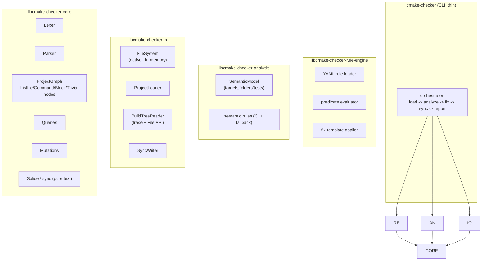

# Implementation Plan: `cmake-checker` v2 — Graph-Based Analysis, Fixes & Declarative Rule Engine

## Goal Description

Evolve `cmake-checker` (v1, see `CMAKE_STYLE_CHECKER_PLAN.md`) from a **checker-only** tool with
hardcoded rules into a **fix-capable, rule-driven** platform. The v2 architecture is centered on an
**in-memory graph of the CMake project structure** — each node holds the declared CMake constructs
for a given `CMakeLists.txt` / `*.cmake` file — which becomes the single source of truth for
analysis, fixes and future tooling.

The two primary pursued goals:

1. **Fixits.** Every rule can produce a *fix* in addition to a diagnostic. Fixes are computed as
   typed **graph mutations**; writing them back to disk is a separate, verifiable **sync** step that
   applies **surgical minimal-diff patches** (untouched bytes stay identical).
2. **Flexibility.** Rules are **declarative**: they *match* a node of the graph (e.g. any
   `add_executable` node) and *validate* its contents (regular expressions, argument predicates, …).
   Users can define their own style without recompiling. The currently hardcoded rules become a
   shipped, built-in rule set expressed in the same declarative format.

Secondary goals: a queryable graph as the basis for more advanced analysis (cross-file renames,
dead-target detection, formatting); per-library unit tests; a `FileSystem` abstraction layer so IO
is testable in isolation.

> [!NOTE]
> This is a **big-bang rewrite** of the v1 architecture. The existing tool's observable behavior is
> frozen first as golden tests so the rewrite is verified against the old tool's output before the
> new `--fix` / DSL capabilities land.

---

## User Review Required (locked decisions)

> [!IMPORTANT]
> **Locked decisions** (confirmed during design review):

| Decision              | Choice                                                                 |
| --------------------- | ---------------------------------------------------------------------- |
| Write-back            | **Surgical minimal-diff** patching (splice only mutated nodes; untouched content byte-identical). |
| Built-in rules        | **DSL now, C++ fallback** — re-express the 15 v1 rules declaratively; semantic rules may register C++ implementations. |
| Semantic facts        | **Side-car model in analysis** — the graph holds lexical structure only; target/folder/test facts live in a separate `SemanticModel`. |
| Fix scope (v1)        | **Shape + local arg fixes** — L1, L2 (trailing/tabs), L4, L5, R4, R5, R6-typo, R7. Deferred: L2-indent, L3 wrap, L6, R1/R2/R3. |
| Migration             | **Big-bang rewrite** (single effort replacing the current architecture). |
| Test layout           | **Per-library `-test` targets** (engine convention).                    |
| Lexer reuse           | **Keep + extend** the v1 `TokenKind` vocabulary; the graph parser consumes the token stream. |
| DSL scope (v1)        | Pure-lexical rules (L1, L2, L4, L5, L6) and arg-shape rule **R4** expressed in the DSL; semantic rules (R1, R2, R3, R5, R7) as C++ fallback. |

> [!NOTE]
> **DSL vs semantic split.** The rule engine's declarative surface in v1 covers rules whose inputs
> are the graph's lexical structure (whitespace, quoting, argument shape). Rules that need the
> trace/File-API side-car facts (target names, test classification, folder attribution) are
> registered as C++ implementations in `cmake-checker-analysis` and appear in the same rule table.
> This keeps the first DSL surface small and well-tested while proving the extension mechanism.

---

## Architecture & Layout Plan



### Dependency direction

`libcmake-checker-core <- libcmake-checker-io <- libcmake-checker-analysis <- libcmake-checker-rule-engine <- cmake-checker`

No circular dependencies. `core` has no filesystem access; it operates on text and builds/querying the
graph. `io` owns all filesystem interaction. `analysis` owns the semantic side-car. `rule-engine`
interprets declarative rules using core queries + analysis facts.

---

## Proposed Changes

### Component 1: Library layout & build

```
src/cmake-checker/src/
├── libcmake-checker-core/            # Lexer, Parser, ProjectGraph, queries, mutations, splice, Finding/Severity, YAML helpers
├── libcmake-checker-core-test/
├── libcmake-checker-io/              # FileSystem (native + in-memory), ProjectLoader, BuildTreeReader, SyncWriter
├── libcmake-checker-io-test/
├── libcmake-checker-analysis/        # SemanticModel, semantic rules (C++ fallback), findings + fix mutations
├── libcmake-checker-analysis-test/
├── libcmake-checker-rule-engine/     # YAML rule loading, predicate eval, fix-template application
├── libcmake-checker-rule-engine-test/
├── cmake-checker/                    # thin CLI orchestration
└── cmake-checker-test/               # end-to-end / golden tests
```

- One target per folder (per `docs/CMAKE.md`): libraries are `cmake-checker-core`,
  `cmake-checker-io`, `cmake-checker-analysis`, `cmake-checker-rule-engine` (folder `lib*` prefix
  stripped); the CLI target is `cmake-checker`.
- The existing component `conanfile.py` and `CMakeLists.txt` at `src/cmake-checker/` remain the
  project root; `add_subdirectory("src")` wires the libraries, CLI and (with tests) test targets.
- Dependencies (single conanfile): `fmt/[>=11 <12]`, `nlohmann_json/3.12.0`,
  `rapidyaml/0.7.1` (target `ryml::ryml`), `cxxopts/3.3.1`; `catch2/3.14.0` for tests.
  `rapidyaml` is used by core (config + rule YAML helpers).

### Component 2: Core — graph model, queries, mutations, splice

#### Lexer (keep + extend)

Reuse the v1 `TokenKind` vocabulary, extended for lossless round-tripping:

- `Comment` split into line comments (`# ...`) and bracket comments (`#[[ ... ]]`).
- Bracket arguments (`[[ ... ]]`, `[=[ ... ]=]`) already tokenized; keep.
- `Semicolon` as list-argument separator already present; keep.
- Token spans (`offset`, `line`, `column`) already present; keep.

Existing lexer tests carry over unchanged; new tests cover bracket comments and escaped
multi-line quoted args.

#### Parser → ProjectGraph

A minimal recursive-descent parser over the token stream that recovers structure:

```
ProjectGraph
└── ListfileNode                 # path + statements[]
    ├── CommandNode              # name '(' args[] ')'   (add_executable, set, ...)
    │   └── ArgumentNode         # unquoted / quoted / bracket — text + span
    ├── BlockNode                # if/elseif/else/endif, function/endfunction,
    │                            # macro/endmacro, foreach/while, block/endblock
    │   └── header CommandNode + children StatementNode[]
    └── TriviaNode               # comments + whitespace/newline runs
```

Invariants:

- Every node carries a **source span** (offset begin/end into the original file text) and a
  `dirty` flag.
- **Trivia is preserved** as interleaved statement nodes so round-trips are lossless and fixes
  produce minimal diffs.
- Unrecognized constructs degrade to `CommandNode`/`TriviaNode`; the parser never fails on
  well-formed CMake and never drops text.

#### Queries (core API)

`findCommands(name)`, `findCommandsIn(file, name)`, `file(path)`, `command.name()`,
`command.arg(i)`, `command.arguments()`, `argument.text()`, `statement.isBlock()`, project-wide
walkers/iterators, plus projections used by rules (e.g. `argumentsAsList()`).

#### Mutations (core API)

`setCommandName`, `setArgumentText`, `addArgument`, `removeArgument`, `reorderArguments`,
`insertStatement`, `removeStatement`, `splitCommandIntoLines`, `createCommand`,
`stripTrailingWhitespace`, `replaceTabs(width)`, `collapseBlankLines`, `normalizeQuoting(style)`.

Mutations mark affected nodes `dirty`; non-dirty subtrees are never touched.

#### Splice / sync (pure text, in core)

`applyMutationsToText(originalText, mutations) -> updatedText`

Walk the statement list; emit each node's **original slice** unless dirty, in which case reserialize
the node + adjacent trivia. The result is a minimal patch. This is a pure function, unit-testable
against golden inputs; `io::SyncWriter` wraps it with read/write.

### Component 3: IO — filesystem abstraction, loader, build-tree reader, sync writer

- `FileSystem` interface: `readText`, `writeText`, `exists`, `isDirectory`, `listDir`,
  `canonical`. Implementations: `NativeFileSystem`, `InMemoryFileSystem` (tests).
- `ProjectLoader`: walks a project root, applies `.cmake-check.yaml` exclude globs, reads listfiles,
  hands raw text to the graph builder.
- `BuildTreeReader`: reads `trace.json` (json-v1) and File API replies (codemodel v2 + cmakeFiles v1)
  → raw semantic data. The v1 `TraceParser` / `FileApiParser` move here from core.
- `SyncWriter`: `originalText + mutations → updatedText` (via core splice) then write to disk.

### Component 4: Analysis — semantic side-car & semantic rules

- `SemanticModel` holds facts computed from trace + File API: targets, folders, `is_alias` /
  `is_test`, definition file/line, and **node ↔ fact** links back into the graph.
- Semantic rules registered as C++ (the "fallback"): R1 `one_target_per_folder`, R2a/b/c naming,
  R3 `target_location`, R5 `include_directories`, R7 `catch2_test_pattern`. They run through the same
  rule table as DSL rules and emit `{finding, fix?}`.
- R5/R7 fixes are local insertions (add `target_include_directories(...)`,
  `include(Catch)` + `catch_discover_tests(...)`); R1/R2/R3 emit findings without fixes in v1.

### Component 5: Rule engine — declarative rules

Rules are declared in YAML, extending `.cmake-check.yaml` (or a separate user rules file):

```yaml
rules:
  - id: L1.space_before_paren
    severity: warn
    match: { node: command }
    when: text ~ "^[a-z_]+ \\("
    fix: { remove_spaces_before_paren: {} }

  - id: L2.whitespace
    severity: warn
    match: { node: file }
    when: any_line_has_tab(lines) or has_trailing_whitespace(lines)
    fix: { strip_trailing_whitespace: {}, replace_tabs: { width: 4 } }

  - id: L4.quoting
    severity: warn
    match: { command: set }
    when: source_list_mixed_quoting(arguments)
    fix: { normalize_quotes: { style: quoted } }

  - id: L5.blank_lines
    severity: warn
    match: { node: file }
    when: has_consecutive_blank_lines(lines)
    fix: { collapse_blank_lines: {} }

  - id: R4.link_keywords
    severity: warn
    match: { command: target_link_libraries }
    when: keywords_out_of_order(arguments, [PUBLIC, PRIVATE, INTERFACE]) \
      or dependency_without_keyword(arguments)
    fix: { reorder_keyword_groups: { order: [PUBLIC, PRIVATE, INTERFACE] } }
```

- `match` selects node kind / command name; `when` is a predicate expression evaluated against core
  queries (+ analysis facts); `fix` is a mutation template.
- Fix templates (v1): `remove_spaces_before_paren`, `strip_trailing_whitespace`,
  `replace_tabs{width}`, `collapse_blank_lines`, `normalize_quotes{style}`, `insert_arg`,
  `delete_arg`, `insert_scope_keyword`, `reorder_keyword_groups`, `split_args_one_per_line`,
  `add_command{template}`, `replace_typo` (R6).
- Built-in rules ship as a bundled YAML rule set (the 15 v1 rules re-expressed per the DSL/semantic
  split above); users can override severities or add their own rules.

### Component 6: CLI — orchestration and `--fix`

```
cmake-checker --project <path> [--project-build-dir <path>] [--config <path>]
              [--werror] [--fix] [--diff] [--help]
```

Pipeline: `ProjectLoader` (io) → build graph (core) → `BuildTreeReader` (io) → `SemanticModel`
(analysis) → run rules (rule-engine) → report; with `--fix`, apply mutations in rule order
(skipping fixes whose target span was already mutated), then re-run rules on the mutated graph and
report leftovers.

- `--diff`: print unified diffs without writing.
- Exit codes: `0` no error-level findings / `1` error-level findings (or warn promoted via
  `--werror`, or unfixed findings remain after `--fix`) / `2` tool or usage failure.
- The v1 CLI surface (`--project`, `--project-build-dir`, `--config`, `--werror`, `--help`) is
  preserved.

### Component 7: Tests (per library + end-to-end)

- **core-test**: lexer fixtures (existing + bracket comments); parser round-trip (byte-identical
  when no mutation); splice golden tests per mutation type; query tests.
- **io-test**: in-memory FS; loader exclude-glob behavior; sync golden tests (mutations → text).
- **analysis-test**: semantic model construction from trace/File API golden fixtures (reuse existing
  golden JSON); semantic rule pass/fail per rule.
- **rule-engine-test**: DSL loading, severity/off overrides, user-rule discovery; one pass/fail per
  built-in DSL rule; fix-template application.
- **cmake-checker-test** (end-to-end): **golden baseline of the current 281 `src/engine` findings**
  to guarantee no diagnostic regressions; `--fix`/`--diff` golden outputs on known fixtures.

### Component 8: Documentation

- **`docs/plans/CMAKE_STYLE_CHECKER_V2_PLAN.md`** — this document.
- **`docs/CMAKE.md`** — cross-link the rule catalog to the declarative rule format once stable.
- **`AGENTS.md`** — note the new libraries and the `--fix` capability in the `cmake-check` step.

---

## Adoption & Migration Strategy

Big-bang rewrite with regression guards:

1. **Freeze v1 behavior.** Capture the current `src/engine` findings and CLI behavior as golden
   tests before the rewrite begins (they are the verification oracle).
2. **Land the new architecture** in one effort: core graph → io → analysis → rule-engine → CLI.
3. **Re-express the 15 rules** (DSL for lexical/arg-shape rules, C++ fallback for semantic rules)
   and verify the golden diagnostics match the v1 output.
4. **Enable `--fix`** for the v1 scope (shape + local arg fixes) with golden diff tests.
5. Keep `--fix` conservative: a fix is applied only when its target node is unambiguous; ambiguous
   or risky cases (L2-indent, L3 wrap, L6, R1/R2/R3) are reported but not auto-fixed in v1.

---

## Verification Plan

```bash
# 1. Build and run the per-library test suites
mise run build:cmake-check:release          # builds the tool
src/cmake-checker/build-cmake-check/Release/bin/cmake-checker-test --reporter compact

# 2. Configure trace + File API for src/engine (unchanged v1 flow)
mise run configure:cmake-check:release

# 3. Diagnostics must match the frozen v1 golden baseline
mise run cmake-check:release

# 4. Fixes
mise run cmake-check:release -- --fix --diff   # preview
mise run cmake-check:release -- --fix          # apply
# Re-run to confirm leftovers are reported; files must re-parse and re-check cleanly.
```

Manual checks:

- `cmake-checker --help` documents the new flags.
- A known-bad fixture is fixed by `--fix` and the diff is minimal (only the mutated spans).
- A known-good fixture is untouched by `--fix` (byte-identical output).
- Zero-warning compilation of all libraries (`-Wall -Wextra -Werror`).

---

## Risks & Open Items

| # | Item                                                                 | Disposition |
| - | -------------------------------------------------------------------- | ----------- |
| 1 | Big-bang rewrite risks regression of v1 diagnostics.                 | Golden baseline tests frozen before rewrite; CLI surface kept compatible. |
| 2 | CMake grammar is large; round-trip fidelity requires care.           | Trivia preserved; parser degrades to trivia/command nodes rather than failing; round-trip golden tests per construct. |
| 3 | Surgical splice must never corrupt untouched text.                   | Pure `applyMutationsToText` with exhaustive per-mutation golden tests + in-memory FS tests. |
| 4 | Declarative DSL needs to be stable and documented to be user-facing. | Ship a minimal, well-tested template set in v1; version the DSL format. |
| 5 | Semantic rules (R1–R3, R5, R7) cannot be fully DSL-driven in v1.     | C++ fallback registered in the same rule table; future DSL extensions for fact-based predicates. |
| 6 | Fixes with overlapping spans.                                        | Apply in rule order; skip a fix whose target span was already mutated; re-run rules after application. |
| 7 | L2 tab→spaces width policy.                                          | Configurable (`replace_tabs{width}`, default 4, aligned with `indent`); documented. |

---

## Out of Scope (v1)

- Auto-formatting of whole files (v2 focuses on targeted fixes; a full formatter is a future
  consumer of the graph/splice machinery).
- Cross-file structural fixes: R1 target moves, R2 cross-file renames, R3 relocations.
- Ambiguous shape fixes: L2 indentation normalization, L3 line wrapping, L6 commented-out-code
  removal (reported, not auto-fixed).
- A plugin ABI for third-party rule libraries (declarative YAML rules only in v1).
- Non-local `FileSystem` backends beyond the in-memory test implementation.